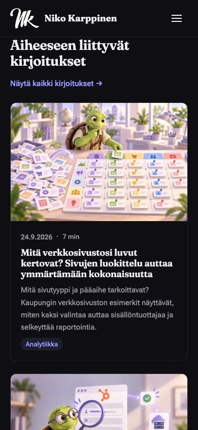
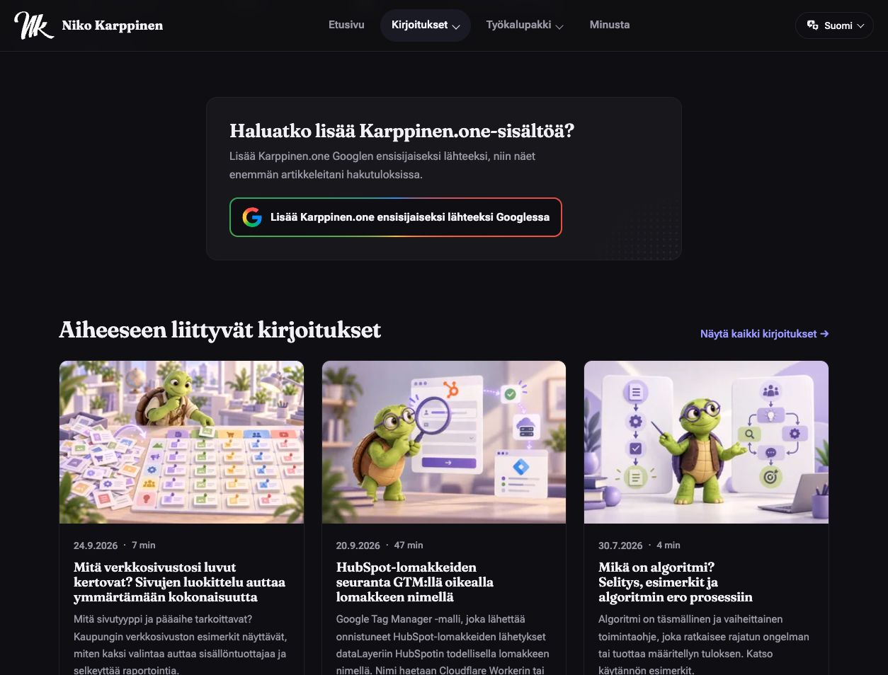

# Lisälukemisosioiden tarkistus 4.10.2026

Korjaus tehtiin paikalliseen projektiin. Muutoksia ei ole julkaistu karppinen.one-sivustolle.

## Tarkistuksen laajuus

Tarkistin kaikkien 17 julkaistun Markdown-sivun julkisen HTML:n ja buildin HTML:n: 12 varsinaista blogikirjoitusta, yksi noindex-testisivu ja neljä toteutusmallia. Kaikki julkiset sivut palauttivat HTTP 200. Luonnokset jätettiin pois julkaistujen sivujen tarkastuksesta.

Yhteinen artikkelipohja on src/layouts/Base.astro. Lisälukemisosion muodostavat src/components/RelatedArticles.astro, src/components/ArticleCard.astro ja src/utils/related-posts.ts. Suomen- ja englanninkieliset blogit sekä Markdown-toteutusmallit käyttävät samaa pohjaa. ServiceLayout.astro on palvelusivujen pohja, joten siihen ei lisätty artikkelien lisälukemista. Tavalliset sivut ja työkalusivut eivät saa osiota.

Julkisen englanninkielisen tasausartikkelin osio tarkistettiin myös selaimessa. Korjatun buildin suomenkielinen mittausartikkeli tarkistettiin silmämääräisesti työpöytä- ja mobiilinäkymissä. Automaattiset selaintestit kattavat molemmat kielet, AI-artikkelit, mittausartikkelit ja molemmat toteutusmallit.

## Löydökset ja korjaukset

- Osio oli jo artikkelin loppuosassa, ennen footeria. Se oli sekä julkisessa HTML:ssä että selaimen näkymässä; JavaScript ei luonut osiota. section, aria-labelledby, h2, kuvaavat h3-otsikot ja oikeat a href -linkit olivat käytössä. Otsikot ja kortit erottuvat omaksi kokonaisuudekseen. Näitä rakenteita ei tarvinnut korvata.
- Valintalogiikka täydensi listan kolmeen uusimmilla kirjoituksilla, vaikka aihe ei vastannut artikkelia. Esimerkiksi tasausartikkeli suositteli tekoälypaneelia ja promptien optimointia. Tämä täyttö poistettiin.
- Ehdokkaiksi hyväksyttiin vain blogikirjoituksia. Julkaistut toteutusmallit otettiin mukaan samoilla kieli-, julkaisuajankohta-, draft- ja noindex-suodattimilla. Pelkkä templates-luokka kuvaa sisältömuotoa, joten se ei yksin riitä aiheyhteydeksi.
- Cookiebot-oppaiden tunnisteisiin lisättiin Google Tag Manager, jota molemmat oppaat käsittelevät. Näin niiden aiheeseen liittyvät mittaus- ja GTM-oppaat löytyvät nykyisellä logiikalla.
- Linkkikohteet yksilöidään URL:n perusteella ja nykyisen sivun URL suljetaan pois. Sama kortti on yksi artikkelikohde. Arkistolinkkiä ei lasketa artikkelisuositukseksi.

Manuaaliset relatedPosts-valinnat säilyvät etusijalla. Muut suositukset perustuvat yhteisiin tunnisteisiin tai aihetta kuvaavaan luokkaan. Kortteja näytetään enintään kolme. Pienemmät määrät hyväksytään; tyhjää osiota ei tuoteta. Tasausartikkeleille ei löytynyt tästä sisällöstä suoraa aihekumppania, joten niiden aiemmat yleissuositukset poistuivat.

## Tarkistetut sivut ja yksilölliset kohdemäärät

| Sivu | Julkinen ennen | Korjattu build |
|---|---:|---:|
| [Use AI for multi-expert analysis with one prompt](https://karppinen.one/blog/ai-panel-with-experts/) | 3 | 2 |
| [Are people reading your articles? A practical guide to content consumption metrics](https://karppinen.one/blog/content-consumption-metrics/) | 3 | 2 |
| [Create McKinsey-style presentation using ChatGPT or Gemini](https://karppinen.one/blog/mckinsey-style-presentation-chatgpt-gemini/) | 3 | 2 |
| [Use prompt optimization system to create better prompts in ChatGPT](https://karppinen.one/blog/prompt-optimization-chatgpt/) | 3 | 2 |
| [All Blog post elements](https://karppinen.one/blog/tester-post/) (noindex-testisivu) | 3 | 1 |
| [Centered or left-aligned text? How alignment affects online readability](https://karppinen.one/blog/text-alignment-accessibility/) | 3 | 0 |
| [Käytä tekoälyä asiantuntijapaneelina yhdellä promptilla](https://karppinen.one/fi/blog/asiantuntijapaneeli-yhdella-promptilla/) | 3 | 2 |
| [Luo McKinsey-tyylinen esitys ChatGPT:n tai Geminin avulla](https://karppinen.one/fi/blog/mckinsey-tyylinen-esitys-chatgpt-gemini/) | 3 | 2 |
| [Mikä on algoritmi? Selitys, esimerkit ja algoritmin ero prosessiin](https://karppinen.one/fi/blog/mika-on-algoritmi/) | 3 | 2 |
| [Luo parempia prompteja ChatGPT:ssä promptien optimointijärjestelmän avulla](https://karppinen.one/fi/blog/promptien-optimointijarjestelma-chatgpt/) | 3 | 2 |
| [Luetaanko artikkeleitasi? Käytännön opas sisällön kulutuksen mittaamiseen](https://karppinen.one/fi/blog/sisallon-kulutuksen-mittaaminen/) | 3 | 3 |
| [Mitä verkkosivustosi luvut kertovat? Sivujen luokittelu auttaa ymmärtämään kokonaisuutta](https://karppinen.one/fi/blog/sivujen-luokittelu-analytiikassa/) | 3 | 2 |
| [Keskitetty vai vasemmalle tasattu teksti? Näin tasaus vaikuttaa luettavuuteen verkossa](https://karppinen.one/fi/blog/tekstin-tasaus-saavutettavuus/) | 3 | 0 |
| [Cookiebot guide](https://karppinen.one/templates/cookiebot-guide/) | 3 | 2 |
| [Track HubSpot form submissions in GTM with the real form name](https://karppinen.one/templates/hubspot-form-tracking-gtm/) | 3 | 2 |
| [Cookiebot-opas](https://karppinen.one/fi/toteutusmallit/cookiebot-opas/) | 3 | 2 |
| [HubSpot-lomakkeiden seuranta GTM:llä oikealla lomakkeen nimellä](https://karppinen.one/fi/toteutusmallit/hubspot-lomakkeiden-seuranta-gtm/) | 3 | 2 |

## Linkkikohteet korjauksen jälkeen

Alla näkyvät kaikkien sivujen lopulliset kohteet sekä julkiseen sivuun verrattuna lisätyt ja poistetut linkit.

### Use AI for multi-expert analysis with one prompt

Lähdesivu: https://karppinen.one/blog/ai-panel-with-experts/

Kohteet: [Use prompt optimization system to create better prompts in ChatGPT](https://karppinen.one/blog/prompt-optimization-chatgpt/); [Create McKinsey-style presentation using ChatGPT or Gemini](https://karppinen.one/blog/mckinsey-style-presentation-chatgpt-gemini/)

Lisätyt: Ei uusia kohteita.

Poistetut: [Are people reading your articles? A practical guide to content consumption metrics](https://karppinen.one/blog/content-consumption-metrics/)

### Are people reading your articles? A practical guide to content consumption metrics

Lähdesivu: https://karppinen.one/blog/content-consumption-metrics/

Kohteet: [Track HubSpot form submissions in GTM with the real form name](https://karppinen.one/templates/hubspot-form-tracking-gtm/); [Cookiebot guide](https://karppinen.one/templates/cookiebot-guide/)

Lisätyt: [Track HubSpot form submissions in GTM with the real form name](https://karppinen.one/templates/hubspot-form-tracking-gtm/); [Cookiebot guide](https://karppinen.one/templates/cookiebot-guide/)

Poistetut: [Centered or left-aligned text? How alignment affects online readability](https://karppinen.one/blog/text-alignment-accessibility/); [Use AI for multi-expert analysis with one prompt](https://karppinen.one/blog/ai-panel-with-experts/); [Use prompt optimization system to create better prompts in ChatGPT](https://karppinen.one/blog/prompt-optimization-chatgpt/)

### Create McKinsey-style presentation using ChatGPT or Gemini

Lähdesivu: https://karppinen.one/blog/mckinsey-style-presentation-chatgpt-gemini/

Kohteet: [Use AI for multi-expert analysis with one prompt](https://karppinen.one/blog/ai-panel-with-experts/); [Use prompt optimization system to create better prompts in ChatGPT](https://karppinen.one/blog/prompt-optimization-chatgpt/)

Lisätyt: Ei uusia kohteita.

Poistetut: [Are people reading your articles? A practical guide to content consumption metrics](https://karppinen.one/blog/content-consumption-metrics/)

### Use prompt optimization system to create better prompts in ChatGPT

Lähdesivu: https://karppinen.one/blog/prompt-optimization-chatgpt/

Kohteet: [Use AI for multi-expert analysis with one prompt](https://karppinen.one/blog/ai-panel-with-experts/); [Create McKinsey-style presentation using ChatGPT or Gemini](https://karppinen.one/blog/mckinsey-style-presentation-chatgpt-gemini/)

Lisätyt: Ei uusia kohteita.

Poistetut: [Are people reading your articles? A practical guide to content consumption metrics](https://karppinen.one/blog/content-consumption-metrics/)

### All Blog post elements

Lähdesivu: https://karppinen.one/blog/tester-post/

Kohteet: [Are people reading your articles? A practical guide to content consumption metrics](https://karppinen.one/blog/content-consumption-metrics/)

Lisätyt: Ei uusia kohteita.

Poistetut: [Centered or left-aligned text? How alignment affects online readability](https://karppinen.one/blog/text-alignment-accessibility/); [Use AI for multi-expert analysis with one prompt](https://karppinen.one/blog/ai-panel-with-experts/)

### Centered or left-aligned text? How alignment affects online readability

Lähdesivu: https://karppinen.one/blog/text-alignment-accessibility/

Kohteet: Ei osiota, koska sopivaa lisälukemista ei löytynyt.

Lisätyt: Ei uusia kohteita.

Poistetut: [Are people reading your articles? A practical guide to content consumption metrics](https://karppinen.one/blog/content-consumption-metrics/); [Use AI for multi-expert analysis with one prompt](https://karppinen.one/blog/ai-panel-with-experts/); [Use prompt optimization system to create better prompts in ChatGPT](https://karppinen.one/blog/prompt-optimization-chatgpt/)

### Käytä tekoälyä asiantuntijapaneelina yhdellä promptilla

Lähdesivu: https://karppinen.one/fi/blog/asiantuntijapaneeli-yhdella-promptilla/

Kohteet: [Luo parempia prompteja ChatGPT:ssä promptien optimointijärjestelmän avulla](https://karppinen.one/fi/blog/promptien-optimointijarjestelma-chatgpt/); [Luo McKinsey-tyylinen esitys ChatGPT:n tai Geminin avulla](https://karppinen.one/fi/blog/mckinsey-tyylinen-esitys-chatgpt-gemini/)

Lisätyt: Ei uusia kohteita.

Poistetut: [Mitä verkkosivustosi luvut kertovat? Sivujen luokittelu auttaa ymmärtämään kokonaisuutta](https://karppinen.one/fi/blog/sivujen-luokittelu-analytiikassa/)

### Luo McKinsey-tyylinen esitys ChatGPT:n tai Geminin avulla

Lähdesivu: https://karppinen.one/fi/blog/mckinsey-tyylinen-esitys-chatgpt-gemini/

Kohteet: [Käytä tekoälyä asiantuntijapaneelina yhdellä promptilla](https://karppinen.one/fi/blog/asiantuntijapaneeli-yhdella-promptilla/); [Luo parempia prompteja ChatGPT:ssä promptien optimointijärjestelmän avulla](https://karppinen.one/fi/blog/promptien-optimointijarjestelma-chatgpt/)

Lisätyt: Ei uusia kohteita.

Poistetut: [Mitä verkkosivustosi luvut kertovat? Sivujen luokittelu auttaa ymmärtämään kokonaisuutta](https://karppinen.one/fi/blog/sivujen-luokittelu-analytiikassa/)

### Mikä on algoritmi? Selitys, esimerkit ja algoritmin ero prosessiin

Lähdesivu: https://karppinen.one/fi/blog/mika-on-algoritmi/

Kohteet: [Mitä verkkosivustosi luvut kertovat? Sivujen luokittelu auttaa ymmärtämään kokonaisuutta](https://karppinen.one/fi/blog/sivujen-luokittelu-analytiikassa/); [Luetaanko artikkeleitasi? Käytännön opas sisällön kulutuksen mittaamiseen](https://karppinen.one/fi/blog/sisallon-kulutuksen-mittaaminen/)

Lisätyt: Ei uusia kohteita.

Poistetut: [Keskitetty vai vasemmalle tasattu teksti? Näin tasaus vaikuttaa luettavuuteen verkossa](https://karppinen.one/fi/blog/tekstin-tasaus-saavutettavuus/)

### Luo parempia prompteja ChatGPT:ssä promptien optimointijärjestelmän avulla

Lähdesivu: https://karppinen.one/fi/blog/promptien-optimointijarjestelma-chatgpt/

Kohteet: [Käytä tekoälyä asiantuntijapaneelina yhdellä promptilla](https://karppinen.one/fi/blog/asiantuntijapaneeli-yhdella-promptilla/); [Luo McKinsey-tyylinen esitys ChatGPT:n tai Geminin avulla](https://karppinen.one/fi/blog/mckinsey-tyylinen-esitys-chatgpt-gemini/)

Lisätyt: Ei uusia kohteita.

Poistetut: [Mitä verkkosivustosi luvut kertovat? Sivujen luokittelu auttaa ymmärtämään kokonaisuutta](https://karppinen.one/fi/blog/sivujen-luokittelu-analytiikassa/)

### Luetaanko artikkeleitasi? Käytännön opas sisällön kulutuksen mittaamiseen

Lähdesivu: https://karppinen.one/fi/blog/sisallon-kulutuksen-mittaaminen/

Kohteet: [Mitä verkkosivustosi luvut kertovat? Sivujen luokittelu auttaa ymmärtämään kokonaisuutta](https://karppinen.one/fi/blog/sivujen-luokittelu-analytiikassa/); [HubSpot-lomakkeiden seuranta GTM:llä oikealla lomakkeen nimellä](https://karppinen.one/fi/toteutusmallit/hubspot-lomakkeiden-seuranta-gtm/); [Mikä on algoritmi? Selitys, esimerkit ja algoritmin ero prosessiin](https://karppinen.one/fi/blog/mika-on-algoritmi/)

Lisätyt: [HubSpot-lomakkeiden seuranta GTM:llä oikealla lomakkeen nimellä](https://karppinen.one/fi/toteutusmallit/hubspot-lomakkeiden-seuranta-gtm/)

Poistetut: [Keskitetty vai vasemmalle tasattu teksti? Näin tasaus vaikuttaa luettavuuteen verkossa](https://karppinen.one/fi/blog/tekstin-tasaus-saavutettavuus/)

### Mitä verkkosivustosi luvut kertovat? Sivujen luokittelu auttaa ymmärtämään kokonaisuutta

Lähdesivu: https://karppinen.one/fi/blog/sivujen-luokittelu-analytiikassa/

Kohteet: [Luetaanko artikkeleitasi? Käytännön opas sisällön kulutuksen mittaamiseen](https://karppinen.one/fi/blog/sisallon-kulutuksen-mittaaminen/); [Mikä on algoritmi? Selitys, esimerkit ja algoritmin ero prosessiin](https://karppinen.one/fi/blog/mika-on-algoritmi/)

Lisätyt: Ei uusia kohteita.

Poistetut: [Keskitetty vai vasemmalle tasattu teksti? Näin tasaus vaikuttaa luettavuuteen verkossa](https://karppinen.one/fi/blog/tekstin-tasaus-saavutettavuus/)

### Keskitetty vai vasemmalle tasattu teksti? Näin tasaus vaikuttaa luettavuuteen verkossa

Lähdesivu: https://karppinen.one/fi/blog/tekstin-tasaus-saavutettavuus/

Kohteet: Ei osiota, koska sopivaa lisälukemista ei löytynyt.

Lisätyt: Ei uusia kohteita.

Poistetut: [Mitä verkkosivustosi luvut kertovat? Sivujen luokittelu auttaa ymmärtämään kokonaisuutta](https://karppinen.one/fi/blog/sivujen-luokittelu-analytiikassa/); [Luetaanko artikkeleitasi? Käytännön opas sisällön kulutuksen mittaamiseen](https://karppinen.one/fi/blog/sisallon-kulutuksen-mittaaminen/); [Mikä on algoritmi? Selitys, esimerkit ja algoritmin ero prosessiin](https://karppinen.one/fi/blog/mika-on-algoritmi/)

### Cookiebot guide

Lähdesivu: https://karppinen.one/templates/cookiebot-guide/

Kohteet: [Are people reading your articles? A practical guide to content consumption metrics](https://karppinen.one/blog/content-consumption-metrics/); [Track HubSpot form submissions in GTM with the real form name](https://karppinen.one/templates/hubspot-form-tracking-gtm/)

Lisätyt: [Track HubSpot form submissions in GTM with the real form name](https://karppinen.one/templates/hubspot-form-tracking-gtm/)

Poistetut: [Centered or left-aligned text? How alignment affects online readability](https://karppinen.one/blog/text-alignment-accessibility/); [Use AI for multi-expert analysis with one prompt](https://karppinen.one/blog/ai-panel-with-experts/)

### Track HubSpot form submissions in GTM with the real form name

Lähdesivu: https://karppinen.one/templates/hubspot-form-tracking-gtm/

Kohteet: [Are people reading your articles? A practical guide to content consumption metrics](https://karppinen.one/blog/content-consumption-metrics/); [Cookiebot guide](https://karppinen.one/templates/cookiebot-guide/)

Lisätyt: [Cookiebot guide](https://karppinen.one/templates/cookiebot-guide/)

Poistetut: [Centered or left-aligned text? How alignment affects online readability](https://karppinen.one/blog/text-alignment-accessibility/); [Use AI for multi-expert analysis with one prompt](https://karppinen.one/blog/ai-panel-with-experts/)

### Cookiebot-opas

Lähdesivu: https://karppinen.one/fi/toteutusmallit/cookiebot-opas/

Kohteet: [Luetaanko artikkeleitasi? Käytännön opas sisällön kulutuksen mittaamiseen](https://karppinen.one/fi/blog/sisallon-kulutuksen-mittaaminen/); [HubSpot-lomakkeiden seuranta GTM:llä oikealla lomakkeen nimellä](https://karppinen.one/fi/toteutusmallit/hubspot-lomakkeiden-seuranta-gtm/)

Lisätyt: [HubSpot-lomakkeiden seuranta GTM:llä oikealla lomakkeen nimellä](https://karppinen.one/fi/toteutusmallit/hubspot-lomakkeiden-seuranta-gtm/)

Poistetut: [Mitä verkkosivustosi luvut kertovat? Sivujen luokittelu auttaa ymmärtämään kokonaisuutta](https://karppinen.one/fi/blog/sivujen-luokittelu-analytiikassa/); [Mikä on algoritmi? Selitys, esimerkit ja algoritmin ero prosessiin](https://karppinen.one/fi/blog/mika-on-algoritmi/)

### HubSpot-lomakkeiden seuranta GTM:llä oikealla lomakkeen nimellä

Lähdesivu: https://karppinen.one/fi/toteutusmallit/hubspot-lomakkeiden-seuranta-gtm/

Kohteet: [Luetaanko artikkeleitasi? Käytännön opas sisällön kulutuksen mittaamiseen](https://karppinen.one/fi/blog/sisallon-kulutuksen-mittaaminen/); [Cookiebot-opas](https://karppinen.one/fi/toteutusmallit/cookiebot-opas/)

Lisätyt: [Cookiebot-opas](https://karppinen.one/fi/toteutusmallit/cookiebot-opas/)

Poistetut: [Mitä verkkosivustosi luvut kertovat? Sivujen luokittelu auttaa ymmärtämään kokonaisuutta](https://karppinen.one/fi/blog/sivujen-luokittelu-analytiikassa/); [Mikä on algoritmi? Selitys, esimerkit ja algoritmin ero prosessiin](https://karppinen.one/fi/blog/mika-on-algoritmi/)

## Varmistus

- npm run build: läpäisi; 69 reittiä rakennettiin ja sisältövalidointi läpäisi. Build ilmoitti Shiki/CSP- ja suuren JavaScript-paketin varoituksista. Ne eivät estäneet buildia.
- node --test test/related-posts.test.ts: kaikki kuusi testiä läpäisivät. Tarkistukset kattavat aiheettoman täytön estämisen, kielirajauksen, manuaaliset valinnat, URL-duplikaatit, itselinkit, luonnokset, tulevat julkaisut ja noindex-kohteet.
- Playwright test/e2e/related-reading.spec.ts: kaikki 10 testiä läpäisivät tuotantobuildin esikatselua vasten. Kahdeksan edustavaa sivua tarkistettiin ilman JavaScriptiä; kaikkien niiden korttilinkkien kohteet palauttivat HTTP 200 ja pääotsikko vastasi kortin otsikkoa. Tasausartikkelien ja tavallisten sivujen osioiden puuttuminen tarkistettiin.
- Mobiili- ja näppäimistötesti: 320, 390 ja 1 280 pikselin leveydet, osion vaakasuuntainen ylivuoto, Tab, näkyvä kohdistus ja Enter-navigointi läpäisivät. Näkyvässä mobiilinäkymässä kortit asettuvat yhteen sarakkeeseen.
- Buildin HTML tarkistettiin kaikilta 17 sivulta ilman JavaScriptin suorittamista. Kaikki korttien kohdetiedostot löytyivät, niiden h1 vastasi linkin artikkeliotsikkoa, kohteet olivat samaa kieltä eikä listassa ollut itse-, duplikaatti- tai noindex-linkkejä.

## Rajaukset ja avoimet asiat

Koko npm test -ajo: 37 yksikkötestiä läpäisi; vanhoista Node-testeistä 61 läpäisi ja yksi epäonnistui. Epäonnistuminen on test/schema.test.ts:162: testi odottaa author-oliolta vain @id-kenttää, mutta jo ennen tämän työn alkua muokattu src/utils/schema.ts lisää name- ja url-kentät. Tähän erilliseen muutokseen ei puututtu. Koko testipaketti ei siis ole vihreä.

Automaattiset selaintestit ajettiin käyttöjärjestelmän rajoitusten vuoksi sandboxin ulkopuolella. Valmiin buildin esikatselu oli http://127.0.0.1:4331/. Ensimmäinen yritys sandboxissa ei pystynyt käynnistämään Chromiumia; lopullinen ajo onnistui. Fyysistä puhelinta tai ruudunlukijaa ei käytetty. Koko sivuston muita E2E-testejä ei ajettu.

Design-hookin broken-image-havainto Base.astro-riviltä 46 oli väärä positiivinen: rivi laskee img-elementtejä HTML-merkkijonosta regexillä eikä luo kuvaa. Havainto vaimennettiin ohjeen mukaisesti vain tiedostoon src/layouts/Base.astro rajatulla ignore-value-poikkeuksella (.impeccable/config.json). Varsinaista kuvavirhettä ei löytynyt, eikä epävarmoja design-havaintoja jäänyt avoimeksi.

Täydellinen koneellisesti luettava ennen/jälkeen-aineisto: [related-reading-2026-10-04.json](related-reading-2026-10-04.json).

Lopputarkistuksen kolme global.css-havaintoa koskivat ennestään käytössä olevia Roboto Flex- ja Fraunces-fontteja sekä .classification-example-tietolaatikon reunusta. Ne eivät syntyneet tästä korjauksesta. Nykyinen typografia ja artikkelin CMS-kenttäesimerkin tarkoituksellinen korostus säilytettiin käyttäjän pyytämän nykyisen ulkoasun mukaisesti. Havainnoille lisättiin tiedostoon src/styles/global.css rajatut ignore-value-poikkeukset; CSS:ään ei tehty muutoksia. Näistä havainnoista ei jäänyt epävarmoja asioita avoimeksi.
