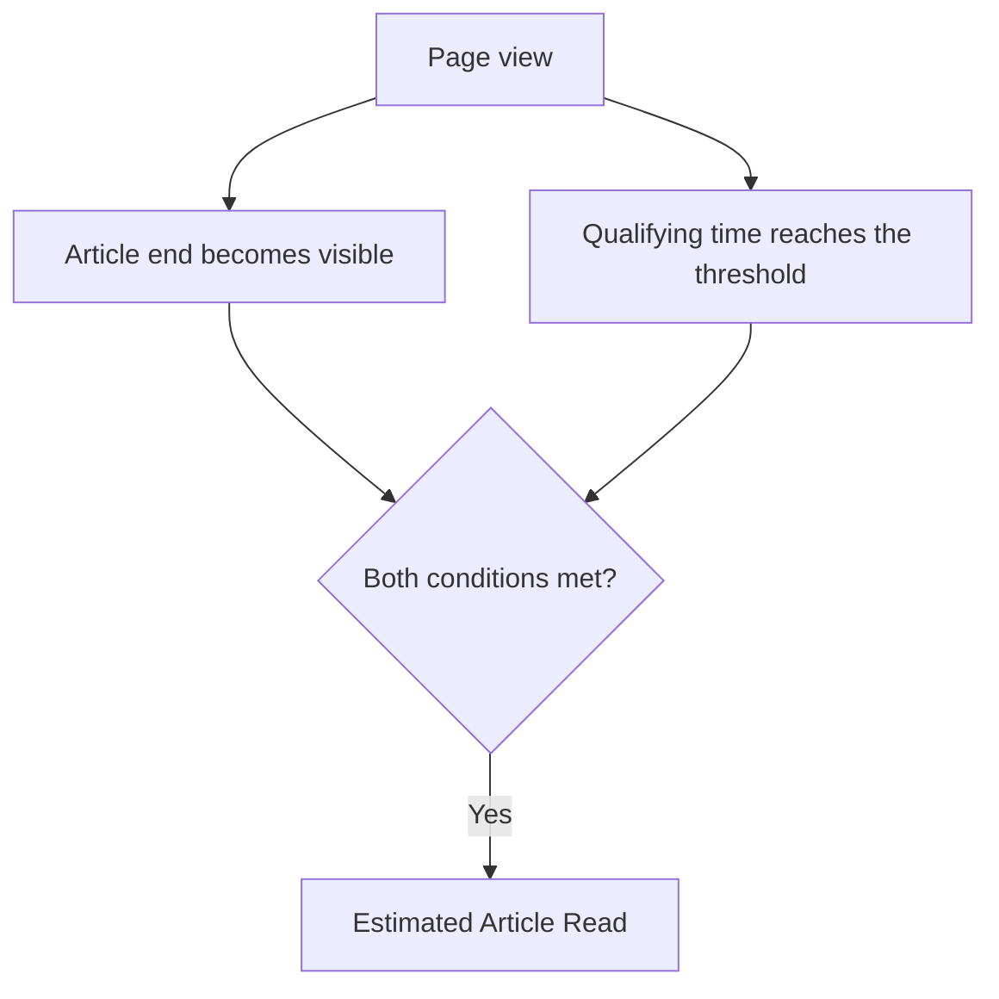

An article attracts visitors. Its page views look healthy, and your analytics report shows a reasonable engagement rate. But when someone asks whether people are actually reading it, the answer is less clear.

Some visitors may read carefully. Others may scan the headings, jump to one useful section or leave after the introduction. Those behaviours can look similar in a summary report.

Page views tell you that the article was loaded. Engagement rate tells you something about the session. Scroll depth tells you how far down the page the viewport travelled. None of them, on their own, tells you whether the visitor made meaningful progress through the article and spent enough time with it for reading to be plausible.

That requires an article-specific measurement layer. This article uses progress through the article body and qualifying time to build a more transparent estimate of content consumption.

This article was inspired by [Dana DiTomaso's guide to content consumption measurement](https://kpplaybook.com/resources/content-consumption-measurement/) at Analytics Playbook, which combines time spent with reaching the end of the content. The model here adds scroll-start and midpoint signals and treats the combined result as an estimate of reading, rather than proof that someone read or understood every word.

## Why engagement rate is not an article-reading metric

Bounce rate and engagement rate can help you evaluate visits, but their scope matters.

In GA4, both metrics are based on sessions. An engaged session meets at least one of three conditions: it exceeds the engagement-time threshold, contains a key event, or includes at least two page or screen views. Google's standard definition uses a time threshold of more than 10 seconds. Engagement rate is the share of engaged sessions; bounce rate is the share that were not engaged. [Google's engagement and bounce rate definitions](https://support.google.com/analytics/answer/12195621?hl=en)

A session can therefore qualify as engaged without the visitor reaching the middle of the article, making it to the final paragraph or spending enough time with the content for reading to be plausible. These metrics answer a broader question than whether a particular piece of content was consumed.

Engagement rate can help answer whether a session showed signs of engagement. It cannot tell you whether the visitor consumed the article.

For that, you need signals tied to the article itself.

## Why GA4 scroll tracking still does not tell you whether an article was read

When scroll measurement is enabled, GA4 records a scroll event when 90% of the page's vertical depth becomes visible. It does not automatically record intermediate milestones such as 25%, 50% or 75%. [Google's enhanced measurement documentation](https://support.google.com/analytics/answer/9216061?hl=en)

The 90% threshold applies to the whole page, not the article. A long footer, comments or related content can push it well past the final paragraph.

It also means very different things on pages of different lengths. Reaching 90% of a short page may take one small scroll, while a long article may require several screens of movement. Treating those events as directly comparable can be misleading.

And scroll depth only tells you where the viewport travelled. It does not tell you whether the content was read.

To measure article consumption, you need signals tied to the article itself and the time spent with it.

## What an article-reading measurement model needs

If page-level metrics are not enough, the next question is what additional information would actually help.

For this model, there are two dimensions:

1. **Progress through the article**

   How far did the visitor get through the article?

2. **Time spent with the article**

   Did the visitor spend enough time with the article to plausibly read that much of it?

Neither is sufficient alone. Progress can happen through fast scrolling. Time can accumulate without the visitor reaching the end.

The measurement model combines both.

## Four signals and one derived reading outcome

The model records four article-specific signals and derives an estimated read when the required end and time conditions are both satisfied. Each signal is counted at most once during a page view of the article, so repeatedly scrolling past the same point does not inflate the count. Opening the article again can create another page view: the counts describe visits to the content, not unique people.

The model only measures articles that are longer than one screen. If the whole article body fits in the viewport when the page opens, progress through it cannot be observed, so the page view records none of these signals.

### 1. Article Scroll Starts

**The first scroll that shows article text while the page is visible and in focus.**

This gives you an observable starting signal beyond a page load. Comparing scroll starts with page views for the article can help you investigate whether visitors begin moving through the content.

At least 20 pixels of article text must be on screen when the scroll happens, so scrolling through the page header alone does not count.

However, someone can read the opening paragraphs without scrolling. Treat this as a scroll-start signal, not a count of everyone who began reading.

### 2. Article Midpoint Reached

**The midpoint of the article body becomes visible or has already been passed.**

This shows whether visitors reach the middle of the content, excluding the surrounding page elements. It can help you decide where to investigate a loss of interest or a mismatch between the introduction and the rest of the article.

Visibility does not establish that the preceding paragraphs were read. A visitor may follow a link directly to a later section, and the midpoint then counts as reached because it is above the viewport.

### 3. Article End Reached

**The end of the article body becomes visible.**

Measuring the article's ending gives you a more relevant completion boundary than the bottom of the entire page. It helps distinguish reaching the final paragraph from reaching a footer or comments section.

It remains a position signal. A quick jump to the conclusion can satisfy this condition without much time spent on the content.

### 4. Article Time Threshold Reached

**Accumulated qualifying time reaches the article's estimated reading time.**

In this model, qualifying time starts when article text first comes into view. From then on, it accumulates while the page is visible and in focus. Time in a background tab or another window does not count.

Calculate the threshold from the article's word count and a configurable reading-speed assumption:

<math display="block">
<mrow>
<mtext>Estimated reading time</mtext>
<mo>=</mo>
<mfrac>
<mtext>Article word count</mtext>
<mtext>Assumed words per minute</mtext>
</mfrac>
</mrow>
</math>

For example, a 1,000-word article at an assumed 250 words per minute gives a four-minute threshold:

<math display="block">
<mrow>
<mfrac>
<mrow>
<mn>1000</mn>
<mtext> words</mtext>
</mrow>
<mrow>
<mn>250</mn>
<mtext> words per minute</mtext>
</mrow>
</mfrac>
<mo>=</mo>
<mn>4</mn>
<mtext> minutes</mtext>
</mrow>
</math>

That is an illustrative setting, not a universal reading speed. The model also adds one second for each image or figure, so illustrated articles get slightly more time.

GA4 already measures engagement time with the web page in focus. This custom signal adds an article-specific start condition and a threshold based on its length. [Google's user engagement documentation](https://support.google.com/analytics/answer/11109416?hl=en)

Even foreground time cannot establish attention. Someone may leave the screen, pause to think or inspect an illustration. The threshold qualifies time; it does not verify reading.

### Derived outcome: Estimated Article Reads

**Both the article end and the time threshold have been reached during the same page view.**

<math display="block">
<mrow>
<mtext>Estimated Article Read</mtext>
<mo>=</mo>
<mtext>Article End Reached</mtext>
<mo>∧</mo>
<mtext>Article Time Threshold Reached</mtext>
</mrow>
</math>

The ∧ symbol means that both conditions must be satisfied during the same page view.

This is not a separate behaviour signal. It is a derived outcome that combines two observations: the visitor reached the end, and enough qualifying time accumulated to meet your chosen estimate.

The reporting label should make its meaning clear: **Estimated Article Reads**. It is a proxy for consumption, with limitations inherited from both conditions.

For content intended to be read through, this is a useful outcome to monitor alongside the individual signals.

## Depth and time work together, but not in a fixed sequence

It is tempting to arrange all five events into a funnel. In practice, the time condition can be satisfied before or after the end becomes visible.

One visitor might spend several minutes in the first half, then continue to the conclusion. Another might reach the end quickly and scroll back to read a section in detail. Either can eventually satisfy both conditions.

The start and midpoint events add diagnostic detail. They are not prerequisites for an estimated read. A visitor who opens a link straight to the conclusion can reach the end without a recorded scroll start.

## What this model does not tell you

An Estimated Article Read is still an estimate based on observable behaviour. It does not prove that someone read every word, paid attention throughout the visit or understood the content.

The model also does not tell you whether the article was useful or whether the visitor achieved what they came for. A long reading time can indicate interest, but it can also mean that the content was difficult to use.

The model is best treated as a way to measure and compare content consumption signals, not as proof of attention, comprehension or content quality.

## Use patterns to decide what to investigate

Individual counts become more useful when you examine them together for the same article and comparable groups of visits.

| Observed pattern | Possible explanation | What to investigate |
| --- | --- | --- |
| Many scroll starts, few midpoint reaches | Visitors begin scrolling but may not find what they expected | The introduction, early sections and the promise made by the traffic source |
| Many midpoint reaches, few end reaches | Later sections may lose relevance, or readers may find their answer earlier | Section order, repetition and where the main answer appears |
| Many end reaches, few estimated reads | Visitors may skim, jump to the conclusion or read faster than your assumption | Navigation behaviour, content format and the time threshold |
| Many time-threshold reaches, few end reaches | Visitors may focus on one section, encounter difficulty or pause | Dense passages, code examples, illustrations and section usefulness |
| Many estimated reads | Many measured views satisfy both conditions | Whether those visits also support the article's intended outcome |

These are hypotheses to investigate. Before rewriting content, check the tracking and compare devices, traffic sources and article formats. Different audiences may use the same article differently.

## A worked example

Suppose an article produces the following results. These numbers are hypothetical, not performance benchmarks.

| Metric | Count |
| --- | ---: |
| Page views | 1,000 |
| Article Scroll Starts | 600 |
| Article Midpoint Reached | 420 |
| Article End Reached | 260 |
| Article Time Threshold Reached | 310 |
| Estimated Article Reads | 180 |

More views met the time threshold than reached the end. That is possible because time and position are independent conditions. The 180 estimated reads represent views where both were satisfied.

The estimated read rate is:

<math display="block">
<mrow>
<mtext>Estimated Article Read Rate</mtext>
<mo>=</mo>
<mfrac>
<mtext>Estimated Article Reads</mtext>
<mtext>Page views for the article</mtext>
</mfrac>
<mo>×</mo>
<mn>100</mn>
</mrow>
</math>

Using the example above:

<math display="block">
<mrow>
<mtext>Estimated Article Read Rate</mtext>
<mo>=</mo>
<mfrac>
<mn>180</mn>
<mn>1000</mn>
</mfrac>
<mo>×</mo>
<mn>100</mn>
<mo>=</mo>
<mn>18</mn>
<mo>%</mo>
</mrow>
</math>

The denominator should use GA4 page views for the same set of eligible article pages as the article events. Articles short enough to fit on one screen send no signals, so leave them out of both counts. Mixing the article events with a broader page-view total collected under different rules can distort the rate.

The result means that 18% of those page views for the article met the configured conditions. It does not mean that exactly 18% of visitors read the article.

## Choose a KPI that fits the article's purpose

For an essay or an educational article intended to be followed through, estimated read rate can help you monitor consumption. Keep the read count and page-view count alongside it so that a high percentage based on very few visits does not dominate decisions.

A reference article has a different job. Someone who finds the command they need, copies it and leaves may have had a successful visit without reaching the end. Making that answer harder to find might increase time spent while making the article less useful.

Interpret the metrics against the content's purpose. Where appropriate, pair them with a relevant next action, such as downloading a resource, using an example or continuing to a related guide.

Compare articles with similar formats, lengths and audiences. Keep the reading-time assumption consistent, document changes to tracking and establish your own baseline before setting targets.

## Put the measurement model into practice

Start with a question you can act on: are visitors getting past the introduction, reaching the conclusion, or spending time in the content without finishing it?

The four signals and the derived read outcome give you a way to investigate those questions and choose what to inspect next. Their value comes from the decisions they support, not from replacing one broad engagement metric with another.

Coming next: an implementation template for Google Tag Manager and GA4, with the tracking code, event definitions, reporting formulas and validation steps. I will add the link here when it is ready.
