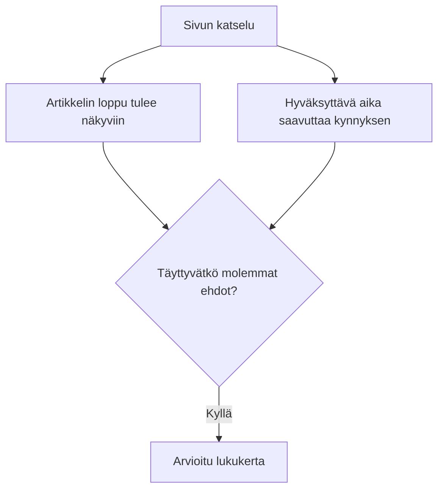

Artikkeli tuo sivustolle kävijöitä. Sivun katseluja kertyy hyvin, ja analytiikkaraportin sitoutumisaste näyttää kohtuulliselta. Kun joku kuitenkin kysyy, lukevatko ihmiset artikkelia oikeasti, vastaus on epäselvempi.

Osa kävijöistä lukee tekstin huolellisesti. Toiset silmäilevät väliotsikot, hyppäävät yhteen hyödylliseen kohtaan tai lähtevät johdannon jälkeen. Yhteenvetoraportissa nämä tavat voivat näyttää samalta.

Sivun katselu kertoo, että artikkeli latautui. Sitoutumisaste kertoo jotain istunnosta. Vierityssyvyys kertoo, kuinka alas näkymä sivulla kulki. Mikään niistä ei yksinään kerro, eteni kävijä artikkelissa merkittävästi ja viettikö hän sen parissa niin paljon aikaa, että lukeminen on uskottavaa.

Siihen tarvitaan artikkelikohtainen mittauskerros. Tässä kirjoituksessa käytetään artikkelin leipätekstissä etenemistä ja hyväksyttävää aikaa, jotta sisällön kulutuksesta saadaan läpinäkyvämpi arvio.

Kirjoitus sai alkunsa [Dana DiTomason oppaasta sisällön kulutuksen mittaamiseen](https://kpplaybook.com/resources/content-consumption-measurement/) Analytics Playbookissa. Opas yhdistää sisällön parissa vietetyn ajan ja sisällön loppuun pääsemisen. Tämä malli lisää siihen vierityksen alun ja puolivälin signaalit ja käsittelee yhdistettyä tulosta arviona lukemisesta, ei todisteena siitä, että joku luki tai ymmärsi jokaisen sanan.

## Miksi sitoutumisaste ei mittaa artikkelin lukemista

Välitön poistuminen ja sitoutumisaste auttavat arvioimaan käyntejä, mutta niiden tarkastelutaso on tärkeä.

GA4:ssä molemmat mittarit perustuvat istuntoihin. Sitoutunut istunto täyttää vähintään yhden kolmesta ehdosta: se ylittää sitoutumisajan raja-arvon, sisältää avaintapahtuman tai sisältää vähintään kaksi sivun tai näkymän katselua. Googlen vakiomäärityksessä aikaraja on yli 10 sekuntia. Sitoutumisaste on sitoutuneiden istuntojen osuus, ja välitön poistuminen on niiden istuntojen osuus, jotka eivät olleet sitoutuneita. [Googlen määritelmät sitoutumisasteelle ja välittömälle poistumiselle](https://support.google.com/analytics/answer/12195621?hl=fi)

Istunto voi siis olla sitoutunut, vaikka kävijä ei pääsisi artikkelin puoliväliin tai viimeiseen kappaleeseen eikä viettäisi sisällön parissa niin paljon aikaa, että lukeminen olisi uskottavaa. Nämä mittarit vastaavat laajempaan kysymykseen kuin siihen, kulutettiinko tietty sisältö.

Sitoutumisaste auttaa vastaamaan siihen, näkyikö istunnossa merkkejä sitoutumisesta. Se ei kerro, kuluttiko kävijä artikkelin.

Siihen tarvitaan signaaleja, jotka liittyvät itse artikkeliin.

## Miksi GA4:n vierityksen seuranta ei vieläkään kerro, luettiinko artikkeli

Kun vierityksen mittaus on käytössä, GA4 kirjaa scroll-tapahtuman, kun 90 % sivun korkeudesta on tullut näkyviin. Väliin jääviä virstanpylväitä, kuten 25 %, 50 % tai 75 %, se ei kirjaa automaattisesti. [Googlen ohje tehostetusta mittauksesta](https://support.google.com/analytics/answer/9216061?hl=fi)

90 prosentin raja koskee koko sivua, ei artikkelia. Pitkä alatunniste, kommentit tai aiheeseen liittyvä sisältö voivat siirtää sen selvästi viimeisen kappaleen alapuolelle.

Raja tarkoittaa myös hyvin eri asioita eripituisilla sivuilla. Lyhyellä sivulla 90 prosenttiin voi päästä yhdellä pienellä vierityksellä, kun taas pitkässä artikkelissa siihen tarvitaan useita näytöllisiä. Jos näitä tapahtumia verrataan suoraan keskenään, tulkinta voi mennä harhaan.

Lisäksi vierityssyvyys kertoo vain, minne näkymä kulki. Se ei kerro, luettiinko sisältö.

Artikkelin kulutuksen mittaamiseen tarvitaan signaaleja, jotka liittyvät itse artikkeliin ja sen parissa vietettyyn aikaan.

## Mitä artikkelin lukemisen mittausmalli tarvitsee

Jos sivutason mittarit eivät riitä, seuraava kysymys on, mikä lisätieto oikeasti auttaisi.

Tässä mallissa ulottuvuuksia on kaksi:

1. **Eteneminen artikkelissa**

   Kuinka pitkälle kävijä pääsi artikkelissa?

2. **Artikkelin parissa vietetty aika**

   Oliko kävijällä artikkelin parissa riittävästi aikaa lukea siihen asti, mihin hän pääsi?

Kumpikaan ei riitä yksinään. Etenemistä voi syntyä nopealla vierityksellä. Aikaa voi kertyä, vaikka kävijä ei pääsisi loppuun.

Mittausmalli yhdistää molemmat.

## Neljä signaalia ja niistä johdettu lukukerta

Malli kirjaa neljä artikkelikohtaista signaalia ja johtaa niistä arvioidun lukukerran, kun sekä loppuun pääsemisen että ajan ehto täyttyvät. Kukin signaali lasketaan enintään kerran artikkelin sivun katselua kohden, joten saman kohdan ohi vierittäminen useasti ei kasvata lukua. Artikkelin avaaminen uudelleen voi luoda uuden sivun katselun: luvut kuvaavat käyntejä sisällössä, eivät yksittäisiä ihmisiä.

Malli mittaa vain artikkeleita, jotka ovat pidempiä kuin yksi näytöllinen. Jos koko leipäteksti mahtuu näkymään sivun avautuessa, etenemistä ei voi havaita, eikä sivun katselu kirjaa yhtään näistä signaaleista.

### 1. Artikkelin vieritys alkoi

**Ensimmäinen vieritys, joka tuo artikkelin tekstiä näkyviin, kun sivu on näkyvissä ja aktiivisena.**

Tämä antaa havaittavan aloitussignaalin, joka kertoo enemmän kuin pelkkä sivun lataus. Kun vierityksen alkuja verrataan artikkelin sivun katseluihin, voit selvittää, lähtevätkö kävijät liikkeelle sisällössä.

Vierityksen hetkellä näytöllä on oltava vähintään 20 pikseliä artikkelin tekstiä, joten pelkän sivun ylätunnisteen ohi vierittäminen ei riitä.

Joku voi kuitenkin lukea alun kappaleet vierittämättä lainkaan. Käsittele tätä vierityksen alun signaalina, älä kaikkien lukemisen aloittaneiden määränä.

### 2. Artikkelin puoliväli saavutettu

**Artikkelin leipätekstin puoliväli tulee näkyviin tai on jo ohitettu.**

Tämä näyttää, pääsevätkö kävijät sisällön keskivaiheille, kun sivun muita osia ei lasketa mukaan. Sen avulla voit päättää, mistä etsiä kiinnostuksen hiipumista tai johdannon ja muun artikkelin välistä ristiriitaa.

Näkyminen ei todista, että edeltävät kappaleet luettiin. Kävijä voi tulla linkistä suoraan myöhempään osioon, jolloin puoliväli lasketaan saavutetuksi, koska se on näkymän yläpuolella.

### 3. Artikkelin loppu saavutettu

**Artikkelin leipätekstin loppu tulee näkyviin.**

Kun mitataan artikkelin loppua, valmistumisen raja on osuvampi kuin koko sivun alareuna. Näin viimeiseen kappaleeseen pääseminen erottuu alatunnisteeseen tai kommentteihin pääsemisestä.

Kyse on silti sijaintisignaalista. Nopea hyppy loppupäätelmään voi täyttää ehdon, vaikka sisällön parissa ei vietettäisi juuri aikaa.

### 4. Lukuajan kynnys saavutettu

**Kertynyt hyväksyttävä aika saavuttaa artikkelin arvioidun lukuajan.**

Tässä mallissa hyväksyttävän ajan laskenta alkaa, kun artikkelin tekstiä tulee ensimmäisen kerran näkyviin. Siitä eteenpäin aikaa kertyy, kun sivu on näkyvissä ja aktiivisena. Taustavälilehdellä tai toisessa ikkunassa kulunutta aikaa ei lasketa.

Laske kynnys artikkelin sanamäärästä ja muokattavasta lukunopeusoletuksesta:

<math display="block">
<mtable columnalign="left">
<mtr><mtd><mrow>
<mtext>Arvioitu lukuaika</mtext>
<mspace width="0.28em"/><mo>=</mo>
</mrow></mtd></mtr>
<mtr><mtd><mrow>
<mspace width="1em"/>
<mfrac>
<mtext>Artikkelin sanamäärä</mtext>
<mtext>Oletettu sanaa minuutissa</mtext>
</mfrac>
</mrow></mtd></mtr>
</mtable>
</math>

Esimerkiksi 1 000 sanan artikkeli ja oletettu 250 sanan minuuttivauhti antavat neljän minuutin kynnyksen:

<math display="block">
<mrow>
<mfrac>
<mrow>
<mn>1000</mn>
<mtext> sanaa</mtext>
</mrow>
<mrow>
<mn>250</mn>
<mtext> sanaa minuutissa</mtext>
</mrow>
</mfrac>
<mo>=</mo>
<mn>4</mn>
<mtext> minuuttia</mtext>
</mrow>
</math>

Luku on esimerkkiasetus, ei yleispätevä lukunopeus. Malli lisää myös yhden sekunnin jokaista kuvaa tai kuviota kohden, joten kuvitetut artikkelit saavat hieman enemmän aikaa.

Suomenkielisessä tekstissä sanat ovat keskimäärin pidempiä kuin englanniksi, joten sanaa minuutissa -oletus kannattaa valita kielen mukaan eikä kopioida suoraan englanninkielisistä lähteistä.

GA4 mittaa jo sitoutumisaikaa, jonka verkkosivu on aktiivisena. Tämä oma signaali lisää siihen artikkelikohtaisen aloitusehdon ja artikkelin pituuteen perustuvan kynnyksen. [Googlen ohje käyttäjän sitoutumisesta](https://support.google.com/analytics/answer/11109416?hl=fi)

Edes etualalla vietetty aika ei todista tarkkaavaisuutta. Joku voi poistua näytön ääreltä, pysähtyä miettimään tai tutkia kuvitusta. Kynnys hyväksyy ajan, mutta se ei varmista lukemista.

### Johdettu tulos: Arvioitu lukukerta

**Sekä artikkelin loppu että lukuajan kynnys on saavutettu saman sivun katselun aikana.**

<math display="block">
<mtable columnalign="left">
<mtr><mtd><mrow>
<mtext>Arvioitu lukukerta</mtext>
<mspace width="0.28em"/><mo>=</mo>
</mrow></mtd></mtr>
<mtr><mtd><mrow>
<mspace width="1em"/>
<mtext>Artikkelin loppu saavutettu</mtext>
</mrow></mtd></mtr>
<mtr><mtd><mrow>
<mspace width="1em"/>
<mo>∧</mo><mspace width="0.22em"/>
<mtext>Lukuajan kynnys saavutettu</mtext>
</mrow></mtd></mtr>
</mtable>
</math>

∧-merkki tarkoittaa, että molempien ehtojen on täytyttävä saman sivun katselun aikana.

Kyse ei ole erillisestä käyttäytymissignaalista. Se on johdettu tulos, joka yhdistää kaksi havaintoa: kävijä pääsi loppuun, ja hyväksyttävää aikaa kertyi valitsemasi arvion verran.

Raportissa nimen pitää kertoa, mitä luku tarkoittaa: **arvioidut lukukerrat**. Se on kulutuksen välillinen mittari, ja siihen periytyvät molempien ehtojen rajoitukset.

Sisällölle, joka on tarkoitettu luettavaksi alusta loppuun, tämä on hyödyllinen tulos seurata yksittäisten signaalien rinnalla.

## Syvyys ja aika toimivat yhdessä, mutta eivät tietyssä järjestyksessä

Kaikki viisi tapahtumaa on houkuttelevaa järjestää suppiloksi. Käytännössä ajan ehto voi täyttyä ennen kuin loppu tulee näkyviin tai vasta sen jälkeen.

Yksi kävijä voi viettää useita minuutteja artikkelin alkupuoliskolla ja jatkaa sitten loppuun. Toinen voi päästä loppuun nopeasti ja vierittää takaisin lukemaan yhden osion tarkasti. Kumpi tahansa voi lopulta täyttää molemmat ehdot.

Alun ja puolivälin tapahtumat tuovat lisätietoa ongelmien selvittämiseen. Ne eivät ole arvioidun lukukerran edellytyksiä. Kävijä, joka avaa linkin suoraan loppupäätelmään, voi päästä loppuun ilman kirjattua vierityksen alkua.

## Mitä tämä malli ei kerro

Arvioitu lukukerta on edelleen arvio, joka perustuu havaittavaan käyttäytymiseen. Se ei todista, että joku luki jokaisen sanan, keskittyi koko käynnin ajan tai ymmärsi sisällön.

Malli ei myöskään kerro, oliko artikkeli hyödyllinen tai saavuttiko kävijä sen, mitä tuli hakemaan. Pitkä lukuaika voi kertoa kiinnostuksesta, mutta se voi myös tarkoittaa, että sisältöä oli vaikea käyttää.

Mallia kannattaa käyttää sisällön kulutuksen signaalien mittaamiseen ja vertailuun, ei todisteena tarkkaavaisuudesta, ymmärtämisestä tai sisällön laadusta.

## Päätä tutkittavat asiat toistuvien kuvioiden perusteella

Yksittäiset luvut ovat hyödyllisempiä, kun tarkastelet niitä yhdessä saman artikkelin ja vertailukelpoisten käyntiryhmien osalta.

| Havaittu kuvio | Mahdollinen selitys | Mitä kannattaa tutkia |
| --- | --- | --- |
| Paljon vierityksen alkuja, vähän puolivälin saavutuksia | Kävijät alkavat vierittää, mutta eivät ehkä löydä odottamaansa | Johdanto, alun osiot ja liikenteen lähteen antama lupaus |
| Paljon puolivälin saavutuksia, vähän loppuun pääsyjä | Myöhemmät osiot voivat menettää merkityksensä, tai lukijat löytävät vastauksensa aiemmin | Osioiden järjestys, toisto ja se, missä kohdassa pääasiallinen vastaus on |
| Paljon loppuun pääsyjä, vähän arvioituja lukuja | Kävijät voivat silmäillä, hypätä loppupäätelmään tai lukea oletustasi nopeammin | Navigointitavat, sisällön muoto ja aikakynnys |
| Paljon aikakynnyksen saavutuksia, vähän loppuun pääsyjä | Kävijät voivat keskittyä yhteen osioon, kohdata vaikeuksia tai pitää taukoa | Tiiviit kohdat, koodiesimerkit, kuvitukset ja osioiden hyödyllisyys |
| Paljon arvioituja lukuja | Moni mitattu katselu täyttää molemmat ehdot | Tukevatko nämä käynnit myös artikkelin tavoiteltua lopputulosta |

Nämä ovat tutkittavia oletuksia. Ennen kuin kirjoitat sisältöä uudelleen, tarkista seuranta ja vertaa laitteita, liikenteen lähteitä ja artikkelimuotoja. Eri yleisöt voivat käyttää samaa artikkelia eri tavoin.

## Laskettu esimerkki

Oletetaan, että artikkelista saadaan seuraavat tulokset. Luvut ovat kuviteltuja, eivät vertailuarvoja.

| Mittari | Määrä |
| --- | ---: |
| Sivun katselut | 1 000 |
| Artikkelin vieritys alkoi | 600 |
| Artikkelin puoliväli saavutettu | 420 |
| Artikkelin loppu saavutettu | 260 |
| Lukuajan kynnys saavutettu | 310 |
| Arvioitu lukukerta | 180 |

Aikakynnys täyttyi useammassa katselussa kuin loppuun pääsy. Se on mahdollista, koska aika ja sijainti ovat toisistaan riippumattomia ehtoja. 180 arvioitua lukukertaa ovat katseluja, joissa molemmat täyttyivät.

Arvioitu lukuaste lasketaan näin:

<math display="block">
<mtable columnalign="left">
<mtr><mtd><mrow>
<mtext>Arvioitu lukuaste</mtext>
<mspace width="0.28em"/><mo>=</mo>
</mrow></mtd></mtr>
<mtr><mtd><mrow>
<mspace width="1em"/>
<mfrac>
<mtext>Arvioidut lukukerrat</mtext>
<mtext>Artikkelin sivun katselut</mtext>
</mfrac>
<mo>×</mo>
<mn>100</mn>
</mrow></mtd></mtr>
</mtable>
</math>

Yllä olevan esimerkin luvuilla:

<math display="block">
<mtable columnalign="left">
<mtr><mtd><mrow>
<mtext>Arvioitu lukuaste</mtext>
<mspace width="0.28em"/><mo>=</mo>
</mrow></mtd></mtr>
<mtr><mtd><mrow>
<mspace width="1em"/>
<mfrac>
<mn>180</mn>
<mn>1000</mn>
</mfrac>
<mo>×</mo>
<mn>100</mn>
<mo>=</mo>
<mn>18</mn>
<mtext> </mtext>
<mo>%</mo>
</mrow></mtd></mtr>
</mtable>
</math>

Nimittäjässä pitää käyttää GA4:n sivun katseluja samoilta mittaukseen kelpaavilta artikkelisivuilta kuin artikkelitapahtumissa. Yhden näytöllisen mittaiset artikkelit eivät lähetä signaaleja, joten jätä ne pois molemmista luvuista. Jos artikkelitapahtumia verrataan laajempaan, eri säännöillä kerättyyn sivun katselujen kokonaismäärään, aste vääristyy.

Tulos tarkoittaa, että 18 % artikkelin sivun katseluista täytti asetetut ehdot. Se ei tarkoita, että täsmälleen 18 % kävijöistä luki artikkelin.

## Valitse artikkelin tarkoitukseen sopiva avainmittari

Esseelle tai opettavalle artikkelille, joka on tarkoitettu luettavaksi loppuun, arvioitu lukuaste auttaa seuraamaan kulutusta. Pidä lukukertojen määrä ja sivun katselujen määrä sen rinnalla, jottei korkea prosentti hyvin pienestä käyntimäärästä ohjaa päätöksiä.

Hakuteoksenomaisella artikkelilla on eri tehtävä. Jos kävijä löytää tarvitsemansa komennon, kopioi sen ja lähtee, käynti voi olla onnistunut, vaikka hän ei päässyt loppuun. Jos vastaus tehtäisiin vaikeammaksi löytää, sisällön parissa vietetty aika voisi kasvaa, mutta artikkelista tulisi vähemmän hyödyllinen.

Tulkitse mittareita sisällön tarkoitusta vasten. Yhdistä ne tarvittaessa johonkin olennaiseen seuraavaan toimintoon, kuten materiaalin lataamiseen, esimerkin käyttämiseen tai siirtymiseen aiheeseen liittyvään oppaaseen.

Vertaa keskenään artikkeleita, joiden muoto, pituus ja yleisö ovat samankaltaisia. Pidä lukuaikaoletus samana, dokumentoi seurannan muutokset ja määritä oma lähtötasosi ennen tavoitteiden asettamista.

## Ota mittausmalli käyttöön

Aloita kysymyksestä, jonka perusteella voit toimia: pääsevätkö kävijät johdannon ohi, päätyvätkö he loppupäätelmään vai viettävätkö he aikaa sisällön parissa lukematta sitä loppuun?

Neljä signaalia ja niistä johdettu arvioitu lukukerta auttavat selvittämään näitä kysymyksiä ja päättämään, mitä tarkastella seuraavaksi. Niiden arvo syntyy päätöksistä, joita ne tukevat, ei siitä, että yksi laaja sitoutumismittari vaihdetaan toiseen.

Tulossa: toteutusmalli Google Tag Managerille ja GA4:lle, jossa on seurantakoodi, tapahtumien määritykset, raportoinnin kaavat ja testausvaiheet. Lisään linkin tähän, kun malli on valmis.
