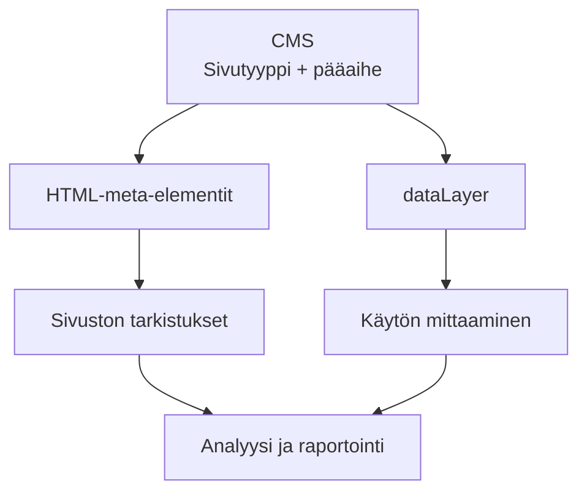

Kaupungin verkkosivuston analytiikkaraportissa voivat olla rinnakkain päivähoitopaikan hakeminen, rakennusluvat, syysloman tapahtumat ja jätteiden lajitteluohjeet. Niitä kaikkia mitataan sivuina, vaikka niiden tehtävät ovat aivan erilaisia.

Jos kaikki sivut päätyvät samaan keskiarvoon, raportti kertoo vähän siitä, miten sivuston eri sisältöjä käytetään. Yksittäisten sivuosoitteiden lista voi puolestaan olla tuhansien rivien mittainen.

Kokonaisuutta voidaan selkeyttää antamalla jokaiselle sivulle kaksi perustietoa: **millainen sivu se on ja mihin pääaiheeseen se kuuluu.** Näin raportissa voidaan tarkastella ymmärrettäviä ryhmiä ja verrata yksittäistä sivua muihin samankaltaisiin sivuihin.

## Sivutyyppi kertoo, millainen sivu on. Pääaihe kertoo, mistä se kertoo.

**Sivutyyppi vastaa kysymykseen: millainen sivu tämä on?** Kaupungin sivustolla sivu voi olla esimerkiksi palvelu, tapahtuma, ohje tai uutinen.

**Pääaihe vastaa kysymykseen: mistä tämä sivu ensisijaisesti kertoo?** Aihe voi olla esimerkiksi varhaiskasvatus ja koulutus, asuminen ja rakentaminen, kulttuuri ja vapaa-aika tai ympäristö.

Ero näkyy käytännössä näin:

| Sivu | Sivutyyppi | Pääaihe |
|---|---|---|
| Päivähoitopaikan hakeminen | Palvelu | Varhaiskasvatus ja koulutus |
| Rakennusluvan hakeminen | Palvelu | Asuminen ja rakentaminen |
| Syysloman tapahtumat | Tapahtuma | Kulttuuri ja vapaa-aika |
| Kotitalouden jätteiden lajittelu | Ohje | Ympäristö |

Päivähoitopaikan ja rakennusluvan hakeminen ovat molemmat palvelusivuja, vaikka ne käsittelevät eri aiheita. Varhaiskasvatuksen ja koulutuksen aiheeseen voi puolestaan kuulua palvelujen lisäksi ohjeita, uutisia ja tapahtumia.

Sivutyyppi ja pääaihe eivät siis ole vaihtoehtoja toisilleen, vaan jokainen sivu saa molemmat. Kahden erillisen tiedon avulla raportissa voidaan tarkastella sekä samantyyppisiä sivuja että saman aiheen sisältöjä.

<figure>


</figure>

Teknisessä toteutuksessa sivutyypin kenttä voi olla nimeltään `page_type` ja pääaiheen kenttä `primary_category`. Sisältöä tehdessä riittää, että ymmärrät suomenkieliset käsitteet ja osaat valita sivulle sopivat vaihtoehdot.

## Näin luokittelu antaa raportille kontekstin

Kuvitellaan, että kaupungin sivustolla on kuukaudessa 100 000 sivukatselua. Sivukatselu tarkoittaa sivun katselukertaa; sama ihminen voi kerryttää niitä useita. Seuraavat luvut ovat kuvitteellisia ja koskevat samaa kuukautta.

Luokittelun avulla samaa aineistoa voidaan tarkastella viidellä tavalla:

| Tarkastelu | Mitä raporttiin valitaan? | Sivukatselut |
|---|---|---:|
| Koko sivusto | Kaikki kaupungin sivut | 100 000 |
| Sivutyyppi | Kaikki palvelusivut aiheesta riippumatta | 40 000 |
| Pääaihe | Kaikki varhaiskasvatuksen ja koulutuksen sivut sivutyypistä riippumatta | 20 000 |
| Sivutyyppi + pääaihe | Varhaiskasvatuksen ja koulutuksen palvelusivut | 12 000 |
| Yksittäinen sivu | Päivähoitopaikan hakeminen | 3 600 |

Rivit ovat osittain päällekkäisiä näkymiä samaan aineistoon, joten niiden lukuja ei lasketa yhteen.

Taulukossa aineistoa voidaan rajata koko sivustosta yhä tarkempaan vertailuryhmään:

**koko sivusto → sivutyyppi tai pääaihe → sivutyyppi + pääaihe → yksittäinen sivu**

Koko sivuston luku kertoo käytön kokonaismäärän, mutta ei sitä, mitä sisältöjä käytetään. Sivutyyppi ja pääaihe rajaavat aineistoa kumpikin omalla tavallaan: sivutyypillä voidaan tarkastella esimerkiksi kaikkia palvelusivuja, ja pääaiheen avulla aihealueesta vastaava henkilö näkee oman kokonaisuutensa käytön.

Kun rajaukset yhdistetään, päivähoitopaikan hakeminen saa vertailuryhmän sivuista, joilla on sekä samankaltainen tehtävä että yhteinen aihealue. Yksittäistä sivua voidaan tarkastella tämän ryhmän sisällä. Kuvitteellisen esimerkin 12 000 katselua voisivat jakautua näin:

| Varhaiskasvatuksen ja koulutuksen palvelusivu | Sivukatselut |
|---|---:|
| Päivähoitopaikan hakeminen | 3 600 |
| Esiopetukseen ilmoittautuminen | 4 200 |
| Kouluun ilmoittautuminen | 2 900 |
| Koulukuljetuksen hakeminen | 1 300 |

Nyt päivähoitopaikan hakemista voidaan tarkastella suhteessa muihin saman ryhmän sivuihin. Jos katselut muuttuvat, voidaan selvittää, näkyykö vastaava muutos myös muilla sivuilla vai koskeeko se vain tätä palvelua.

## Vertailuryhmä auttaa löytämään kysymyksen, ei vielä vastausta

Koulukuljetuksen hakemissivun pienempi katselumäärä ei sellaisenaan tarkoita, että sivu toimii huonosti. Palvelua voi tarvita pienempi joukko ihmisiä. Esiopetuksen ilmoittautumisaika voi puolestaan selittää kyseisen sivun suurempaa katselumäärää.

Luokittelu auttaa tunnistamaan eroja ja valitsemaan, mitä kannattaa tutkia. Eron syy selvitetään erikseen. Myös samassa ryhmässä sivuilla voi olla erilaiset käyttäjämäärät, määräajat ja asiointitavat.

Sivun onnistumista arvioidaan sen tavoitteen mukaan. Päivähoidon palvelusivulla voidaan esimerkiksi selvittää, löytävätkö kävijät hakemukseen. Lajitteluohjeen lukija voi saada tarvitsemansa vastauksen suoraan sivulta. Pelkkä katselumäärä ei vastaa kumpaankaan kysymykseen, ja hakemukseen siirtymisen tutkiminen vaatii myös sitä kuvaavan mittauksen.

**Luokittelu antaa luvuille vertailukontekstin. Se ei yksin kerro, miksi sisältö toimii tietyllä tavalla.**

## Mitä valitsen, kun julkaisen sivun?

Kun luokittelu on otettu käyttöön, päivähoitopaikan hakemista käsittelevän sivun julkaisemisen pitäisi näyttää suunnilleen tältä:

<dl class="classification-example">
  <div class="classification-row">
    <dt class="classification-label">Sivutyyppi</dt>
    <dd class="classification-value">Palvelu</dd>
  </div>
  <div class="classification-row">
    <dt class="classification-label">Pääaihe</dt>
    <dd class="classification-value">Varhaiskasvatus ja koulutus</dd>
  </div>
</dl>

Valitset sopivat vaihtoehdot valmiista luetteloista. Jos sivutyyppi voidaan päätellä luotettavasti sivuston rakenteesta tai sisältötyypistä, järjestelmä voi asettaa sen automaattisesti. Muissa tapauksissa valitset sivutyypin itse.

Nämä valinnat kuuluvat samaan julkaisutyöhön kuin otsikon, linkkien ja sisällön tarkistaminen. Sivuston tehtävänä on tallentaa tiedot ja välittää ne sovittuihin työkaluihin. Sisällöntuottajan ei tarvitse osata mittaustyökalujen asetuksia tai siirtää luokituksia raportteihin käsin.

### Yhdellä sivulla on yksi pääaihe

Sivu voi käsitellä useita asioita, mutta tällä raportoinnin tasolla se kuuluu yhteen pääaiheeseen. Valitse aihe sen perusteella, mitä asiaa sivu ensisijaisesti auttaa hoitamaan tai ymmärtämään.

Päivähoitopaikan hakemissivu voi kertoa myös perheen muuttamisesta uudelle asuinalueelle. Pääaiheeksi valitaan silti **Varhaiskasvatus ja koulutus**, koska päivähoitopaikan hakeminen kuuluu ensisijaisesti siihen aihekokonaisuuteen. Muuttamisen mainitseminen ei tee siitä asumisen palvelusivua.

Jos valinta jää epäselväksi, käytä yhteisiä luokitteluohjeita tai kysy sisällöistä vastaavalta henkilöltä. Myös etusivun ja muiden yleisten sivujen luokittelulle sovitaan oma käytäntö.

Monikielisellä sivustolla pääaihe voidaan periä kieliversioille, jotta samaa sisältöä ei tarvitse luokitella monta kertaa.

### Valmiit vaihtoehdot pitävät raportin koossa

Jos pääaihe kirjoitetaan vapaaseen tekstikenttään, sama käsite voi päätyä järjestelmään nimillä ”Koulutus”, ”koulutus”, ”Opetus” ja ”Kasvatus ja koulutus”. Kun nämä välittyvät erillisinä arvoina, yhden aihekokonaisuuden luvut hajaantuvat raportissa eri ryhmiin.

Valmiissa valintalistassa kaikille tarjotaan sama vaihtoehto. Uuden pääaiheen lisäämisestä sovitaan yhdessä, jos nykyiset vaihtoehdot eivät riitä.

Vaihtoehtoja kannattaa olla niin vähän, että sisällöntuottaja pystyy valitsemaan avaamatta luokitteluohjetta joka kerta. Jos vaihtoehtoja alkaa olla kymmeniä, kannattaa tarkistaa, onko luokittelusta tullut liian yksityiskohtainen. Tavoitteena on luokittelu, jonka ihmiset ymmärtävät ja jota he pystyvät käyttämään johdonmukaisesti.

## Sama malli toimii muillakin sivustoilla

Kaupungin sivustolla malli erottaa esimerkiksi palvelun ja sen aihealueen. Muilla sivustoilla vastaavat parit voisivat olla tällaisia:

| Sivusto | Sivutyyppi | Pääaihe |
|---|---|---|
| Verkkokauppa | Tuote | Valaisimet |
| B2B-yritys | Asiakastarina | Tietoturva |
| Järjestö | Ohje | Vapaaehtoistyö |

Kysymykset pysyvät samoina: millainen sivu tämä on ja mistä se ensisijaisesti kertoo?

## Määrittele kerran ja käytä samaa tietoa eri työkaluissa

Sivustolla pitää olla paikka luokitusten tallentamiseen ja tapa välittää ne eteenpäin. Tämä voi edellyttää kehitystyötä. Kehittäjä ja analytiikasta vastaava henkilö huolehtivat toteutuksesta ja sen tarkistamisesta.

Sisällönhallintajärjestelmä eli CMS tallentaa valinnat ja on luokitusten lähde. Muut järjestelmät käyttävät samaa tietoa. Luokittelu voidaan julkaista esimerkiksi sivun omissa HTML-meta-elementeissä, eli sivun koodissa olevina koneellisesti luettavina tietoina:

<div data-no-copy>

```html
<meta name="page_type" content="service">
<meta name="primary_category" content="education">
```

</div>

Tässä sovitut tunnisteet `service` ja `education` vastaavat valintoja Palvelu sekä Varhaiskasvatus ja koulutus. Sisällöntuottajalle vaihtoehdot voidaan näyttää suomeksi. Kenttien nimet ovat sivuston omia määrityksiä, eivätkä selaimet tai hakukoneet tunne niitä valmiiksi.

Tietojen välittämiseen analytiikkatyökaluille voidaan käyttää yhteistä tietorakennetta nimeltä [dataLayer](https://developers.google.com/tag-platform/tag-manager/datalayer). Alla luokittelu kulkee CMS:stä kahteen käyttötarkoitukseen: sivuston tarkistuksiin ja käytön mittaamiseen. Molempien tuottamia tietoja voidaan käyttää analyysissä ja raportoinnissa.



Kaavion yhteydet pitää toteuttaa sivustolle: metatiedot eivät itsestään siirry analytiikkaan. Sisällöntuottajalle riittää sivutyypin ja pääaiheen valitseminen kerran.

Sivustoa automaattisesti läpikäyvä tarkistustyökalu, kuten [Screaming Frog](https://www.screamingfrog.co.uk/seo-spider/tutorials/web-scraping/), voidaan määrittää poimimaan nämä metatiedot. Tarkistuksessa löytyvät esimerkiksi sivut, joilta sivutyyppi tai pääaihe puuttuu, arvot, joita ei pitäisi enää käyttää, ja saman arvon eri kirjoitusasut, kuten `education` ja `Education`. Samoja tietoja voi lisäksi käyttää vaikkapa eri aihealueiden otsikoiden vertailuun.

Luokitusten kattavuutta kannattaa seurata jo sisällönhallintajärjestelmässä. Sisältölistassa voidaan esimerkiksi näyttää luokittelemattomat sivut. Tarkistustyökalu täydentää tätä tarkistamalla sivustolle lopulta julkaistut arvot: CMS kertoo, mitä sivuilla pitäisi olla, ja tarkistus kertoo, mitä sivustolla on.

**Määrittele luokittelu kerran ja käytä sitä uudelleen.** Sama tieto tukee sisällönhallintaa, analytiikkaa, raportointia ja sivuston teknisiä tarkistuksia.

## Kaksi valintaa osaksi jatkuvaa julkaisutyötä

Luokittelun voi aloittaa rajatusta sisältöjoukosta, esimerkiksi varhaiskasvatuksen palvelusivuista. Niiden avulla voidaan kokeilla, ovatko vaihtoehdot selkeitä ja auttaako ryhmittely raportoinnissa. Vanhoja sisältöjä voidaan luokitella sovituissa erissä.

Jatkossa jokainen uusi sivu luokitellaan julkaistaessa. Kun sivun tarkoitus muuttuu, myös luokitus tarkistetaan. Yhteisille valintalistoille sovitaan vastuuhenkilö, ja luokkien muutokset kirjataan, jotta raporttien kehitystä voidaan tulkita ajan yli.

Kun luokittelu kuuluu tavalliseen julkaisutyöhön, raportointia varten ei tarvitse myöhemmin rakentaa samoja ryhmiä käsin. Jokaisesta sivusta tiedetään kaksi asiaa: **millainen sivu se on ja mikä on sen pääaihe.**