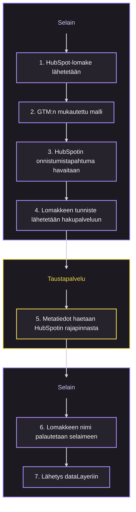

HubSpot-lomakkeiden seuranta Google Tag Managerissa päätyy yleensä kahteen huonoon lopputulokseen: tapahtumissa on vain lomakkeen tunniste, tai GTM-muuttujassa on käsin ylläpidetty lista lomakkeiden tunnisteista ja nimistä, jota kukaan ei päivitä.

Tämä malli ei tee kumpaakaan. HubSpot pysyy lomakkeen nimen ainoana lähteenä, pieni taustapalvelu hakee nimen palvelinpuolen tunnuksella, ja GTM saa analytiikkaan sopivan tapahtuman.

Oletuksena lähetys tuottaa HubSpotin lomakkeen nimen täsmälleen sellaisena kuin se on tallennettu:

```javascript
{
  event: "hubspot_form_success",
  hubspot_form_id: "135222a8-a170-416f-8f4e-91330645d86a",
  hubspot_form_name: "Support : Return or Refund | Start a Return",
  hubspot_form_instance_id: "70c1f954-c923-484c-a3dc-0712421cb5e4"
}
```

Jos lomakkeiden nimet noudattavat muotoa `Category : Type | Name`, yksi valinnainen asetus jakaa merkkijonon kolmeksi raportoinnin dimensioksi:

```javascript
{
  event: "hubspot_form_success",
  hubspot_form_id: "135222a8-a170-416f-8f4e-91330645d86a",
  hubspot_form_category: "Support",
  hubspot_form_type: "Return or Refund",
  hubspot_form_name: "Start a Return",
  hubspot_form_instance_id: "70c1f954-c923-484c-a3dc-0712421cb5e4"
}
```

## Miten se toimii



Työn tekee kolme osaa:

1. **GTM:n mukautettu malli**, joka lataa seurantaskriptin ja sisältää asetukset.
2. **Taustapalvelu**, joka pitää HubSpot-tunnuksen palvelimella, muuntaa lomakkeiden tunnisteet nimiksi, tallentaa tuloksen välimuistiin ja jakaa seurantaskriptin.
3. **Selaimen seurantaskripti**, joka kuuntelee HubSpot-lomakkeiden tapahtumia, yhdistää tapahtuman tiedot lomakkeen metatietoihin ja lähettää yhden siistin tapahtuman.

Kun seurantalogiikka on erotettu GTM-mallista, HubSpotin tapahtumankäsittelyn korjaus on taustapalvelun julkaisu eikä jokaisen mallia käyttävän tagin uudelleenrakennus.

## Mitä taustapalvelu tarjoaa

| Päätepiste | Tarkoitus |
| --- | --- |
| `/` | Tilan tarkistus. Palauttaa palvelun tilan ja seurantaskriptin version. |
| `/form?id=HUBSPOT_FORM_ID` | Palauttaa yhden lomakkeen tiedot muodossa `{ "id": "...", "name": "..." }`. |
| `/hubspot-form-tracker.js` | Jakaa selaimen seurantaskriptin, joka luodaan GTM-mallin asetuksista. |

Selain tietää vain taustapalvelun julkisen osoitteen. HubSpotin käyttötunnus pysyy palvelimella.

Tilan tarkistuksen vastaus näyttää tältä:

```json
{
  "status": "ok",
  "service": "HubSpot Form Lookup",
  "trackerVersion": "1"
}
```

Metatietojen haku palauttaa vain seurannan tarvitsemat tiedot, ei koko HubSpotin lomakeobjektia:

```json
{
  "id": "135222a8-a170-416f-8f4e-91330645d86a",
  "name": "Support : Return or Refund | Start a Return"
}
```

## Ennen kuin aloitat

Tarvitset:

- HubSpotin private app -tunnuksen, jolla on lomakkeiden käyttöoikeus
- julkaisuoikeudet Google Tag Manager -säiliöön
- hallitsemasi verkkotunnuksen taustapalvelulle, esimerkiksi `forms-api.example.com`
- joko Cloudflare-tilin tai PHP-palvelimen sen mukaan, mitä valitset vaiheessa 1.

> **Huomio:** Lomakkeen nimi ei ole salainen, mutta HubSpot-tunnus on. Älä koskaan kutsu HubSpotin rajapintaa suoraan selaimesta äläkä liitä tunnusta GTM-muuttujaan tai mallin kenttään.

## Vaihe 1 – Valitse taustapalvelu

<fieldset class="hubspot-backend-picker">
  <legend>Hakupalvelun alusta</legend>
  <p>Missä HubSpotin hakupalvelu ajetaan?</p>
  <label class="form-choice" for="hubspot-backend-worker">
    <input
      id="hubspot-backend-worker"
      name="hubspot-backend"
      type="radio"
      value="worker"
      aria-controls="hubspot-backend-worker-steps"
      checked
    >
    <span><strong>Cloudflare Worker.</strong> Ei ylläpidettävää palvelinta, sisäänrakennettu välimuisti ja salaisuudet tallessa Cloudflaressa.</span>
  </label>
  <label class="form-choice" for="hubspot-backend-php">
    <input
      id="hubspot-backend-php"
      name="hubspot-backend"
      type="radio"
      value="php"
      aria-controls="hubspot-backend-php-steps"
    >
    <span><strong>PHP-päätepiste.</strong> Toimii nykyisessä verkkohotellissasi, eikä tekniikkaan tule uutta alustaa.</span>
  </label>
</fieldset>

Molemmat vaihtoehdot tarjoavat samat kolme päätepistettä ja saman JSONin, joten GTM-malli ja seurantaskripti ovat kummassakin tapauksessa samat. Valitse se, jonka tiimisi pystyy julkaisemaan ja jota se pystyy valvomaan. Jos sivusto on jo Cloudflaren takana, Worker on yleensä vähemmän työtä.

<section id="hubspot-backend-worker-steps">

### Ota Cloudflare Worker käyttöön

1. Luo uusi Worker Cloudflaren hallintapaneelissa tai aja `npx wrangler init hubspot-form-lookup`.
2. Korvaa Workerin lähdekoodi alla olevalla koodilla.
3. Lisää kohdassa *Workerin asetukset* kuvattu salaisuus ja ympäristömuuttuja.
4. Liitä Worker reittiin, esimerkiksi `forms-api.example.com/*`.

<div class="code-accordion" data-code-accordion>
<div class="code-accordion__content" id="hubspot-worker-script" data-code-accordion-content>

```javascript
const HUBSPOT_FORMS_API_VERSION = "2026-09-beta";
const CACHE_TTL_SECONDS = 86400; // 24 hours
const NOT_FOUND_TTL_SECONDS = 300; // unknown IDs stop reaching HubSpot for 5 minutes
const TRACKER_VERSION = "1";

export default {
  async fetch(request, env, ctx) {
    const url = new URL(request.url);
    const origin = request.headers.get("Origin");

    /*
     * -------------------------------------------------------
     * ALLOWED ORIGINS
     * -------------------------------------------------------
     */

    const allowedOrigins = (env.ALLOWED_ORIGINS || "")
      .split(",")
      .map((value) => value.trim())
      .filter(Boolean);

    const originAllowed =
      allowedOrigins.length === 0 ||
      !origin ||
      allowedOrigins.includes(origin);

    if (!originAllowed) {
      return jsonResponse(
        {
          error: "Origin not allowed"
        },
        403,
        origin
      );
    }

    /*
     * -------------------------------------------------------
     * CORS PREFLIGHT
     * -------------------------------------------------------
     */

    if (request.method === "OPTIONS") {
      return new Response(null, {
        status: 204,
        headers: corsHeaders(origin)
      });
    }

    /*
     * -------------------------------------------------------
     * ONLY GET REQUESTS
     * -------------------------------------------------------
     */

    if (request.method !== "GET") {
      return jsonResponse(
        {
          error: "Method not allowed"
        },
        405,
        origin,
        {
          Allow: "GET, OPTIONS"
        }
      );
    }

    /*
     * -------------------------------------------------------
     * TRACKER SCRIPT
     * -------------------------------------------------------
     */

    if (url.pathname === "/hubspot-form-tracker.js") {
      /*
       * -----------------------------------------------------
       * EVENT NAME
       * -----------------------------------------------------
       */

      const requestedEventName =
        url.searchParams.get("event") ||
        "hubspot_form_success";

      const eventName =
        validateEventName(requestedEventName)
          ? requestedEventName
          : "hubspot_form_success";

      /*
       * -----------------------------------------------------
       * DATALAYER OUTPUT CONFIGURATION
       * -----------------------------------------------------
       */

      const customizeDataLayerSettings =
        url.searchParams.get(
          "customizeDataLayerSettings"
        ) === "1";

      /*
       * Default parameter names.
       */

      const DEFAULT_FORM_ID_PARAMETER =
        "hubspot_form_id";

      const DEFAULT_FORM_CATEGORY_PARAMETER =
        "hubspot_form_category";

      const DEFAULT_FORM_TYPE_PARAMETER =
        "hubspot_form_type";

      const DEFAULT_FORM_NAME_PARAMETER =
        "hubspot_form_name";

      const DEFAULT_INSTANCE_ID_PARAMETER =
        "hubspot_form_instance_id";

      /*
       * Optional structured HubSpot form naming convention:
       *
       * Category : Type | Name
       */

      const DEFAULT_FORM_CATEGORY_SEPARATOR =
        ":";

      const DEFAULT_FORM_NAME_SEPARATOR =
        "|";

      /*
       * -----------------------------------------------------
       * FORM ID PARAMETER
       * -----------------------------------------------------
       */

      let formIdParameter =
        DEFAULT_FORM_ID_PARAMETER;

      if (customizeDataLayerSettings) {
        formIdParameter =
          getSafeParameterName(
            url.searchParams.get(
              "formIdParameter"
            ),
            DEFAULT_FORM_ID_PARAMETER
          );
      }

      /*
       * -----------------------------------------------------
       * FORM CATEGORY PARAMETER
       * -----------------------------------------------------
       */

      let formCategoryParameter =
        DEFAULT_FORM_CATEGORY_PARAMETER;

      if (customizeDataLayerSettings) {
        formCategoryParameter =
          getSafeParameterName(
            url.searchParams.get(
              "formCategoryParameter"
            ),
            DEFAULT_FORM_CATEGORY_PARAMETER
          );
      }

      /*
       * -----------------------------------------------------
       * FORM TYPE PARAMETER
       * -----------------------------------------------------
       */

      let formTypeParameter =
        DEFAULT_FORM_TYPE_PARAMETER;

      if (customizeDataLayerSettings) {
        formTypeParameter =
          getSafeParameterName(
            url.searchParams.get(
              "formTypeParameter"
            ),
            DEFAULT_FORM_TYPE_PARAMETER
          );
      }

      /*
       * -----------------------------------------------------
       * FORM NAME PARAMETER
       * -----------------------------------------------------
       */

      let formNameParameter =
        DEFAULT_FORM_NAME_PARAMETER;

      if (customizeDataLayerSettings) {
        formNameParameter =
          getSafeParameterName(
            url.searchParams.get(
              "formNameParameter"
            ),
            DEFAULT_FORM_NAME_PARAMETER
          );
      }

      /*
       * -----------------------------------------------------
       * INSTANCE ID PARAMETER
       * -----------------------------------------------------
       */

      let instanceIdParameter =
        DEFAULT_INSTANCE_ID_PARAMETER;

      if (customizeDataLayerSettings) {
        instanceIdParameter =
          getSafeParameterName(
            url.searchParams.get(
              "instanceIdParameter"
            ),
            DEFAULT_INSTANCE_ID_PARAMETER
          );
      }

      /*
       * -----------------------------------------------------
       * STRUCTURED FORM NAME
       * -----------------------------------------------------
       *
       * Disabled by default.
       *
       * Default behavior:
       *
       * hubspot_form_name contains the complete HubSpot
       * form name.
       *
       * When splitFormName=1, the expected naming format is:
       *
       * Category : Type | Name
       *
       * Example:
       *
       * Support : Return or Refund | Start a Return
       */

      let splitFormName = false;

      const requestedSplitFormName =
        url.searchParams.get(
          "splitFormName"
        );

      /*
       * Temporary backwards compatibility with the previous
       * template parameter.
       */

      const legacyIncludeFormType =
        url.searchParams.get(
          "includeFormType"
        );

      if (
        requestedSplitFormName !== null
      ) {
        splitFormName =
          requestedSplitFormName === "1";
      } else if (
        customizeDataLayerSettings &&
        legacyIncludeFormType !== null
      ) {
        splitFormName =
          legacyIncludeFormType === "1";
      }

      /*
       * -----------------------------------------------------
       * CATEGORY / TYPE SEPARATOR
       * -----------------------------------------------------
       */

      let formCategorySeparator =
        DEFAULT_FORM_CATEGORY_SEPARATOR;

      if (
        customizeDataLayerSettings &&
        splitFormName
      ) {
        formCategorySeparator =
          getSafeSeparator(
            url.searchParams.get(
              "formCategorySeparator"
            ),
            DEFAULT_FORM_CATEGORY_SEPARATOR
          );
      }

      /*
       * -----------------------------------------------------
       * TYPE / NAME SEPARATOR
       * -----------------------------------------------------
       */

      let formNameSeparator =
        DEFAULT_FORM_NAME_SEPARATOR;

      if (
        customizeDataLayerSettings &&
        splitFormName
      ) {
        formNameSeparator =
          getSafeSeparator(
            url.searchParams.get(
              "formNameSeparator"
            ),
            DEFAULT_FORM_NAME_SEPARATOR
          );
      }

      /*
       * -----------------------------------------------------
       * TRACKER CONFIGURATION
       * -----------------------------------------------------
       */

      const endpoint =
        url.origin;

      const trackerKey = [
        TRACKER_VERSION,
        eventName,
        formIdParameter,
        formCategoryParameter,
        formTypeParameter,
        formNameParameter,
        instanceIdParameter,
        splitFormName
          ? "split"
          : "no-split",
        formCategorySeparator,
        formNameSeparator
      ].join("|");

      /*
       * -----------------------------------------------------
       * BROWSER TRACKER
       * -----------------------------------------------------
       */

      const script = `
(function() {
  window.dataLayer =
    window.dataLayer || [];

  window.__hubspotFormTracking =
    window.__hubspotFormTracking || {};

  var eventName =
    ${JSON.stringify(eventName)};

  var endpoint =
    ${JSON.stringify(endpoint)};

  var trackerVersion =
    ${JSON.stringify(TRACKER_VERSION)};

  var trackerKey =
    ${JSON.stringify(trackerKey)};

  /*
   * dataLayer parameter configuration.
   */

  var formIdParameter =
    ${JSON.stringify(formIdParameter)};

  var formCategoryParameter =
    ${JSON.stringify(formCategoryParameter)};

  var formTypeParameter =
    ${JSON.stringify(formTypeParameter)};

  var formNameParameter =
    ${JSON.stringify(formNameParameter)};

  var instanceIdParameter =
    ${JSON.stringify(instanceIdParameter)};

  var splitFormName =
    ${JSON.stringify(splitFormName)};

  var formCategorySeparator =
    ${JSON.stringify(formCategorySeparator)};

  var formNameSeparator =
    ${JSON.stringify(formNameSeparator)};


  /*
   * -------------------------------------------------------
   * PREVENT DUPLICATE TRACKER INSTALLATION
   * -------------------------------------------------------
   */

  if (
    window.__hubspotFormTracking[
      trackerKey
    ]
  ) {
    return;
  }

  window.__hubspotFormTracking[
    trackerKey
  ] = trackerVersion;


  /*
   * -------------------------------------------------------
   * FORM NAME CACHE
   * -------------------------------------------------------
   */

  var formNames = {};

  var formNamePromises = {};


  /*
   * -------------------------------------------------------
   * SUBMISSION STATE
   * -------------------------------------------------------
   */

  var recentSubmissions = {};

  var pendingSubmissions = {};

  var DUPLICATE_WINDOW_MS =
    2000;

  var SUBMISSION_MERGE_WINDOW_MS =
    250;


  /*
   * -------------------------------------------------------
   * LOOK UP HUBSPOT FORM NAME
   * -------------------------------------------------------
   */

  function lookupFormName(formId) {
    if (!formId) {
      return Promise.resolve(null);
    }

    /*
     * Already resolved.
     */

    if (formNames[formId]) {
      return Promise.resolve(
        formNames[formId]
      );
    }

    /*
     * Lookup already running.
     */

    if (formNamePromises[formId]) {
      return formNamePromises[formId];
    }

    var lookupPromise = fetch(
      endpoint +
        "/form?id=" +
        encodeURIComponent(formId),
      {
        method: "GET",
        credentials: "omit",
        keepalive: true
      }
    )
      .then(function(response) {
        if (!response.ok) {
          throw new Error(
            "HubSpot form lookup failed: " +
              response.status
          );
        }

        return response.json();
      })

      .then(function(data) {
        if (
          !data ||
          !data.name
        ) {
          return null;
        }

        formNames[formId] =
          data.name;

        return data.name;
      })

      .catch(function(error) {
        console.warn(
          "HubSpot form name lookup failed:",
          error
        );

        return null;
      })

      .then(function(name) {
        delete formNamePromises[
          formId
        ];

        return name;
      });

    formNamePromises[formId] =
      lookupPromise;

    return lookupPromise;
  }


  /*
   * -------------------------------------------------------
   * PRELOAD FORM NAME
   * -------------------------------------------------------
   */

  function preloadFormName(formId) {
    if (!formId) {
      return;
    }

    lookupFormName(formId);
  }


  /*
   * -------------------------------------------------------
   * PARSE HUBSPOT FORM NAME
   * -------------------------------------------------------
   *
   * Parsing only happens when splitFormName is enabled.
   *
   * Expected format:
   *
   * Category : Type | Name
   *
   * Example:
   *
   * Support : Return or Refund | Start a Return
   *
   * becomes:
   *
   * category = Support
   * type     = Return or Refund
   * name     = Start a Return
   *
   * If splitting is disabled, the complete HubSpot form
   * name stays in the name property.
   *
   * If splitting is enabled but the expected separators or
   * values are missing, the complete HubSpot form name is
   * also kept as the name.
   */

  function parseFormName(fullFormName) {
    var result = {
      category: null,
      type: null,
      name: fullFormName || null
    };

    if (
      !splitFormName ||
      !fullFormName ||
      !formCategorySeparator ||
      !formNameSeparator
    ) {
      return result;
    }

    /*
     * Find the category / type separator.
     */

    var categorySeparatorIndex =
      fullFormName.indexOf(
        formCategorySeparator
      );

    if (
      categorySeparatorIndex === -1
    ) {
      return result;
    }

    /*
     * Everything after the category separator.
     */

    var remainingName =
      fullFormName.substring(
        categorySeparatorIndex +
          formCategorySeparator.length
      );

    /*
     * Find the type / name separator.
     */

    var nameSeparatorIndex =
      remainingName.indexOf(
        formNameSeparator
      );

    if (
      nameSeparatorIndex === -1
    ) {
      return result;
    }

    var category =
      fullFormName
        .substring(
          0,
          categorySeparatorIndex
        )
        .trim();

    var type =
      remainingName
        .substring(
          0,
          nameSeparatorIndex
        )
        .trim();

    var cleanName =
      remainingName
        .substring(
          nameSeparatorIndex +
            formNameSeparator.length
        )
        .trim();

    /*
     * Only use structured values when all three
     * parts contain a value.
     */

    if (
      !category ||
      !type ||
      !cleanName
    ) {
      return result;
    }

    result.category =
      category;

    result.type =
      type;

    result.name =
      cleanName;

    return result;
  }


  /*
   * -------------------------------------------------------
   * RECENT SUBMISSION CHECK
   * -------------------------------------------------------
   */

  function isRecentSubmission(
    formId
  ) {
    if (!formId) {
      return false;
    }

    var previous =
      recentSubmissions[
        formId
      ];

    if (!previous) {
      return false;
    }

    return (
      Date.now() - previous <
      DUPLICATE_WINDOW_MS
    );
  }


  /*
   * -------------------------------------------------------
   * FINAL DATALAYER PUSH
   * -------------------------------------------------------
   */

  function pushSubmission(
    formId,
    instanceId,
    fullFormName
  ) {
    if (!formId) {
      return;
    }

    if (
      isRecentSubmission(formId)
    ) {
      return;
    }

    recentSubmissions[
      formId
    ] = Date.now();

    setTimeout(
      function() {
        delete recentSubmissions[
          formId
        ];
      },
      DUPLICATE_WINDOW_MS
    );

    var parsedForm =
      parseFormName(
        fullFormName
      );

    var output = {
      event: eventName
    };

    /*
     * Form ID.
     */

    if (formId) {
      output[
        formIdParameter
      ] = formId;
    }

    /*
     * Optional form category.
     */

    if (parsedForm.category) {
      output[
        formCategoryParameter
      ] = parsedForm.category;
    }

    /*
     * Optional form type.
     */

    if (parsedForm.type) {
      output[
        formTypeParameter
      ] = parsedForm.type;
    }

    /*
     * Form name.
     *
     * Default:
     * complete HubSpot form name.
     *
     * When splitting succeeds:
     * only the name section.
     */

    if (parsedForm.name) {
      output[
        formNameParameter
      ] = parsedForm.name;
    }

    /*
     * Instance ID.
     */

    if (instanceId) {
      output[
        instanceIdParameter
      ] = instanceId;
    }

    window.dataLayer.push(
      output
    );
  }


  /*
   * -------------------------------------------------------
   * MERGE SUCCESS EVENTS
   * -------------------------------------------------------
   */

  function queueSubmission(
    formId,
    instanceId,
    fullFormName
  ) {
    if (!formId) {
      return;
    }

    if (
      isRecentSubmission(formId)
    ) {
      return;
    }

    var pending =
      pendingSubmissions[
        formId
      ];

    if (!pending) {
      pending = {
        formId: formId,
        instanceId: null,
        formName: null,
        timer: null
      };

      pendingSubmissions[
        formId
      ] = pending;
    }

    /*
     * Keep the richest metadata received.
     */

    if (instanceId) {
      pending.instanceId =
        instanceId;
    }

    if (fullFormName) {
      pending.formName =
        fullFormName;
    }

    /*
     * Push immediately once both the form name and
     * instance ID are available.
     */

    if (
      pending.instanceId &&
      pending.formName
    ) {
      flushSubmission(
        formId
      );

      return;
    }

    /*
     * Wait briefly for another HubSpot event to provide
     * missing metadata.
     */

    if (!pending.timer) {
      pending.timer =
        setTimeout(
          function() {
            flushSubmission(
              formId
            );
          },
          SUBMISSION_MERGE_WINDOW_MS
        );
    }
  }


  /*
   * -------------------------------------------------------
   * FLUSH MERGED SUBMISSION
   * -------------------------------------------------------
   */

  function flushSubmission(
    formId
  ) {
    var pending =
      pendingSubmissions[
        formId
      ];

    if (!pending) {
      return;
    }

    if (pending.timer) {
      clearTimeout(
        pending.timer
      );
    }

    delete pendingSubmissions[
      formId
    ];

    pushSubmission(
      pending.formId,
      pending.instanceId,
      pending.formName
    );
  }


  /*
   * -------------------------------------------------------
   * NEW HUBSPOT FORMS
   * -------------------------------------------------------
   */

  window.addEventListener(
    "hs-form-event:on-ready",
    function(event) {
      if (
        !event ||
        !event.detail ||
        !event.detail.formId
      ) {
        return;
      }

      preloadFormName(
        event.detail.formId
      );
    }
  );


  /*
   * Successful submission.
   */

  window.addEventListener(
    "hs-form-event:on-submission:success",
    function(event) {
      if (
        !event ||
        !event.detail ||
        !event.detail.formId
      ) {
        return;
      }

      var formId =
        event.detail.formId;

      var instanceId =
        event.detail.instanceId ||
        undefined;

      var formName =
        formNames[formId];

      if (formName) {
        queueSubmission(
          formId,
          instanceId,
          formName
        );

        return;
      }

      lookupFormName(formId)
        .then(function(name) {
          queueSubmission(
            formId,
            instanceId,
            name
          );
        });
    }
  );


  /*
   * -------------------------------------------------------
   * LEGACY HUBSPOT FORMS
   * -------------------------------------------------------
   */

  window.addEventListener(
    "message",
    function(event) {
      if (
        !event ||
        !event.data ||
        event.data.type !==
          "hsFormCallback"
      ) {
        return;
      }

      var formId =
        event.data.id;

      if (!formId) {
        return;
      }

      /*
       * Preload metadata before submission.
       */

      if (
        event.data.eventName ===
          "onFormReady" ||
        event.data.eventName ===
          "onFormSubmit" ||
        event.data.eventName ===
          "onBeforeFormSubmit"
      ) {
        preloadFormName(
          formId
        );

        return;
      }

      /*
       * Only completed submissions are tracked.
       */

      if (
        event.data.eventName !==
          "onFormSubmitted"
      ) {
        return;
      }

      var instanceId =
        event.data.instanceId ||
        undefined;

      var formName =
        formNames[formId];

      if (formName) {
        queueSubmission(
          formId,
          instanceId,
          formName
        );

        return;
      }

      lookupFormName(formId)
        .then(function(name) {
          queueSubmission(
            formId,
            instanceId,
            name
          );
        });
    }
  );

})();
`;

      return new Response(
        script,
        {
          status: 200,

          headers: {
            "Content-Type":
              "application/javascript; charset=UTF-8",

            "Cache-Control":
              "no-cache",

            "X-Content-Type-Options":
              "nosniff",

            "Cross-Origin-Resource-Policy":
              "cross-origin"
          }
        }
      );
    }


    /*
     * -------------------------------------------------------
     * HEALTH CHECK
     * -------------------------------------------------------
     */

    if (url.pathname === "/") {
      return jsonResponse(
        {
          status: "ok",

          service:
            "HubSpot Form Lookup",

          trackerVersion:
            TRACKER_VERSION,

          defaults: {
            event:
              "hubspot_form_success",

            formIdParameter:
              "hubspot_form_id",

            formNameParameter:
              "hubspot_form_name",

            instanceIdParameter:
              "hubspot_form_instance_id",

            splitFormName:
              false,

            formCategoryParameter:
              "hubspot_form_category",

            formTypeParameter:
              "hubspot_form_type",

            formCategorySeparator:
              ":",

            formNameSeparator:
              "|"
          },

          optionalNamingConvention:
            "Category : Type | Name",

          endpoints: {
            form:
              "/form?id=HUBSPOT_FORM_ID",

            tracker:
              "/hubspot-form-tracker.js?v=" +
              TRACKER_VERSION +
              "&event=hubspot_form_success"
          }
        },
        200,
        origin
      );
    }


    /*
     * -------------------------------------------------------
     * FORM LOOKUP ENDPOINT
     * -------------------------------------------------------
     */

    if (url.pathname !== "/form") {
      return jsonResponse(
        {
          error: "Not found"
        },
        404,
        origin
      );
    }


    /*
     * -------------------------------------------------------
     * GET FORM ID
     * -------------------------------------------------------
     */

    const formId =
      url.searchParams.get("id");

    if (!formId) {
      return jsonResponse(
        {
          error: "Missing form ID"
        },
        400,
        origin
      );
    }

    /*
     * HubSpot form IDs are UUIDs. Validating the shape keeps
     * anything else out of the HubSpot API path.
     */

    if (!validateFormId(formId)) {
      return jsonResponse(
        {
          error: "Invalid form ID"
        },
        400,
        origin
      );
    }


    /*
     * -------------------------------------------------------
     * HUBSPOT TOKEN
     * -------------------------------------------------------
     */

    if (!env.HUBSPOT_TOKEN) {
      return jsonResponse(
        {
          error:
            "HubSpot token is not configured"
        },
        500,
        origin
      );
    }


    /*
     * -------------------------------------------------------
     * CLOUDFLARE CACHE
     * -------------------------------------------------------
     */

    const cache =
      caches.default;

    const cacheUrl =
      new URL(request.url);

    cacheUrl.pathname =
      "/__hubspot_form_cache/" +
      encodeURIComponent(formId);

    cacheUrl.search = "";

    const cacheKey =
      new Request(
        cacheUrl.toString(),
        {
          method: "GET"
        }
      );

    const cachedResponse =
      await cache.match(
        cacheKey
      );

    if (cachedResponse) {
      const cachedData =
        await cachedResponse.json();

      if (cachedData.notFound) {
        return jsonResponse(
          {
            error:
              "HubSpot form not found",

            id: formId
          },
          404,
          origin,
          {
            "X-HubSpot-Form-Cache":
              "HIT"
          }
        );
      }

      return jsonResponse(
        cachedData,
        200,
        origin,
        {
          "Cache-Control":
            "public, max-age=3600",

          "X-HubSpot-Form-Cache":
            "HIT"
        }
      );
    }


    /*
     * -------------------------------------------------------
     * RATE LIMIT
     * -------------------------------------------------------
     * Only cache misses reach HubSpot, so only they are limited.
     * Optional: bind FORM_LOOKUP_LIMITER in wrangler.toml.
     */

    if (env.FORM_LOOKUP_LIMITER) {
      const { success } =
        await env.FORM_LOOKUP_LIMITER.limit({
          key:
            request.headers.get("CF-Connecting-IP") ||
            "unknown"
        });

      if (!success) {
        return jsonResponse(
          {
            error:
              "Too many form lookups"
          },
          429,
          origin,
          {
            "Retry-After": "60"
          }
        );
      }
    }


    /*
     * -------------------------------------------------------
     * HUBSPOT API REQUEST
     * -------------------------------------------------------
     */

    const hubspotUrl =
      "https://api.hubapi.com/marketing/forms/" +
      HUBSPOT_FORMS_API_VERSION +
      "/" +
      encodeURIComponent(formId);

    let hubspotResponse;

    try {
      hubspotResponse =
        await fetch(
          hubspotUrl,
          {
            method: "GET",

            headers: {
              Authorization:
                "Bearer " +
                env.HUBSPOT_TOKEN,

              Accept:
                "application/json"
            }
          }
        );
    } catch (error) {
      console.error(
        "HubSpot request failed:",
        error
      );

      return jsonResponse(
        {
          error:
            "HubSpot request failed"
        },
        502,
        origin
      );
    }


    /*
     * -------------------------------------------------------
     * HUBSPOT ERRORS
     * -------------------------------------------------------
     */

    if (!hubspotResponse.ok) {
      console.error(
        "HubSpot API error:",
        hubspotResponse.status
      );

      if (
        hubspotResponse.status ===
          404
      ) {
        ctx.waitUntil(
          cache.put(
            cacheKey,
            new Response(
              JSON.stringify({
                notFound: true
              }),
              {
                headers: {
                  "Content-Type":
                    "application/json; charset=UTF-8",

                  "Cache-Control":
                    "public, max-age=" +
                    NOT_FOUND_TTL_SECONDS
                }
              }
            )
          )
        );

        return jsonResponse(
          {
            error:
              "HubSpot form not found",

            id: formId
          },
          404,
          origin
        );
      }

      if (
        hubspotResponse.status ===
          401 ||
        hubspotResponse.status ===
          403
      ) {
        return jsonResponse(
          {
            error:
              "HubSpot authentication or permission error"
          },
          502,
          origin
        );
      }

      if (
        hubspotResponse.status ===
          429
      ) {
        return jsonResponse(
          {
            error:
              "HubSpot rate limit reached"
          },
          503,
          origin
        );
      }

      return jsonResponse(
        {
          error:
            "HubSpot API request failed",

          status:
            hubspotResponse.status
        },
        502,
        origin
      );
    }


    /*
     * -------------------------------------------------------
     * PARSE HUBSPOT RESPONSE
     * -------------------------------------------------------
     */

    let form;

    try {
      form =
        await hubspotResponse.json();
    } catch (error) {
      return jsonResponse(
        {
          error:
            "Invalid response from HubSpot"
        },
        502,
        origin
      );
    }

    if (
      !form.id ||
      !form.name
    ) {
      return jsonResponse(
        {
          error:
            "HubSpot response did not contain form metadata"
        },
        502,
        origin
      );
    }


    /*
     * -------------------------------------------------------
     * ONLY RETURN TRACKING METADATA
     * -------------------------------------------------------
     */

    const result = {
      id: form.id,
      name: form.name
    };


    /*
     * -------------------------------------------------------
     * CACHE RESULT
     * -------------------------------------------------------
     */

    const responseToCache =
      new Response(
        JSON.stringify(result),
        {
          status: 200,

          headers: {
            "Content-Type":
              "application/json; charset=UTF-8",

            "Cache-Control":
              "public, max-age=" +
              CACHE_TTL_SECONDS
          }
        }
      );

    ctx.waitUntil(
      cache.put(
        cacheKey,
        responseToCache
      )
    );


    /*
     * -------------------------------------------------------
     * RETURN FORM METADATA
     * -------------------------------------------------------
     */

    return jsonResponse(
      result,
      200,
      origin,
      {
        "Cache-Control":
          "public, max-age=3600",

        "X-HubSpot-Form-Cache":
          "MISS"
      }
    );
  }
};


/*
 * ---------------------------------------------------------
 * FORM ID VALIDATION
 * ---------------------------------------------------------
 */

function validateFormId(value) {
  // HubSpot form IDs are UUIDs. Anything else is rejected
  // before it can cost a HubSpot API call.
  return /^[0-9a-f]{8}-[0-9a-f]{4}-[0-9a-f]{4}-[0-9a-f]{4}-[0-9a-f]{12}$/i.test(
    value || ""
  );
}


/*
 * ---------------------------------------------------------
 * EVENT NAME VALIDATION
 * ---------------------------------------------------------
 */

function validateEventName(value) {
  if (
    !value ||
    value.length > 100
  ) {
    return false;
  }

  for (
    let i = 0;
    i < value.length;
    i++
  ) {
    const character =
      value.charAt(i);

    const valid =
      (
        character >= "a" &&
        character <= "z"
      ) ||
      (
        character >= "A" &&
        character <= "Z"
      ) ||
      (
        character >= "0" &&
        character <= "9"
      ) ||
      character === "_" ||
      character === "-" ||
      character === ".";

    if (!valid) {
      return false;
    }
  }

  return true;
}


/*
 * ---------------------------------------------------------
 * PARAMETER NAME VALIDATION
 * ---------------------------------------------------------
 */

function validateParameterName(
  value
) {
  if (
    !value ||
    value.length > 100 ||
    value === "event"
  ) {
    return false;
  }

  for (
    let i = 0;
    i < value.length;
    i++
  ) {
    const character =
      value.charAt(i);

    const valid =
      (
        character >= "a" &&
        character <= "z"
      ) ||
      (
        character >= "A" &&
        character <= "Z"
      ) ||
      (
        character >= "0" &&
        character <= "9"
      ) ||
      character === "_" ||
      character === "-" ||
      character === ".";

    if (!valid) {
      return false;
    }
  }

  return true;
}


function getSafeParameterName(
  requestedValue,
  fallbackValue
) {
  if (
    validateParameterName(
      requestedValue
    )
  ) {
    return requestedValue;
  }

  return fallbackValue;
}


/*
 * ---------------------------------------------------------
 * SEPARATOR VALIDATION
 * ---------------------------------------------------------
 */

function getSafeSeparator(
  requestedValue,
  fallbackValue
) {
  if (
    !requestedValue ||
    requestedValue.length > 50
  ) {
    return fallbackValue;
  }

  return requestedValue;
}


/*
 * ---------------------------------------------------------
 * JSON RESPONSE
 * ---------------------------------------------------------
 */

function jsonResponse(
  data,
  status,
  origin,
  additionalHeaders = {}
) {
  return new Response(
    JSON.stringify(
      data,
      null,
      2
    ),
    {
      status,

      headers: {
        "Content-Type":
          "application/json; charset=UTF-8",

        ...corsHeaders(origin),

        ...additionalHeaders
      }
    }
  );
}


/*
 * ---------------------------------------------------------
 * CORS
 * ---------------------------------------------------------
 */

function corsHeaders(origin) {
  return {
    "Access-Control-Allow-Origin":
      origin || "*",

    "Access-Control-Allow-Methods":
      "GET, OPTIONS",

    "Access-Control-Allow-Headers":
      "Content-Type",

    "Vary":
      "Origin"
  };
}
```

</div>
<button class="code-accordion__toggle" type="button" aria-expanded="false" aria-controls="hubspot-worker-script" data-code-accordion-toggle data-collapsed-label="Näytä Workerin koko koodi" data-expanded-label="Piilota Workerin koko koodi">Näytä Workerin koko koodi</button>
</div>

#### Workerin asetukset

<table class="worker-configuration">
  <colgroup>
    <col style="width: 23%">
    <col style="width: 13%">
    <col style="width: 36%">
    <col style="width: 28%">
  </colgroup>
  <thead>
    <tr>
      <th scope="col">Nimi</th>
      <th scope="col">Tyyppi</th>
      <th scope="col">Esimerkki</th>
      <th scope="col">Tarkoitus</th>
    </tr>
  </thead>
  <tbody>
    <tr>
      <td><span class="worker-configuration__label" aria-hidden="true">Nimi</span><code>HUBSPOT_TOKEN</code></td>
      <td><span class="worker-configuration__label" aria-hidden="true">Tyyppi</span>Salaisuus</td>
      <td><span class="worker-configuration__label" aria-hidden="true">Esimerkki</span><code>pat-eu1-...</code></td>
      <td><span class="worker-configuration__label" aria-hidden="true">Tarkoitus</span>HubSpotin private app -tunnus, jolla on lomakkeiden käyttöoikeus. Älä koskaan kirjoita sitä suoraan lähdekoodiin.</td>
    </tr>
    <tr>
      <td><span class="worker-configuration__label" aria-hidden="true">Nimi</span><code>ALLOWED_ORIGINS</code></td>
      <td><span class="worker-configuration__label" aria-hidden="true">Tyyppi</span>Muuttuja</td>
      <td><span class="worker-configuration__label" aria-hidden="true">Esimerkki</span><code>https://www.example.com,<wbr>https://example.com</code></td>
      <td><span class="worker-configuration__label" aria-hidden="true">Tarkoitus</span>Pilkuilla eroteltu lista selaimen alkuperistä, jotka saavat kutsua päätepisteitä.</td>
    </tr>
  </tbody>
</table>

Lisää tunnus salaisuutena, ei tavallisena muuttujana:

<div data-copy>

```bash
npx wrangler secret put HUBSPOT_TOKEN
```

</div>

Worker jäsentää alkuperälistan ja hylkää pyynnöt kaikkialta muualta:

```javascript
const allowedOrigins = (env.ALLOWED_ORIGINS || "")
  .split(",")
  .map((value) => value.trim())
  .filter(Boolean);
```

Alkuperän tarkistus rajoittaa julkista päätepistettä, mutta se ei ole se, mikä suojaa tunnuksen. Tunnus on suojassa, koska se ei koskaan poistu Workerista.

#### Pyyntöjen rajoittaminen

Kuka tahansa voi kutsua `/form`-päätepistettä, ja jokainen haku, jota ei löydy välimuistista, kuluttaa yhden pyynnön HubSpot-rajapinnan kiintiöstäsi. Päiväkohtainen kiintiö on yhteinen tilin kaikille private appeille, joten hakujen tulva voi hidastaa myös CRM-integraatioitasi. Worker suojaa kiintiötä kolmella tavalla: se hyväksyy vain UUID-muotoiset lomakkeiden tunnisteet, se tallentaa ”lomaketta ei löydy” -vastaukset välimuistiin viideksi minuutiksi, ja se voi rajoittaa välimuistin ohi menevät haut kävijän IP-osoitetta kohden. Ota rajoitus käyttöön lisäämällä `wrangler.toml`-tiedostoon rate limiting -sidonta:

```toml
[[ratelimits]]
name = "FORM_LOOKUP_LIMITER"
namespace_id = "1001"

  [ratelimits.simple]
  limit = 30
  period = 60
```

Ilman sidontaa Worker toimii edelleen, mutta ilman IP-kohtaista rajoitusta. Cloudflaren WAF-palvelun rate limiting -sääntö polulle `/form` tekee saman, jos hallitset asetusta mieluummin hallintapaneelissa.

#### Välimuisti

Lomakkeiden metatiedot tallennetaan Cloudflaren välimuistiin 24 tunniksi lomakkeen tunnisteen mukaan:

```javascript
const CACHE_TTL_SECONDS = 86400;

cacheUrl.pathname =
  "/__hubspot_form_cache/" +
  encodeURIComponent(formId);
```

Lomakkeen ensimmäinen haku:

```text
Browser → Worker → HubSpot API → Worker cache → Browser
```

Jokainen haku sen jälkeen, kunnes välimuisti vanhenee:

```text
Browser → Worker cache → Browser
```

Vastauksen otsakkeesta näet, kumpi tapahtui:

```text
X-HubSpot-Form-Cache: HIT
X-HubSpot-Form-Cache: MISS
```

Seurantaskriptin välimuisti toimii toisin. Niin kauan kuin toteutus vielä muuttuu, skripti jaetaan otsakkeella `Cache-Control: no-cache`, jotta korjauksen voi julkaista keksimättä uutta versionumeroa. Kiristä asetusta, kun seurantaskripti on vakiintunut.

</section>

<section id="hubspot-backend-php-steps" hidden>

### Ota PHP-päätepiste käyttöön

1. Ohjaa hallitsemasi verkkotunnus omaan hakemistoonsa, esimerkiksi `forms-api.example.com`. Päätepisteen on oltava verkkotunnuksen juuressa: se ohjaa pyynnöt polun perusteella, joten alihakemistossa jokainen polku palauttaa 404:n.
2. Lisää alla oleva tiedosto etuohjaimeksi ja ohjaa jokainen pyyntö siihen, myös polut, joita ei ole levyllä. Apachessa se tehdään `mod_rewrite`-säännöllä, nginxissä rivillä `try_files $uri /index.php$is_args$args;`.
3. Aseta kohdan *PHP-asetukset* ympäristömuuttujat. `PUBLIC_BASE_URL` ja `HUBSPOT_TOKEN` ovat molemmat pakollisia, eikä päätepiste toimi ilman niitä.
4. Varmista, että palvelin jakaa päätepisteen HTTPS:n kautta ja että PHP:ssä on cURL-laajennus.

<div class="code-accordion" data-code-accordion>
<div class="code-accordion__content" id="hubspot-php-script" data-code-accordion-content>

```php
<?php

declare(strict_types=1);

/*
 * -------------------------------------------------------
 * CONFIGURATION
 * -------------------------------------------------------
 */

const HUBSPOT_FORMS_API_VERSION = '2026-09-beta';
const CACHE_TTL_SECONDS = 86400; // 24 hours
const NOT_FOUND_TTL_SECONDS = 300; // unknown IDs stop reaching HubSpot for 5 minutes
const HUBSPOT_LOOKUPS_PER_MINUTE = 30; // per client IP, cache misses only
const TRACKER_VERSION = '1';


/*
 * -------------------------------------------------------
 * REQUEST
 * -------------------------------------------------------
 */

$method =
    $_SERVER['REQUEST_METHOD'] ?? 'GET';

$origin =
    $_SERVER['HTTP_ORIGIN'] ?? null;

$path =
    parse_url(
        $_SERVER['REQUEST_URI'] ?? '/',
        PHP_URL_PATH
    ) ?: '/';


/*
 * -------------------------------------------------------
 * ALLOWED ORIGINS
 * -------------------------------------------------------
 *
 * Environment variable example:
 *
 * ALLOWED_ORIGINS=
 * https://www.example.com,https://example.com
 */

$allowedOrigins =
    array_values(
        array_filter(
            array_map(
                'trim',
                explode(
                    ',',
                    readEnvironment(
                        'ALLOWED_ORIGINS'
                    )
                )
            )
        )
    );

$originAllowed =
    count($allowedOrigins) === 0 ||
    !$origin ||
    in_array(
        $origin,
        $allowedOrigins,
        true
    );

if (!$originAllowed) {
    /*
     * A rejected origin is not granted CORS access to the
     * rejection itself.
     */

    sendJson(
        [
            'error' =>
                'Origin not allowed'
        ],
        403,
        null,
        [],
        false
    );
}


/*
 * -------------------------------------------------------
 * CORS PREFLIGHT
 * -------------------------------------------------------
 */

if ($method === 'OPTIONS') {
    http_response_code(204);

    sendCorsHeaders(
        $origin
    );

    exit;
}


/*
 * -------------------------------------------------------
 * ONLY GET REQUESTS
 * -------------------------------------------------------
 */

if ($method !== 'GET') {
    sendJson(
        [
            'error' =>
                'Method not allowed'
        ],
        405,
        $origin,
        [
            'Allow' =>
                'GET, OPTIONS'
        ]
    );
}


/*
 * -------------------------------------------------------
 * TRACKER SCRIPT
 * -------------------------------------------------------
 */

if (
    $path ===
    '/hubspot-form-tracker.js'
) {
    /*
     * Public endpoint.
     *
     * Required. The tracker tells the browser where to send
     * its lookups, so this value is never derived from the
     * request headers.
     */

    $endpoint =
        getPublicBaseUrl();

    if ($endpoint === null) {
        sendJson(
            [
                'error' =>
                    'PUBLIC_BASE_URL is not configured'
            ],
            500,
            $origin
        );
    }


    /*
     * Event name.
     */

    $requestedEventName =
        getQueryParameter(
            'event'
        ) ??
        'hubspot_form_success';

    $eventName =
        validateEventName(
            $requestedEventName
        )
            ? $requestedEventName
            : 'hubspot_form_success';


    /*
     * dataLayer configuration.
     */

    $customizeDataLayerSettings =
        getQueryParameter(
            'customizeDataLayerSettings'
        ) === '1';


    /*
     * Defaults.
     */

    $defaultFormIdParameter =
        'hubspot_form_id';

    $defaultFormCategoryParameter =
        'hubspot_form_category';

    $defaultFormTypeParameter =
        'hubspot_form_type';

    $defaultFormNameParameter =
        'hubspot_form_name';

    $defaultInstanceIdParameter =
        'hubspot_form_instance_id';

    $defaultFormCategorySeparator =
        ':';

    $defaultFormNameSeparator =
        '|';


    /*
     * Form ID parameter.
     */

    $formIdParameter =
        $customizeDataLayerSettings
            ? getSafeParameterName(
                getQueryParameter(
                    'formIdParameter'
                ),
                $defaultFormIdParameter
            )
            : $defaultFormIdParameter;


    /*
     * Form category parameter.
     */

    $formCategoryParameter =
        $customizeDataLayerSettings
            ? getSafeParameterName(
                getQueryParameter(
                    'formCategoryParameter'
                ),
                $defaultFormCategoryParameter
            )
            : $defaultFormCategoryParameter;


    /*
     * Form type parameter.
     */

    $formTypeParameter =
        $customizeDataLayerSettings
            ? getSafeParameterName(
                getQueryParameter(
                    'formTypeParameter'
                ),
                $defaultFormTypeParameter
            )
            : $defaultFormTypeParameter;


    /*
     * Form name parameter.
     */

    $formNameParameter =
        $customizeDataLayerSettings
            ? getSafeParameterName(
                getQueryParameter(
                    'formNameParameter'
                ),
                $defaultFormNameParameter
            )
            : $defaultFormNameParameter;


    /*
     * Instance ID parameter.
     */

    $instanceIdParameter =
        $customizeDataLayerSettings
            ? getSafeParameterName(
                getQueryParameter(
                    'instanceIdParameter'
                ),
                $defaultInstanceIdParameter
            )
            : $defaultInstanceIdParameter;


    /*
     * -------------------------------------------------------
     * FORM NAME SPLITTING
     * -------------------------------------------------------
     *
     * Disabled by default.
     *
     * Optional format:
     *
     * Category : Type | Name
     */

    $splitFormName = false;

    $requestedSplitFormName =
        getQueryParameter(
            'splitFormName'
        );

    /*
     * Backwards compatibility with the old parameter.
     */

    $legacyIncludeFormType =
        getQueryParameter(
            'includeFormType'
        );

    if (
        $requestedSplitFormName !== null
    ) {
        $splitFormName =
            $requestedSplitFormName === '1';
    } elseif (
        $customizeDataLayerSettings &&
        $legacyIncludeFormType !== null
    ) {
        $splitFormName =
            $legacyIncludeFormType === '1';
    }


    /*
     * Category / type separator.
     */

    $formCategorySeparator =
        $defaultFormCategorySeparator;

    if (
        $customizeDataLayerSettings &&
        $splitFormName
    ) {
        $formCategorySeparator =
            getSafeSeparator(
                getQueryParameter(
                    'formCategorySeparator'
                ),
                $defaultFormCategorySeparator
            );
    }


    /*
     * Type / name separator.
     */

    $formNameSeparator =
        $defaultFormNameSeparator;

    if (
        $customizeDataLayerSettings &&
        $splitFormName
    ) {
        $formNameSeparator =
            getSafeSeparator(
                getQueryParameter(
                    'formNameSeparator'
                ),
                $defaultFormNameSeparator
            );
    }


    /*
     * Unique tracker configuration.
     */

    $trackerKey =
        implode(
            '|',
            [
                TRACKER_VERSION,
                $eventName,
                $formIdParameter,
                $formCategoryParameter,
                $formTypeParameter,
                $formNameParameter,
                $instanceIdParameter,
                $splitFormName
                    ? 'split'
                    : 'no-split',
                $formCategorySeparator,
                $formNameSeparator
            ]
        );


    /*
     * Generate browser tracker.
     */

    $script =
        buildTrackerScript(
            $eventName,
            $endpoint,
            $trackerKey,
            $formIdParameter,
            $formCategoryParameter,
            $formTypeParameter,
            $formNameParameter,
            $instanceIdParameter,
            $splitFormName,
            $formCategorySeparator,
            $formNameSeparator
        );


    http_response_code(200);

    header(
        'Content-Type: application/javascript; charset=UTF-8'
    );

    header(
        'Cache-Control: no-cache'
    );

    header(
        'X-Content-Type-Options: nosniff'
    );

    header(
        'Cross-Origin-Resource-Policy: cross-origin'
    );

    echo $script;

    exit;
}


/*
 * -------------------------------------------------------
 * HEALTH CHECK
 * -------------------------------------------------------
 */

if ($path === '/') {
    sendJson(
        [
            'status' =>
                'ok',

            'service' =>
                'HubSpot Form Lookup',

            'trackerVersion' =>
                TRACKER_VERSION,

            'defaults' => [
                'event' =>
                    'hubspot_form_success',

                'formIdParameter' =>
                    'hubspot_form_id',

                'formNameParameter' =>
                    'hubspot_form_name',

                'instanceIdParameter' =>
                    'hubspot_form_instance_id',

                'splitFormName' =>
                    false,

                'formCategoryParameter' =>
                    'hubspot_form_category',

                'formTypeParameter' =>
                    'hubspot_form_type',

                'formCategorySeparator' =>
                    ':',

                'formNameSeparator' =>
                    '|'
            ],

            'optionalNamingConvention' =>
                'Category : Type | Name',

            'endpoints' => [
                'form' =>
                    '/form?id=HUBSPOT_FORM_ID',

                'tracker' =>
                    '/hubspot-form-tracker.js?v=' .
                    TRACKER_VERSION .
                    '&event=hubspot_form_success'
            ]
        ],
        200,
        $origin
    );
}


/*
 * -------------------------------------------------------
 * FORM LOOKUP ENDPOINT
 * -------------------------------------------------------
 */

if ($path !== '/form') {
    sendJson(
        [
            'error' =>
                'Not found'
        ],
        404,
        $origin
    );
}


/*
 * -------------------------------------------------------
 * FORM ID
 * -------------------------------------------------------
 */

$formId =
    getQueryParameter(
        'id'
    );

if (
    $formId === null ||
    $formId === ''
) {
    sendJson(
        [
            'error' =>
                'Missing form ID'
        ],
        400,
        $origin
    );
}

/*
 * HubSpot form IDs are UUIDs. Validating the shape keeps
 * anything else out of the HubSpot API path.
 */

if (
    !validateFormId(
        $formId
    )
) {
    sendJson(
        [
            'error' =>
                'Invalid form ID'
        ],
        400,
        $origin
    );
}


/*
 * -------------------------------------------------------
 * HUBSPOT TOKEN
 * -------------------------------------------------------
 */

$hubspotToken =
    readEnvironment(
        'HUBSPOT_TOKEN'
    );

if ($hubspotToken === '') {
    sendJson(
        [
            'error' =>
                'HubSpot token is not configured'
        ],
        500,
        $origin
    );
}


/*
 * -------------------------------------------------------
 * CACHE
 * -------------------------------------------------------
 */

$cachedData =
    getCachedForm(
        $formId
    );

if (
    $cachedData !== null &&
    !empty($cachedData['notFound'])
) {
    sendJson(
        [
            'error' =>
                'HubSpot form not found',

            'id' =>
                $formId
        ],
        404,
        $origin,
        [
            'X-HubSpot-Form-Cache' =>
                'HIT'
        ]
    );
}

if ($cachedData !== null) {
    sendJson(
        $cachedData,
        200,
        $origin,
        [
            'Cache-Control' =>
                'public, max-age=3600',

            'X-HubSpot-Form-Cache' =>
                'HIT'
        ]
    );
}


/*
 * -------------------------------------------------------
 * RATE LIMIT
 * -------------------------------------------------------
 * Only cache misses reach HubSpot, so only they are limited.
 */

if (
    isRateLimited(
        $_SERVER['REMOTE_ADDR'] ?? 'unknown'
    )
) {
    sendJson(
        [
            'error' =>
                'Too many form lookups'
        ],
        429,
        $origin,
        [
            'Retry-After' =>
                '60'
        ]
    );
}


/*
 * -------------------------------------------------------
 * HUBSPOT API
 * -------------------------------------------------------
 */

$hubspotUrl =
    'https://api.hubapi.com/marketing/forms/' .
    HUBSPOT_FORMS_API_VERSION .
    '/' .
    rawurlencode($formId);

$response =
    hubspotRequest(
        $hubspotUrl,
        $hubspotToken
    );

if (
    $response['error'] !== null
) {
    error_log(
        'HubSpot request failed: ' .
        $response['error']
    );

    sendJson(
        [
            'error' =>
                'HubSpot request failed'
        ],
        502,
        $origin
    );
}


$status =
    $response['status'];

$body =
    $response['body'];


/*
 * -------------------------------------------------------
 * HUBSPOT ERRORS
 * -------------------------------------------------------
 */

if (
    $status < 200 ||
    $status >= 300
) {
    error_log(
        'HubSpot API error: ' .
        $status
    );

    if ($status === 404) {
        cacheForm(
            $formId,
            [
                'notFound' =>
                    true
            ]
        );

        sendJson(
            [
                'error' =>
                    'HubSpot form not found',

                'id' =>
                    $formId
            ],
            404,
            $origin
        );
    }

    if (
        $status === 401 ||
        $status === 403
    ) {
        sendJson(
            [
                'error' =>
                    'HubSpot authentication or permission error'
            ],
            502,
            $origin
        );
    }

    if ($status === 429) {
        sendJson(
            [
                'error' =>
                    'HubSpot rate limit reached'
            ],
            503,
            $origin
        );
    }

    sendJson(
        [
            'error' =>
                'HubSpot API request failed',

            'status' =>
                $status
        ],
        502,
        $origin
    );
}


/*
 * -------------------------------------------------------
 * PARSE HUBSPOT RESPONSE
 * -------------------------------------------------------
 */

$form =
    json_decode(
        $body,
        true
    );

if (!is_array($form)) {
    sendJson(
        [
            'error' =>
                'Invalid response from HubSpot'
        ],
        502,
        $origin
    );
}

if (
    empty($form['id']) ||
    empty($form['name'])
) {
    sendJson(
        [
            'error' =>
                'HubSpot response did not contain form metadata'
        ],
        502,
        $origin
    );
}


/*
 * Only expose tracking metadata.
 */

$result = [
    'id' =>
        (string) $form['id'],

    'name' =>
        (string) $form['name']
];


/*
 * Cache result.
 */

cacheForm(
    $formId,
    $result
);


/*
 * Return metadata.
 */

sendJson(
    $result,
    200,
    $origin,
    [
        'Cache-Control' =>
            'public, max-age=3600',

        'X-HubSpot-Form-Cache' =>
            'MISS'
    ]
);


/*
 * =======================================================
 * HELPERS
 * =======================================================
 */


/*
 * -------------------------------------------------------
 * ENVIRONMENT
 * -------------------------------------------------------
 *
 * Under php-fpm, fastcgi_param values arrive in $_SERVER
 * rather than in getenv(), so both are checked.
 */

function readEnvironment(
    string $name
): string {
    $value =
        getenv($name);

    if (
        $value === false ||
        $value === ''
    ) {
        $value =
            $_SERVER[$name] ?? '';
    }

    return is_string($value)
        ? trim($value)
        : '';
}


function getQueryParameter(
    string $name
): ?string {
    if (
        !isset($_GET[$name]) ||
        !is_string($_GET[$name])
    ) {
        return null;
    }

    return $_GET[$name];
}


function validateFormId(
    ?string $value
): bool {
    // HubSpot form IDs are UUIDs. Anything else is rejected
    // before it can cost a HubSpot API call.
    return $value !== null &&
        preg_match(
            '/^[0-9a-f]{8}-[0-9a-f]{4}-[0-9a-f]{4}-[0-9a-f]{4}-[0-9a-f]{12}$/i',
            $value
        ) === 1;
}


function validateEventName(
    ?string $value
): bool {
    if (
        !$value ||
        strlen($value) > 100
    ) {
        return false;
    }

    return preg_match(
        '/^[A-Za-z0-9_.-]+$/',
        $value
    ) === 1;
}


function validateParameterName(
    ?string $value
): bool {
    if (
        !$value ||
        strlen($value) > 100 ||
        $value === 'event'
    ) {
        return false;
    }

    return preg_match(
        '/^[A-Za-z0-9_.-]+$/',
        $value
    ) === 1;
}


function getSafeParameterName(
    ?string $value,
    string $fallback
): string {
    return validateParameterName(
        $value
    )
        ? $value
        : $fallback;
}


function getSafeSeparator(
    ?string $value,
    string $fallback
): string {
    if (
        !$value ||
        strlen($value) > 50
    ) {
        return $fallback;
    }

    return $value;
}


/*
 * -------------------------------------------------------
 * PUBLIC URL
 * -------------------------------------------------------
 *
 * PUBLIC_BASE_URL is required.
 *
 * Example:
 *
 * https://forms-api.example.com
 *
 * The value is never taken from the Host header, because a
 * request can set that header to any value and the tracker
 * would then send its lookups somewhere else.
 */

function getPublicBaseUrl(): ?string
{
    $configured =
        readEnvironment(
            'PUBLIC_BASE_URL'
        );

    if ($configured === '') {
        return null;
    }

    return rtrim(
        $configured,
        '/'
    );
}


/*
 * -------------------------------------------------------
 * FILE CACHE
 * -------------------------------------------------------
 *
 * Cloudflare caches.default is replaced with a small
 * filesystem cache.
 */

function getCacheDirectory(): ?string
{
    $configured =
        readEnvironment(
            'HUBSPOT_CACHE_DIR'
        );

    $directory =
        $configured !== ''
            ? $configured
            : sys_get_temp_dir() .
                DIRECTORY_SEPARATOR .
                'hubspot-form-tracking';

    if (!is_dir($directory)) {
        if (
            !@mkdir(
                $directory,
                0700,
                true
            ) &&
            !is_dir($directory)
        ) {
            return null;
        }
    }

    if (!is_writable($directory)) {
        return null;
    }

    return $directory;
}


function getCacheFile(
    string $formId
): ?string {
    $directory =
        getCacheDirectory();

    if (!$directory) {
        return null;
    }

    return
        rtrim(
            $directory,
            DIRECTORY_SEPARATOR
        ) .
        DIRECTORY_SEPARATOR .
        hash(
            'sha256',
            $formId
        ) .
        '.json';
}


function getCachedForm(
    string $formId
): ?array {
    $file =
        getCacheFile(
            $formId
        );

    if (
        !$file ||
        !is_file($file)
    ) {
        return null;
    }

    $modified =
        @filemtime(
            $file
        );

    if (
        !$modified ||
        time() - $modified >
            CACHE_TTL_SECONDS
    ) {
        @unlink($file);

        return null;
    }

    $content =
        @file_get_contents(
            $file
        );

    if (!$content) {
        return null;
    }

    $data =
        json_decode(
            $content,
            true
        );

    if (!is_array($data)) {
        return null;
    }

    if (!empty($data['notFound'])) {
        return time() - $modified >
            NOT_FOUND_TTL_SECONDS
            ? null
            : $data;
    }

    if (
        empty($data['id']) ||
        empty($data['name'])
    ) {
        return null;
    }

    return $data;
}


/*
 * Counts HubSpot lookups per client IP in one-minute windows,
 * stored next to the form cache. Behind a reverse proxy
 * REMOTE_ADDR is the proxy, so limit at the proxy instead.
 */
function isRateLimited(
    string $clientIp
): bool {
    $directory =
        getCacheDirectory();

    if (!$directory) {
        return false;
    }

    $directory =
        rtrim(
            $directory,
            DIRECTORY_SEPARATOR
        ) .
        DIRECTORY_SEPARATOR;

    $file =
        $directory .
        'rate-' .
        hash(
            'sha256',
            $clientIp .
            '|' .
            intdiv(time(), 60)
        ) .
        '.txt';

    $handle =
        @fopen(
            $file,
            'c+'
        );

    if (!$handle) {
        return false;
    }

    flock($handle, LOCK_EX);

    $count =
        (int) stream_get_contents($handle) + 1;

    ftruncate($handle, 0);
    rewind($handle);
    fwrite($handle, (string) $count);

    flock($handle, LOCK_UN);
    fclose($handle);

    // Occasionally remove counters from past minutes.
    if (random_int(1, 100) === 1) {
        foreach (
            glob($directory . 'rate-*.txt') ?: []
            as $old
        ) {
            if (time() - (int) @filemtime($old) > 120) {
                @unlink($old);
            }
        }
    }

    return $count >
        HUBSPOT_LOOKUPS_PER_MINUTE;
}


function cacheForm(
    string $formId,
    array $data
): void {
    $file =
        getCacheFile(
            $formId
        );

    if (!$file) {
        return;
    }

    $json =
        json_encode(
            $data,
            JSON_UNESCAPED_SLASHES |
            JSON_UNESCAPED_UNICODE
        );

    if (!$json) {
        return;
    }

    @file_put_contents(
        $file,
        $json,
        LOCK_EX
    );
}


/*
 * -------------------------------------------------------
 * HUBSPOT HTTP REQUEST
 * -------------------------------------------------------
 */

function hubspotRequest(
    string $url,
    string $token
): array {
    if (
        !function_exists(
            'curl_init'
        )
    ) {
        return [
            'status' => 0,
            'body' => '',
            'error' =>
                'PHP cURL extension is not available'
        ];
    }

    $curl =
        curl_init(
            $url
        );

    curl_setopt_array(
        $curl,
        [
            CURLOPT_RETURNTRANSFER =>
                true,

            CURLOPT_FOLLOWLOCATION =>
                false,

            CURLOPT_CONNECTTIMEOUT =>
                5,

            CURLOPT_TIMEOUT =>
                15,

            CURLOPT_HTTPHEADER => [
                'Authorization: Bearer ' .
                    $token,

                'Accept: application/json'
            ]
        ]
    );

    $body =
        curl_exec(
            $curl
        );

    if ($body === false) {
        $error =
            curl_error(
                $curl
            );

        curl_close(
            $curl
        );

        return [
            'status' => 0,
            'body' => '',
            'error' => $error
        ];
    }

    $status =
        (int) curl_getinfo(
            $curl,
            CURLINFO_RESPONSE_CODE
        );

    curl_close(
        $curl
    );

    return [
        'status' => $status,
        'body' => $body,
        'error' => null
    ];
}


/*
 * -------------------------------------------------------
 * JSON RESPONSE
 * -------------------------------------------------------
 */

function sendJson(
    array $data,
    int $status,
    ?string $origin,
    array $headers = [],
    bool $cors = true
): void {
    http_response_code(
        $status
    );

    header(
        'Content-Type: application/json; charset=UTF-8'
    );

    header(
        'X-Content-Type-Options: nosniff'
    );

    if ($cors) {
        sendCorsHeaders(
            $origin
        );
    }

    foreach (
        $headers as
        $name => $value
    ) {
        header(
            $name .
            ': ' .
            $value
        );
    }

    echo json_encode(
        $data,
        JSON_PRETTY_PRINT |
        JSON_UNESCAPED_SLASHES |
        JSON_UNESCAPED_UNICODE
    );

    exit;
}


function sendCorsHeaders(
    ?string $origin
): void {
    header(
        'Access-Control-Allow-Origin: ' .
        ($origin ?: '*')
    );

    header(
        'Access-Control-Allow-Methods: GET, OPTIONS'
    );

    header(
        'Access-Control-Allow-Headers: Content-Type'
    );

    header(
        'Vary: Origin'
    );
}


/*
 * -------------------------------------------------------
 * BROWSER TRACKER
 * -------------------------------------------------------
 */

function buildTrackerScript(
    string $eventName,
    string $endpoint,
    string $trackerKey,
    string $formIdParameter,
    string $formCategoryParameter,
    string $formTypeParameter,
    string $formNameParameter,
    string $instanceIdParameter,
    bool $splitFormName,
    string $formCategorySeparator,
    string $formNameSeparator
): string {

    $template = <<<'JS'
(function() {
  window.dataLayer =
    window.dataLayer || [];

  window.__hubspotFormTracking =
    window.__hubspotFormTracking || {};

  var eventName =
    __EVENT_NAME__;

  var endpoint =
    __ENDPOINT__;

  var trackerVersion =
    __TRACKER_VERSION__;

  var trackerKey =
    __TRACKER_KEY__;

  var formIdParameter =
    __FORM_ID_PARAMETER__;

  var formCategoryParameter =
    __FORM_CATEGORY_PARAMETER__;

  var formTypeParameter =
    __FORM_TYPE_PARAMETER__;

  var formNameParameter =
    __FORM_NAME_PARAMETER__;

  var instanceIdParameter =
    __INSTANCE_ID_PARAMETER__;

  var splitFormName =
    __SPLIT_FORM_NAME__;

  var formCategorySeparator =
    __FORM_CATEGORY_SEPARATOR__;

  var formNameSeparator =
    __FORM_NAME_SEPARATOR__;

  if (
    window.__hubspotFormTracking[
      trackerKey
    ]
  ) {
    return;
  }

  window.__hubspotFormTracking[
    trackerKey
  ] = trackerVersion;


  var formNames = {};
  var formNamePromises = {};

  var recentSubmissions = {};
  var pendingSubmissions = {};

  var DUPLICATE_WINDOW_MS =
    2000;

  var SUBMISSION_MERGE_WINDOW_MS =
    250;


  /*
   * -------------------------------------------------------
   * FORM LOOKUP
   * -------------------------------------------------------
   */

  function lookupFormName(formId) {
    if (!formId) {
      return Promise.resolve(null);
    }

    if (formNames[formId]) {
      return Promise.resolve(
        formNames[formId]
      );
    }

    if (formNamePromises[formId]) {
      return formNamePromises[formId];
    }

    var lookupPromise = fetch(
      endpoint +
        "/form?id=" +
        encodeURIComponent(formId),
      {
        method: "GET",
        credentials: "omit",
        keepalive: true
      }
    )
      .then(function(response) {
        if (!response.ok) {
          throw new Error(
            "HubSpot form lookup failed: " +
              response.status
          );
        }

        return response.json();
      })

      .then(function(data) {
        if (
          !data ||
          !data.name
        ) {
          return null;
        }

        formNames[formId] =
          data.name;

        return data.name;
      })

      .catch(function(error) {
        console.warn(
          "HubSpot form name lookup failed:",
          error
        );

        return null;
      })

      .then(function(name) {
        delete formNamePromises[
          formId
        ];

        return name;
      });

    formNamePromises[formId] =
      lookupPromise;

    return lookupPromise;
  }


  function preloadFormName(formId) {
    if (!formId) {
      return;
    }

    lookupFormName(
      formId
    );
  }


  /*
   * -------------------------------------------------------
   * FORM NAME PARSING
   * -------------------------------------------------------
   */

  function parseFormName(
    fullFormName
  ) {
    var result = {
      category: null,
      type: null,
      name: fullFormName || null
    };

    if (
      !splitFormName ||
      !fullFormName ||
      !formCategorySeparator ||
      !formNameSeparator
    ) {
      return result;
    }

    var categorySeparatorIndex =
      fullFormName.indexOf(
        formCategorySeparator
      );

    if (
      categorySeparatorIndex === -1
    ) {
      return result;
    }

    var remainingName =
      fullFormName.substring(
        categorySeparatorIndex +
          formCategorySeparator.length
      );

    var nameSeparatorIndex =
      remainingName.indexOf(
        formNameSeparator
      );

    if (
      nameSeparatorIndex === -1
    ) {
      return result;
    }

    var category =
      fullFormName
        .substring(
          0,
          categorySeparatorIndex
        )
        .trim();

    var type =
      remainingName
        .substring(
          0,
          nameSeparatorIndex
        )
        .trim();

    var cleanName =
      remainingName
        .substring(
          nameSeparatorIndex +
            formNameSeparator.length
        )
        .trim();

    if (
      !category ||
      !type ||
      !cleanName
    ) {
      return result;
    }

    result.category =
      category;

    result.type =
      type;

    result.name =
      cleanName;

    return result;
  }


  /*
   * -------------------------------------------------------
   * DUPLICATE PROTECTION
   * -------------------------------------------------------
   */

  function isRecentSubmission(
    formId
  ) {
    if (!formId) {
      return false;
    }

    var previous =
      recentSubmissions[
        formId
      ];

    if (!previous) {
      return false;
    }

    return (
      Date.now() - previous <
      DUPLICATE_WINDOW_MS
    );
  }


  /*
   * -------------------------------------------------------
   * DATALAYER PUSH
   * -------------------------------------------------------
   */

  function pushSubmission(
    formId,
    instanceId,
    fullFormName
  ) {
    if (!formId) {
      return;
    }

    if (
      isRecentSubmission(formId)
    ) {
      return;
    }

    recentSubmissions[
      formId
    ] = Date.now();

    setTimeout(
      function() {
        delete recentSubmissions[
          formId
        ];
      },
      DUPLICATE_WINDOW_MS
    );

    var parsedForm =
      parseFormName(
        fullFormName
      );

    var output = {
      event: eventName
    };

    if (formId) {
      output[
        formIdParameter
      ] = formId;
    }

    if (parsedForm.category) {
      output[
        formCategoryParameter
      ] = parsedForm.category;
    }

    if (parsedForm.type) {
      output[
        formTypeParameter
      ] = parsedForm.type;
    }

    if (parsedForm.name) {
      output[
        formNameParameter
      ] = parsedForm.name;
    }

    if (instanceId) {
      output[
        instanceIdParameter
      ] = instanceId;
    }

    window.dataLayer.push(
      output
    );
  }


  /*
   * -------------------------------------------------------
   * MERGE SUCCESS EVENTS
   * -------------------------------------------------------
   */

  function queueSubmission(
    formId,
    instanceId,
    fullFormName
  ) {
    if (!formId) {
      return;
    }

    if (
      isRecentSubmission(formId)
    ) {
      return;
    }

    var pending =
      pendingSubmissions[
        formId
      ];

    if (!pending) {
      pending = {
        formId: formId,
        instanceId: null,
        formName: null,
        timer: null
      };

      pendingSubmissions[
        formId
      ] = pending;
    }

    if (instanceId) {
      pending.instanceId =
        instanceId;
    }

    if (fullFormName) {
      pending.formName =
        fullFormName;
    }

    if (
      pending.instanceId &&
      pending.formName
    ) {
      flushSubmission(
        formId
      );

      return;
    }

    if (!pending.timer) {
      pending.timer =
        setTimeout(
          function() {
            flushSubmission(
              formId
            );
          },
          SUBMISSION_MERGE_WINDOW_MS
        );
    }
  }


  function flushSubmission(
    formId
  ) {
    var pending =
      pendingSubmissions[
        formId
      ];

    if (!pending) {
      return;
    }

    if (pending.timer) {
      clearTimeout(
        pending.timer
      );
    }

    delete pendingSubmissions[
      formId
    ];

    pushSubmission(
      pending.formId,
      pending.instanceId,
      pending.formName
    );
  }


  /*
   * -------------------------------------------------------
   * NEW HUBSPOT FORMS
   * -------------------------------------------------------
   */

  window.addEventListener(
    "hs-form-event:on-ready",
    function(event) {
      if (
        !event ||
        !event.detail ||
        !event.detail.formId
      ) {
        return;
      }

      preloadFormName(
        event.detail.formId
      );
    }
  );


  window.addEventListener(
    "hs-form-event:on-submission:success",
    function(event) {
      if (
        !event ||
        !event.detail ||
        !event.detail.formId
      ) {
        return;
      }

      var formId =
        event.detail.formId;

      var instanceId =
        event.detail.instanceId ||
        undefined;

      var formName =
        formNames[formId];

      if (formName) {
        queueSubmission(
          formId,
          instanceId,
          formName
        );

        return;
      }

      lookupFormName(formId)
        .then(function(name) {
          queueSubmission(
            formId,
            instanceId,
            name
          );
        });
    }
  );


  /*
   * -------------------------------------------------------
   * LEGACY HUBSPOT FORMS
   * -------------------------------------------------------
   */

  window.addEventListener(
    "message",
    function(event) {
      if (
        !event ||
        !event.data ||
        event.data.type !==
          "hsFormCallback"
      ) {
        return;
      }

      var formId =
        event.data.id;

      if (!formId) {
        return;
      }

      if (
        event.data.eventName ===
          "onFormReady" ||
        event.data.eventName ===
          "onFormSubmit" ||
        event.data.eventName ===
          "onBeforeFormSubmit"
      ) {
        preloadFormName(
          formId
        );

        return;
      }

      if (
        event.data.eventName !==
          "onFormSubmitted"
      ) {
        return;
      }

      var instanceId =
        event.data.instanceId ||
        undefined;

      var formName =
        formNames[formId];

      if (formName) {
        queueSubmission(
          formId,
          instanceId,
          formName
        );

        return;
      }

      lookupFormName(formId)
        .then(function(name) {
          queueSubmission(
            formId,
            instanceId,
            name
          );
        });
    }
  );

})();
JS;


    $options =
        JSON_UNESCAPED_SLASHES |
        JSON_UNESCAPED_UNICODE;


    return strtr(
        $template,
        [
            '__EVENT_NAME__' =>
                json_encode(
                    $eventName,
                    $options
                ),

            '__ENDPOINT__' =>
                json_encode(
                    $endpoint,
                    $options
                ),

            '__TRACKER_VERSION__' =>
                json_encode(
                    TRACKER_VERSION,
                    $options
                ),

            '__TRACKER_KEY__' =>
                json_encode(
                    $trackerKey,
                    $options
                ),

            '__FORM_ID_PARAMETER__' =>
                json_encode(
                    $formIdParameter,
                    $options
                ),

            '__FORM_CATEGORY_PARAMETER__' =>
                json_encode(
                    $formCategoryParameter,
                    $options
                ),

            '__FORM_TYPE_PARAMETER__' =>
                json_encode(
                    $formTypeParameter,
                    $options
                ),

            '__FORM_NAME_PARAMETER__' =>
                json_encode(
                    $formNameParameter,
                    $options
                ),

            '__INSTANCE_ID_PARAMETER__' =>
                json_encode(
                    $instanceIdParameter,
                    $options
                ),

            '__SPLIT_FORM_NAME__' =>
                $splitFormName
                    ? 'true'
                    : 'false',

            '__FORM_CATEGORY_SEPARATOR__' =>
                json_encode(
                    $formCategorySeparator,
                    $options
                ),

            '__FORM_NAME_SEPARATOR__' =>
                json_encode(
                    $formNameSeparator,
                    $options
                )
        ]
    );
}
```

</div>
<button class="code-accordion__toggle" type="button" aria-expanded="false" aria-controls="hubspot-php-script" data-code-accordion-toggle data-collapsed-label="Näytä PHP:n koko koodi" data-expanded-label="Piilota PHP:n koko koodi">Näytä PHP:n koko koodi</button>
</div>

#### PHP-asetukset

| Nimi | Pakollinen | Esimerkki | Tarkoitus |
| --- | --- | --- | --- |
| `HUBSPOT_TOKEN` | Kyllä | `pat-eu1-...` | HubSpotin private app -tunnus, jolla on lomakkeiden käyttöoikeus. |
| `PUBLIC_BASE_URL` | Kyllä | `https://forms-api.example.com` | Päätepisteen julkinen osoite. Se kirjoitetaan seurantaskriptiin, jotta selain tietää, minne haut lähetetään. |
| `ALLOWED_ORIGINS` | Ei | `https://www.example.com,https://example.com` | Pilkuilla eroteltu lista selaimen alkuperistä, jotka saavat kutsua päätepisteitä. Tyhjä arvo sallii kaikki alkuperät. |
| `HUBSPOT_CACHE_DIR` | Ei | `/var/www/cache/hubspot` | Hakemisto, johon lomakkeiden metatiedot tallennetaan. Oletuksena järjestelmän väliaikaishakemiston alla oleva yksityinen hakemisto. |

Jokainen arvo luetaan ensin ympäristöstä ja sitten `$_SERVER`-muuttujasta, koska php-fpm välittää `fastcgi_param`-arvot vain jälkimmäiseen. Älä koskaan tallenna tunnusta versionhallintaan, ja pidä mahdollinen asetustiedosto julkisen hakemiston ulkopuolella.

Päätepiste hyväksyy vain UUID-muotoiset lomakkeiden tunnisteet ja sallii 30 HubSpot-hakua minuutissa asiakkaan IP-osoitetta kohden (`HUBSPOT_LOOKUPS_PER_MINUTE` tiedoston alussa). Vain välimuistin ohi menevät haut lasketaan. Käänteisvälityspalvelimen tai CDN:n takana `REMOTE_ADDR` on välityspalvelimen osoite, joten aseta rajoitus silloin välityspalvelimelle.

`PUBLIC_BASE_URL` on tarkoituksella pakollinen eikä sitä päätellä `Host`-otsakkeesta. Pyyntö voi lähettää minkä tahansa `Host`-arvon, ja sen perusteella rakennettu seurantaskripti lähettäisi jokaisen lomakehaun siihen osoitteeseen sinun osoitteesi sijaan.

#### Välimuisti

PHP:ssä ei ole alustan välimuistia, joten päätepiste tallentaa lomakkeiden metatiedot itse 24 tunniksi hakemistoon `HUBSPOT_CACHE_DIR`. Jokainen merkintä on pieni JSON-tiedosto, jonka nimi on lomakkeen tunnisteen SHA-256-tiiviste, joten pyyntö ei voi ohjata kirjoitusta mihinkään odottamattomaan paikkaan. Lomakkeiden nimet muuttuvat harvoin, ja tietoja on kaksi kenttää. Tuntemattomat lomakkeiden tunnisteet tallennetaan välimuistiin ”ei löydy” -tilaan viideksi minuutiksi, joten niiden toistaminen ei kuormita HubSpotia. Välimuistin tilan kertova otsake on sama kuin Workerissa, joten testaus toimii samalla tavalla:

```text
X-HubSpot-Form-Cache: HIT
X-HubSpot-Form-Cache: MISS
```

Jaa seurantaskripti otsakkeella `Cache-Control: no-cache` niin kauan kuin toteutus vielä muuttuu.

</section>

<script data-astro-rerun>
(() => {
  const backendOptions = document.querySelectorAll('input[name="hubspot-backend"]');
  const workerSteps = document.getElementById('hubspot-backend-worker-steps');
  const phpSteps = document.getElementById('hubspot-backend-php-steps');

  // sisällysluettelossa näytetään vain lukijan valitsema taustapalvelu
  const tocItem = (section) =>
    document.querySelector('.toc__link[data-target="' + document.querySelector('#' + section + ' h3')?.id + '"]')?.closest('li');

  const workerTocItem = tocItem('hubspot-backend-worker-steps');
  const phpTocItem = tocItem('hubspot-backend-php-steps');

  function showSelectedBackendSteps() {
    const selected = document.querySelector('input[name="hubspot-backend"]:checked');
    const usePhp = selected?.value === 'php';

    phpSteps.hidden = !usePhp;
    workerSteps.hidden = usePhp;

    if (phpTocItem) phpTocItem.hidden = !usePhp;
    if (workerTocItem) workerTocItem.hidden = usePhp;
  }

  showSelectedBackendSteps();

  backendOptions.forEach((option) => {
    option.addEventListener('change', showSelectedBackendSteps);
  });
})();
</script>

## Vaihe 2 – Hae lomake HubSpotista

Valitsitpa kumman taustapalvelun tahansa, itse haku on sama pyyntö. Taustapalvelu muodostaa HubSpotin osoitteen lomakkeen tunnisteesta:

```javascript
const hubspotUrl =
  "https://api.hubapi.com/marketing/forms/" +
  HUBSPOT_FORMS_API_VERSION +
  "/" +
  encodeURIComponent(formId);
```

Tämä toteutus käyttää osoitetta:

```javascript
const HUBSPOT_FORMS_API_VERSION = "2026-09-beta";
```

Tunnusta käytetään vain palvelimella:

```javascript
headers: {
  Authorization: "Bearer " + env.HUBSPOT_TOKEN,
  Accept: "application/json"
}
```

Vastauksesta jätetään vain ne kaksi kenttää, joita seuranta tarvitsee:

```javascript
const result = {
  id: form.id,
  name: form.name
};
```

## Vaihe 3 – Testaa taustapalvelu ennen GTM:ää

Älä yhdistä GTM:ää, ennen kuin haku toimii yksinään. Avaa päätepiste selaimessa:

<div data-copy>

```text
https://forms-api.example.com/form?id=HUBSPOT_FORM_ID
```

</div>

Toimiva vastaus näyttää tältä:

```json
{
  "id": "238f49ee-24ee-4eb7-81ff-9c7113dba4ef",
  "name": "Event : Registration | Analytics Training 2026"
}
```

Tämä yksi vastaus vahvistaa neljä asiaa kerralla:

- taustapalvelu on tavoitettavissa
- HubSpotin tunnistautuminen toimii
- lomakkeen tunniste löytyy
- lomakkeen nimi palautuu.

Lataa osoite uudelleen ja tarkista, että `X-HubSpot-Form-Cache` vaihtuu arvosta `MISS` arvoon `HIT`.

## Vaihe 4 – Tuo GTM-malli

1. Lataa [hubspot-form-tracking.tpl](/downloads/hubspot-form-tracking.tpl) tai kopioi alla oleva lähdekoodi tiedostoon, jolla on sama nimi.
2. Avaa Google Tag Managerissa **Templates → Tag Templates → New**.
3. Valitse mallieditorin valikosta **Import** ja valitse tiedosto.
4. Avaa **Permissions → Injects scripts** ja vaihda sallittu osoite `https://forms-api.example.com/*` oman taustapalvelusi osoitteeksi. Malli ei voi ladata seurantaskriptiä, ennen kuin osoite täsmää.
5. Tallenna malli.

<div class="code-accordion" data-code-accordion>
<div class="code-accordion__content" id="hubspot-gtm-template" data-code-accordion-content>

```text
___TERMS_OF_SERVICE___

By creating or modifying this file you agree to Google Tag Manager's Community
Template Gallery Developer Terms of Service available at
https://developers.google.com/tag-manager/gallery-tos (or such other URL as
Google may provide), as modified from time to time.


___INFO___

{
  "type": "TAG",
  "id": "cvt_temp_public_id",
  "version": 1,
  "securityGroups": [],
  "displayName": "HubSpot Form Tracking",
  "brand": {
    "id": "niko-karppinen",
    "displayName": "Niko Karppinen"
  },
  "description": "Tracks successful HubSpot form submissions and pushes configurable form metadata to the dataLayer, with optional category, type and name parsing.",
  "containerContexts": [
    "WEB"
  ]
}


___TEMPLATE_PARAMETERS___

[
  {
    "type": "TEXT",
    "name": "endpoint",
    "displayName": "Lookup endpoint",
    "simpleValueType": true,
    "defaultValue": "https://forms-api.example.com",
    "alwaysInSummary": true
  },
  {
    "type": "SELECT",
    "name": "eventNameType",
    "displayName": "dataLayer event name",
    "macrosInSelect": true,
    "selectItems": [
      {
        "value": "hubspot_form_success",
        "displayValue": "HubSpot Form Success"
      },
      {
        "value": "generate_lead",
        "displayValue": "Generate Lead"
      },
      {
        "value": "form_submit",
        "displayValue": "Form Submit"
      },
      {
        "value": "custom",
        "displayValue": "Custom"
      }
    ],
    "simpleValueType": true,
    "defaultValue": "hubspot_form_success",
    "alwaysInSummary": false
  },
  {
    "type": "TEXT",
    "name": "customEventName",
    "displayName": "Custom event name",
    "simpleValueType": true,
    "enablingConditions": [
      {
        "paramName": "eventNameType",
        "paramValue": "custom",
        "type": "EQUALS"
      }
    ]
  },
  {
    "type": "CHECKBOX",
    "name": "customizeDataLayerSettings",
    "checkboxText": "Customize dataLayer output",
    "simpleValueType": true,
    "defaultValue": false
  },
  {
    "type": "GROUP",
    "name": "dataLayerOutputSettings",
    "displayName": "dataLayer output settings",
    "groupStyle": "NO_ZIPPY",
    "subParams": [
      {
        "type": "TEXT",
        "name": "formIdParameter",
        "displayName": "Form ID parameter",
        "simpleValueType": true,
        "defaultValue": "hubspot_form_id"
      },
      {
        "type": "TEXT",
        "name": "formNameParameter",
        "displayName": "Form name parameter",
        "simpleValueType": true,
        "defaultValue": "hubspot_form_name"
      },
      {
        "type": "TEXT",
        "name": "instanceIdParameter",
        "displayName": "Instance ID parameter",
        "simpleValueType": true,
        "defaultValue": "hubspot_form_instance_id"
      },
      {
        "type": "CHECKBOX",
        "name": "splitFormName",
        "checkboxText": "Split form name into category, type and name",
        "simpleValueType": true,
        "defaultValue": false
      },
      {
        "type": "GROUP",
        "name": "formAdditionalSettings",
        "displayName": "Form additional settings",
        "groupStyle": "NO_ZIPPY",
        "subParams": [
          {
            "type": "GROUP",
            "name": "formCategorySettings",
            "displayName": "Category settings",
            "groupStyle": "NO_ZIPPY",
            "subParams": [
              {
                "type": "TEXT",
                "name": "formCategoryParameter",
                "displayName": "Form category parameter",
                "simpleValueType": true,
                "defaultValue": "hubspot_form_category"
              },
              {
                "type": "TEXT",
                "name": "formCategorySeparator",
                "displayName": "Category / type separator",
                "simpleValueType": true,
                "defaultValue": ":",
                "help": "Character used between category and type. Example: Support : Return or Refund"
              }
            ]
          },
          {
            "type": "GROUP",
            "name": "typeAndNameSettings",
            "displayName": "Type settings",
            "groupStyle": "NO_ZIPPY",
            "subParams": [
              {
                "type": "TEXT",
                "name": "formTypeParameter",
                "displayName": "Form type parameter",
                "simpleValueType": true,
                "defaultValue": "hubspot_form_type"
              },
              {
                "type": "TEXT",
                "name": "formNameSeparator",
                "displayName": "Type / name separator",
                "simpleValueType": true,
                "defaultValue": "|",
                "help": "Character used between type and name. Example: Return or Refund | Start a Return"
              }
            ]
          }
        ],
        "enablingConditions": [
          {
            "paramName": "splitFormName",
            "paramValue": true,
            "type": "EQUALS"
          }
        ]
      }
    ],
    "enablingConditions": [
      {
        "paramName": "customizeDataLayerSettings",
        "paramValue": true,
        "type": "EQUALS"
      }
    ]
  }
]


___SANDBOXED_JS_FOR_WEB_TEMPLATE___

const injectScript = require('injectScript');
const encodeUriComponent = require('encodeUriComponent');


/*
 * -------------------------------------------------------
 * TRACKER CONFIGURATION
 * -------------------------------------------------------
 *
 * Update TRACKER_VERSION when you release a new
 * browser tracker version.
 */

const TRACKER_VERSION = '1';

const TRACKER_PATH =
  '/hubspot-form-tracker.js';


/*
 * -------------------------------------------------------
 * BASIC SETTINGS
 * -------------------------------------------------------
 */

const endpoint = data.endpoint;

let eventName =
  data.eventNameType;

if (data.eventNameType === 'custom') {
  eventName =
    data.customEventName;
}

if (!endpoint || !eventName) {
  data.gtmOnFailure();
  return;
}


/*
 * -------------------------------------------------------
 * DATALAYER OUTPUT SETTINGS
 * -------------------------------------------------------
 */

const customizeDataLayerSettings =
  data.customizeDataLayerSettings === true;


/*
 * Default output parameter names.
 */

const formIdParameter =
  data.formIdParameter ||
  'hubspot_form_id';

const formNameParameter =
  data.formNameParameter ||
  'hubspot_form_name';

const instanceIdParameter =
  data.instanceIdParameter ||
  'hubspot_form_instance_id';


/*
 * -------------------------------------------------------
 * FORM NAME SPLITTING
 * -------------------------------------------------------
 *
 * Disabled by default.
 *
 * Expected naming convention:
 *
 * Category : Type | Name
 *
 * Example:
 *
 * Support : Return or Refund | Start a Return
 */

const splitFormName =
  customizeDataLayerSettings &&
  data.splitFormName === true;


/*
 * Category settings.
 */

const formCategoryParameter =
  data.formCategoryParameter ||
  'hubspot_form_category';

const formCategorySeparator =
  data.formCategorySeparator ||
  ':';


/*
 * Type settings.
 */

const formTypeParameter =
  data.formTypeParameter ||
  'hubspot_form_type';

const formNameSeparator =
  data.formNameSeparator ||
  '|';


/*
 * -------------------------------------------------------
 * ENDPOINT
 * -------------------------------------------------------
 */

let baseUrl =
  endpoint;

if (
  baseUrl.charAt(
    baseUrl.length - 1
  ) === '/'
) {
  baseUrl =
    baseUrl.substring(
      0,
      baseUrl.length - 1
    );
}


/*
 * -------------------------------------------------------
 * TRACKER URL
 * -------------------------------------------------------
 */

let scriptUrl =
  baseUrl +
  TRACKER_PATH +
  '?v=' +
  TRACKER_VERSION +
  '&event=' +
  encodeUriComponent(eventName);


/*
 * -------------------------------------------------------
 * CUSTOM DATALAYER SETTINGS
 * -------------------------------------------------------
 */

if (customizeDataLayerSettings) {

  scriptUrl =
    scriptUrl +
    '&customizeDataLayerSettings=1' +
    '&formIdParameter=' +
    encodeUriComponent(
      formIdParameter
    ) +
    '&formNameParameter=' +
    encodeUriComponent(
      formNameParameter
    ) +
    '&instanceIdParameter=' +
    encodeUriComponent(
      instanceIdParameter
    );

} else {

  scriptUrl =
    scriptUrl +
    '&customizeDataLayerSettings=0';
}


/*
 * -------------------------------------------------------
 * FORM NAME SPLITTING
 * -------------------------------------------------------
 *
 * Always send splitFormName explicitly.
 *
 * Default:
 * splitFormName=0
 */

if (splitFormName) {

  scriptUrl =
    scriptUrl +
    '&splitFormName=1' +

    /*
     * Category settings.
     */

    '&formCategoryParameter=' +
    encodeUriComponent(
      formCategoryParameter
    ) +

    '&formCategorySeparator=' +
    encodeUriComponent(
      formCategorySeparator
    ) +

    /*
     * Type settings.
     */

    '&formTypeParameter=' +
    encodeUriComponent(
      formTypeParameter
    ) +

    '&formNameSeparator=' +
    encodeUriComponent(
      formNameSeparator
    );

} else {

  scriptUrl =
    scriptUrl +
    '&splitFormName=0';
}


/*
 * -------------------------------------------------------
 * LOAD TRACKER
 * -------------------------------------------------------
 */

injectScript(
  scriptUrl,
  data.gtmOnSuccess,
  data.gtmOnFailure,
  scriptUrl
);


___WEB_PERMISSIONS___

[
  {
    "instance": {
      "key": {
        "publicId": "inject_script",
        "versionId": "1"
      },
      "param": [
        {
          "key": "urls",
          "value": {
            "type": 2,
            "listItem": [
              {
                "type": 1,
                "string": "https://forms-api.example.com/*"
              }
            ]
          }
        }
      ]
    },
    "clientAnnotations": {
      "isEditedByUser": true
    },
    "isRequired": true
  }
]


___TESTS___

scenarios: []


___NOTES___

Created on 9/20/2026, 7:04:39 PM
```

</div>
<button class="code-accordion__toggle" type="button" aria-expanded="false" aria-controls="hubspot-gtm-template" data-code-accordion-toggle data-collapsed-label="Näytä koko GTM-malli" data-expanded-label="Piilota koko GTM-malli">Näytä koko GTM-malli</button>
</div>

## Vaihe 5 – Määritä tagi

Luo mallista uusi tagi ja käynnistä se triggerillä **Initialization - All Pages**, jotta seurantaskripti kuuntelee jo ennen kuin yksikään HubSpot-lomake on valmis.

| Asetus | Pakollinen | Oletus | Huomiot |
| --- | --- | --- | --- |
| Lookup endpoint | Kyllä | `https://forms-api.example.com` | Taustapalvelun osoite vaiheesta 1. Lopussa oleva kauttaviiva poistetaan automaattisesti. |
| dataLayer event name | Kyllä | HubSpot Form Success | Valitse `hubspot_form_success`, `generate_lead`, `form_submit` tai Custom. Muuttujat ovat sallittuja. |
| Custom event name | Vain Customin kanssa | – | Näkyy, kun tapahtuman nimeksi on valittu Custom. |
| Customize dataLayer output | Ei | Pois | Tuo näkyviin kaikki alla olevat asetukset. Jätä pois päältä, jos käytät vakiomuotoisia HubSpot-etuliitteisiä nimiä. |
| Form ID parameter | Ei | `hubspot_form_id` | |
| Form name parameter | Ei | `hubspot_form_name` | |
| Instance ID parameter | Ei | `hubspot_form_instance_id` | |
| Split form name into category, type and name | Ei | Pois | Erottaa HubSpotin lomakkeen nimestä osat `Category : Type \| Name`. Katso vaihe 6. |
| Form category parameter | Ei | `hubspot_form_category` | Näkyy, kun jakaminen on päällä. |
| Category / type separator | Ei | `:` | Näkyy, kun jakaminen on päällä. |
| Form type parameter | Ei | `hubspot_form_type` | Näkyy, kun jakaminen on päällä. |
| Type / name separator | Ei | `\|` | Näkyy, kun jakaminen on päällä. |

Kaikki asetukset kohdasta **Form ID parameter** alaspäin ovat asetuksen **Customize dataLayer output** alla, joten jakaminen on käytettävissä vasta, kun mukauttaminen on otettu käyttöön.

Malli välittää nämä asetukset taustapalvelulle kyselyparametreina, kun se lataa seurantaskriptin:

```text
/hubspot-form-tracker.js
?v=1
&event=hubspot_form_success
&customizeDataLayerSettings=0
&splitFormName=0
```

Kun mukauttaminen on päällä, pyynnössä ovat mukana myös parametrien nimet:

```text
formIdParameter=hubspot_form_id
formCategoryParameter=hubspot_form_category
formTypeParameter=hubspot_form_type
formNameParameter=hubspot_form_name
instanceIdParameter=hubspot_form_instance_id
splitFormName=1
formCategorySeparator=%3A
formNameSeparator=%7C
```

`customizeDataLayerSettings` ja `splitFormName` lähetetään aina erikseen, joten seurantaskriptin ei tarvitse arvata. Taustapalvelu tarkistaa jokaisen arvon ennen kuin se luo seurantaskriptin, ja kaikki tunnistamattomat arvot palautuvat oletuksiin. Vanhempi parametri `includeFormType=1` hyväksytään edelleen parametrin `splitFormName=1` synonyymina, joten edellistä versiota käyttävät tagit toimivat yhä.

## Vaihe 6 – Jaa lomakkeen nimi kategoriaksi, tyypiksi ja nimeksi

Valinnainen ja oletuksena pois päältä. Kun jakaminen ei ole käytössä, `hubspot_form_name` sisältää HubSpotin lomakkeen koko nimen, eikä mitään kirjoiteta uudelleen.

Ota se käyttöön, kun HubSpot-lomakkeidesi nimet noudattavat jäsenneltyä käytäntöä. Yhtenäiset nimet saat [Lomakkeiden nimeämistyökalulla](/fi/tyokalut/lomakkeiden-nimeamistyokalu/):

```text
Category : Type | Name
```

Esimerkiksi:

```text
Support : Return or Refund | Start a Return
```

Jos raportoit koko merkkijonoa, jokainen lomake jää omaksi siilokseen. Kun **Split form name** on käytössä, siitä tulee kolme dimensiota:

```javascript
{
  hubspot_form_category: "Support",
  hubspot_form_type: "Return or Refund",
  hubspot_form_name: "Start a Return"
}
```

Nyt GA4 voi vastata kysymyksiin ”miten tukilomakkeet toimivat” tai ”miten palautuspyynnöt toimivat” ilman säännöllistä lauseketta lomakkeen nimessä.

Molemmat erottimet ovat muokattavissa. Oletuksena kategorian ja tyypin välissä on `:` ja tyypin ja nimen välissä `|`.

Jakaminen toimii kaikki tai ei mitään -periaatteella. Seurantaskripti käyttää jäsenneltyjä arvoja vain, kun kategorian erotin löytyy, nimen erotin löytyy sen jälkeen ja kaikissa kolmessa osassa on tekstiä. Jos jokin näistä ei täyty, `hubspot_form_name` sisältää HubSpotin lomakkeen koko nimen, eikä kategoriaa tai tyyppiä luoda. Käytäntöä noudattamattomia lomakkeita ei koskaan kirjoiteta uudelleen huomaamatta.

## Miten seurantaskripti käsittelee HubSpotin vanhoja ja uusia lomakkeita

HubSpot välittää lomakkeiden tapahtumat kahdella eri tavalla, ja samalla sivustolla on usein molempia.

Uudemmat lomakkeet lähettävät selaintapahtumia:

```text
hs-form-event:on-ready
hs-form-event:on-submission:success
```

Onnistumistapahtuma sisältää sekä lomakkeen tunnisteen että instanssin tunnisteen.

Vanhemmat lomakkeet käyttävät `hsFormCallback`-viestijärjestelmää:

```text
onFormReady
onFormSubmit
onBeforeFormSubmit
onFormSubmitted
```

Vain `onFormSubmitted` lasketaan valmiiksi lähetykseksi. Aiempia tapahtumia käytetään lomakkeen nimen hakemisen aloittamiseen etukäteen, joten haku on yleensä valmis ennen kuin lähetys tulee. Sillä on merkitystä, kun lähetys johtaa uudelleenohjaukseen.

Haettu nimi säilytetään muistissa sivun ajan. Jos useampi HubSpot-tapahtuma pyytää samaa lomaketta yhtä aikaa, ne jakavat yhden Promisen eivätkä tee rinnakkaisia pyyntöjä.

### Instanssitunnisteen kilpatilanne

Jos sivustolla molemmat tapahtumajärjestelmät käynnistyvät samasta lähetyksestä, välitön lähetys dataLayeriin hukkaa tietoa:

```text
Legacy submission event
→ form ID available
→ no instance ID
→ dataLayer event pushed

New HubSpot success event
→ instance ID available
→ detected as a duplicate
→ ignored
```

Seurantaskripti välttää tämän pitämällä onnistuneen lähetyksen hetken odottavassa tilassa sen sijaan, että lähettäisi sen heti:

```text
Legacy event
form ID + form name
        ↓
     pending

New event
form ID + instance ID
        ↓
     merge
        ↓
one dataLayer event
```

Jos toinen tapahtuma saapuu, sen instanssitunniste yhdistetään ennen lähetystä dataLayeriin. Jos se ei saavu, lähetys seurataan silti lyhyen odotuksen jälkeen, mutta ilman instanssitunnistetta. Kaksoislähetysten esto pysyy käytössä, eikä tarkempia metatietoja enää heitetä pois.

## Vianmääritys

Yleisiä oireita ja niiden tavallisimmat syyt.

<details>
<summary>Haku palauttaa virheen, vaikka tunnus on oikea</summary>

Tarkista, että private appilla on lomakkeiden käyttöoikeus (forms scope) ja että lomakkeen tunniste kuuluu samaan HubSpot-tiliin kuin tunnus.

</details>

<details>
<summary>Haku toimii selaimen välilehdellä, mutta ei sivustolta</summary>

Alkuperä ei ole listassa `ALLOWED_ORIGINS`. Lisää sekä `www`-alkuinen että ilman `www`-etuliitettä oleva versio, jos molemmat ovat käytössä.

</details>

<details>
<summary>Tapahtuma käynnistyy ilman lomakkeen nimeä</summary>

Haku ei ehtinyt valmistua ennen lähetystä. Varmista, että tagi käynnistyy triggerillä **Initialization - All Pages**, jotta lomakkeen latautumistapahtuma voi aloittaa haun ajoissa.

</details>

<details>
<summary>Tapahtuma käynnistyy kahdesti</summary>

Kaksi tagia lataa seurantaskriptin, tai tagi käynnistyy useammalla kuin yhdellä triggerillä. Seurantaskripti poistaa HubSpotin omat kaksoistapahtumat, mutta ei kahta kopiota itsestään.

</details>

<details>
<summary>Instanssitunniste puuttuu aina</summary>

Vanhat HubSpot-lomakkeet eivät anna sitä. Tarkista asia lomakkeella, joka lähettää tapahtuman `hs-form-event:on-submission:success`, ennen kuin pidät sitä virheenä.

</details>
