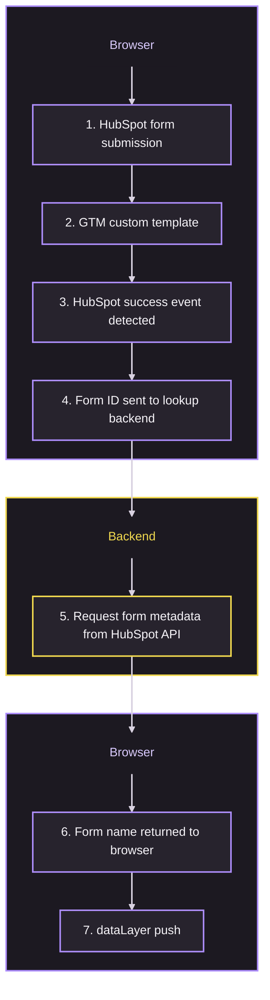

HubSpot form tracking in Google Tag Manager usually ends in one of two bad places: events that carry only a form ID, or a hand-maintained list of form IDs and names inside a GTM variable that nobody updates.

This template does neither. HubSpot stays the source of truth for the form name, a small backend service looks the name up with a server-side credential, and GTM receives an analytics-friendly event.

By default, a submission produces the HubSpot form name exactly as it is stored:

```javascript
{
  event: "hubspot_form_success",
  hubspot_form_id: "135222a8-a170-416f-8f4e-91330645d86a",
  hubspot_form_name: "Support : Return or Refund | Start a Return",
  hubspot_form_instance_id: "70c1f954-c923-484c-a3dc-0712421cb5e4"
}
```

If your form names follow a `Category : Type | Name` convention, one optional setting turns that single string into three reporting dimensions:

```javascript
{
  event: "hubspot_form_success",
  hubspot_form_id: "135222a8-a170-416f-8f4e-91330645d86a",
  hubspot_form_category: "Support",
  hubspot_form_type: "Return or Refund",
  hubspot_form_name: "Start a Return",
  hubspot_form_instance_id: "70c1f954-c923-484c-a3dc-0712421cb5e4"
}
```

## How it works



Three parts do the work:

1. **A GTM custom template** that loads the tracker and holds the configuration.
2. **A backend service** that keeps the HubSpot token server-side, resolves form IDs to form names, caches the result and serves the tracker script.
3. **The browser tracker** that listens for HubSpot form events, combines the event data with the form metadata and pushes one clean event.

Splitting the tracking logic out of the GTM template means a fix to HubSpot event handling is a backend deploy, not a rebuild of every tag using the template.

## What the backend exposes

| Endpoint | Purpose |
| --- | --- |
| `/` | Health check. Returns service status and tracker version. |
| `/form?id=HUBSPOT_FORM_ID` | Returns `{ "id": "...", "name": "..." }` for one form. |
| `/hubspot-form-tracker.js` | Serves the browser tracker, generated from the GTM template's settings. |

The browser only ever knows the public backend URL. The HubSpot access token stays on the server.

A health check response looks like:

```json
{
  "status": "ok",
  "service": "HubSpot Form Lookup",
  "trackerVersion": "1"
}
```

A metadata lookup returns only what tracking needs, not the full HubSpot form object:

```json
{
  "id": "135222a8-a170-416f-8f4e-91330645d86a",
  "name": "Support : Return or Refund | Start a Return"
}
```

## Before you begin

You need:

- A HubSpot private app token with access to forms
- Publish rights in the Google Tag Manager container
- A hostname you control for the backend, for example `forms-api.example.com`
- Either a Cloudflare account or a PHP host, depending on the choice in Step 1

> **Note:** The form name is not secret, but the HubSpot token is. Never call the HubSpot API directly from the browser and never paste the token into a GTM variable or template field.

## Step 1 - Choose the backend

<fieldset class="hubspot-backend-picker">
  <legend>Lookup backend</legend>
  <p>Where will the HubSpot lookup service run?</p>
  <label class="form-choice" for="hubspot-backend-worker">
    <input
      id="hubspot-backend-worker"
      name="hubspot-backend"
      type="radio"
      value="worker"
      aria-controls="hubspot-backend-worker-steps"
      checked
    >
    <span><strong>Cloudflare Worker.</strong> No server to maintain, built-in caching, secrets stored in Cloudflare.</span>
  </label>
  <label class="form-choice" for="hubspot-backend-php">
    <input
      id="hubspot-backend-php"
      name="hubspot-backend"
      type="radio"
      value="php"
      aria-controls="hubspot-backend-php-steps"
    >
    <span><strong>PHP endpoint.</strong> Runs on the web hosting you already have, no new platform in the stack.</span>
  </label>
</fieldset>

Both options expose the same three endpoints and the same JSON, so the GTM template and the tracker are identical either way. Pick whichever your team can deploy and monitor. If the site already sits behind Cloudflare, the Worker is usually less work.

<section id="hubspot-backend-worker-steps">

### Deploy the Cloudflare Worker

1. Create a new Worker in the Cloudflare dashboard, or run `npx wrangler init hubspot-form-lookup`.
2. Replace the Worker source with the code below.
3. Add the secret and the environment variable described under *Worker configuration*.
4. Map the Worker to a route such as `forms-api.example.com/*`.

<div class="code-accordion" data-code-accordion>
<div class="code-accordion__content" id="hubspot-worker-script" data-code-accordion-content>

```javascript
const HUBSPOT_FORMS_API_VERSION = "2026-09-beta";
const CACHE_TTL_SECONDS = 86400; // 24 hours
const NOT_FOUND_TTL_SECONDS = 300; // unknown IDs stop reaching HubSpot for 5 minutes
const TRACKER_VERSION = "1";

export default {
  async fetch(request, env, ctx) {
    const url = new URL(request.url);
    const origin = request.headers.get("Origin");

    /*
     * -------------------------------------------------------
     * ALLOWED ORIGINS
     * -------------------------------------------------------
     */

    const allowedOrigins = (env.ALLOWED_ORIGINS || "")
      .split(",")
      .map((value) => value.trim())
      .filter(Boolean);

    const originAllowed =
      allowedOrigins.length === 0 ||
      !origin ||
      allowedOrigins.includes(origin);

    if (!originAllowed) {
      return jsonResponse(
        {
          error: "Origin not allowed"
        },
        403,
        origin
      );
    }

    /*
     * -------------------------------------------------------
     * CORS PREFLIGHT
     * -------------------------------------------------------
     */

    if (request.method === "OPTIONS") {
      return new Response(null, {
        status: 204,
        headers: corsHeaders(origin)
      });
    }

    /*
     * -------------------------------------------------------
     * ONLY GET REQUESTS
     * -------------------------------------------------------
     */

    if (request.method !== "GET") {
      return jsonResponse(
        {
          error: "Method not allowed"
        },
        405,
        origin,
        {
          Allow: "GET, OPTIONS"
        }
      );
    }

    /*
     * -------------------------------------------------------
     * TRACKER SCRIPT
     * -------------------------------------------------------
     */

    if (url.pathname === "/hubspot-form-tracker.js") {
      /*
       * -----------------------------------------------------
       * EVENT NAME
       * -----------------------------------------------------
       */

      const requestedEventName =
        url.searchParams.get("event") ||
        "hubspot_form_success";

      const eventName =
        validateEventName(requestedEventName)
          ? requestedEventName
          : "hubspot_form_success";

      /*
       * -----------------------------------------------------
       * DATALAYER OUTPUT CONFIGURATION
       * -----------------------------------------------------
       */

      const customizeDataLayerSettings =
        url.searchParams.get(
          "customizeDataLayerSettings"
        ) === "1";

      /*
       * Default parameter names.
       */

      const DEFAULT_FORM_ID_PARAMETER =
        "hubspot_form_id";

      const DEFAULT_FORM_CATEGORY_PARAMETER =
        "hubspot_form_category";

      const DEFAULT_FORM_TYPE_PARAMETER =
        "hubspot_form_type";

      const DEFAULT_FORM_NAME_PARAMETER =
        "hubspot_form_name";

      const DEFAULT_INSTANCE_ID_PARAMETER =
        "hubspot_form_instance_id";

      /*
       * Optional structured HubSpot form naming convention:
       *
       * Category : Type | Name
       */

      const DEFAULT_FORM_CATEGORY_SEPARATOR =
        ":";

      const DEFAULT_FORM_NAME_SEPARATOR =
        "|";

      /*
       * -----------------------------------------------------
       * FORM ID PARAMETER
       * -----------------------------------------------------
       */

      let formIdParameter =
        DEFAULT_FORM_ID_PARAMETER;

      if (customizeDataLayerSettings) {
        formIdParameter =
          getSafeParameterName(
            url.searchParams.get(
              "formIdParameter"
            ),
            DEFAULT_FORM_ID_PARAMETER
          );
      }

      /*
       * -----------------------------------------------------
       * FORM CATEGORY PARAMETER
       * -----------------------------------------------------
       */

      let formCategoryParameter =
        DEFAULT_FORM_CATEGORY_PARAMETER;

      if (customizeDataLayerSettings) {
        formCategoryParameter =
          getSafeParameterName(
            url.searchParams.get(
              "formCategoryParameter"
            ),
            DEFAULT_FORM_CATEGORY_PARAMETER
          );
      }

      /*
       * -----------------------------------------------------
       * FORM TYPE PARAMETER
       * -----------------------------------------------------
       */

      let formTypeParameter =
        DEFAULT_FORM_TYPE_PARAMETER;

      if (customizeDataLayerSettings) {
        formTypeParameter =
          getSafeParameterName(
            url.searchParams.get(
              "formTypeParameter"
            ),
            DEFAULT_FORM_TYPE_PARAMETER
          );
      }

      /*
       * -----------------------------------------------------
       * FORM NAME PARAMETER
       * -----------------------------------------------------
       */

      let formNameParameter =
        DEFAULT_FORM_NAME_PARAMETER;

      if (customizeDataLayerSettings) {
        formNameParameter =
          getSafeParameterName(
            url.searchParams.get(
              "formNameParameter"
            ),
            DEFAULT_FORM_NAME_PARAMETER
          );
      }

      /*
       * -----------------------------------------------------
       * INSTANCE ID PARAMETER
       * -----------------------------------------------------
       */

      let instanceIdParameter =
        DEFAULT_INSTANCE_ID_PARAMETER;

      if (customizeDataLayerSettings) {
        instanceIdParameter =
          getSafeParameterName(
            url.searchParams.get(
              "instanceIdParameter"
            ),
            DEFAULT_INSTANCE_ID_PARAMETER
          );
      }

      /*
       * -----------------------------------------------------
       * STRUCTURED FORM NAME
       * -----------------------------------------------------
       *
       * Disabled by default.
       *
       * Default behavior:
       *
       * hubspot_form_name contains the complete HubSpot
       * form name.
       *
       * When splitFormName=1, the expected naming format is:
       *
       * Category : Type | Name
       *
       * Example:
       *
       * Support : Return or Refund | Start a Return
       */

      let splitFormName = false;

      const requestedSplitFormName =
        url.searchParams.get(
          "splitFormName"
        );

      /*
       * Temporary backwards compatibility with the previous
       * template parameter.
       */

      const legacyIncludeFormType =
        url.searchParams.get(
          "includeFormType"
        );

      if (
        requestedSplitFormName !== null
      ) {
        splitFormName =
          requestedSplitFormName === "1";
      } else if (
        customizeDataLayerSettings &&
        legacyIncludeFormType !== null
      ) {
        splitFormName =
          legacyIncludeFormType === "1";
      }

      /*
       * -----------------------------------------------------
       * CATEGORY / TYPE SEPARATOR
       * -----------------------------------------------------
       */

      let formCategorySeparator =
        DEFAULT_FORM_CATEGORY_SEPARATOR;

      if (
        customizeDataLayerSettings &&
        splitFormName
      ) {
        formCategorySeparator =
          getSafeSeparator(
            url.searchParams.get(
              "formCategorySeparator"
            ),
            DEFAULT_FORM_CATEGORY_SEPARATOR
          );
      }

      /*
       * -----------------------------------------------------
       * TYPE / NAME SEPARATOR
       * -----------------------------------------------------
       */

      let formNameSeparator =
        DEFAULT_FORM_NAME_SEPARATOR;

      if (
        customizeDataLayerSettings &&
        splitFormName
      ) {
        formNameSeparator =
          getSafeSeparator(
            url.searchParams.get(
              "formNameSeparator"
            ),
            DEFAULT_FORM_NAME_SEPARATOR
          );
      }

      /*
       * -----------------------------------------------------
       * TRACKER CONFIGURATION
       * -----------------------------------------------------
       */

      const endpoint =
        url.origin;

      const trackerKey = [
        TRACKER_VERSION,
        eventName,
        formIdParameter,
        formCategoryParameter,
        formTypeParameter,
        formNameParameter,
        instanceIdParameter,
        splitFormName
          ? "split"
          : "no-split",
        formCategorySeparator,
        formNameSeparator
      ].join("|");

      /*
       * -----------------------------------------------------
       * BROWSER TRACKER
       * -----------------------------------------------------
       */

      const script = `
(function() {
  window.dataLayer =
    window.dataLayer || [];

  window.__hubspotFormTracking =
    window.__hubspotFormTracking || {};

  var eventName =
    ${JSON.stringify(eventName)};

  var endpoint =
    ${JSON.stringify(endpoint)};

  var trackerVersion =
    ${JSON.stringify(TRACKER_VERSION)};

  var trackerKey =
    ${JSON.stringify(trackerKey)};

  /*
   * dataLayer parameter configuration.
   */

  var formIdParameter =
    ${JSON.stringify(formIdParameter)};

  var formCategoryParameter =
    ${JSON.stringify(formCategoryParameter)};

  var formTypeParameter =
    ${JSON.stringify(formTypeParameter)};

  var formNameParameter =
    ${JSON.stringify(formNameParameter)};

  var instanceIdParameter =
    ${JSON.stringify(instanceIdParameter)};

  var splitFormName =
    ${JSON.stringify(splitFormName)};

  var formCategorySeparator =
    ${JSON.stringify(formCategorySeparator)};

  var formNameSeparator =
    ${JSON.stringify(formNameSeparator)};


  /*
   * -------------------------------------------------------
   * PREVENT DUPLICATE TRACKER INSTALLATION
   * -------------------------------------------------------
   */

  if (
    window.__hubspotFormTracking[
      trackerKey
    ]
  ) {
    return;
  }

  window.__hubspotFormTracking[
    trackerKey
  ] = trackerVersion;


  /*
   * -------------------------------------------------------
   * FORM NAME CACHE
   * -------------------------------------------------------
   */

  var formNames = {};

  var formNamePromises = {};


  /*
   * -------------------------------------------------------
   * SUBMISSION STATE
   * -------------------------------------------------------
   */

  var recentSubmissions = {};

  var pendingSubmissions = {};

  var DUPLICATE_WINDOW_MS =
    2000;

  var SUBMISSION_MERGE_WINDOW_MS =
    250;


  /*
   * -------------------------------------------------------
   * LOOK UP HUBSPOT FORM NAME
   * -------------------------------------------------------
   */

  function lookupFormName(formId) {
    if (!formId) {
      return Promise.resolve(null);
    }

    /*
     * Already resolved.
     */

    if (formNames[formId]) {
      return Promise.resolve(
        formNames[formId]
      );
    }

    /*
     * Lookup already running.
     */

    if (formNamePromises[formId]) {
      return formNamePromises[formId];
    }

    var lookupPromise = fetch(
      endpoint +
        "/form?id=" +
        encodeURIComponent(formId),
      {
        method: "GET",
        credentials: "omit",
        keepalive: true
      }
    )
      .then(function(response) {
        if (!response.ok) {
          throw new Error(
            "HubSpot form lookup failed: " +
              response.status
          );
        }

        return response.json();
      })

      .then(function(data) {
        if (
          !data ||
          !data.name
        ) {
          return null;
        }

        formNames[formId] =
          data.name;

        return data.name;
      })

      .catch(function(error) {
        console.warn(
          "HubSpot form name lookup failed:",
          error
        );

        return null;
      })

      .then(function(name) {
        delete formNamePromises[
          formId
        ];

        return name;
      });

    formNamePromises[formId] =
      lookupPromise;

    return lookupPromise;
  }


  /*
   * -------------------------------------------------------
   * PRELOAD FORM NAME
   * -------------------------------------------------------
   */

  function preloadFormName(formId) {
    if (!formId) {
      return;
    }

    lookupFormName(formId);
  }


  /*
   * -------------------------------------------------------
   * PARSE HUBSPOT FORM NAME
   * -------------------------------------------------------
   *
   * Parsing only happens when splitFormName is enabled.
   *
   * Expected format:
   *
   * Category : Type | Name
   *
   * Example:
   *
   * Support : Return or Refund | Start a Return
   *
   * becomes:
   *
   * category = Support
   * type     = Return or Refund
   * name     = Start a Return
   *
   * If splitting is disabled, the complete HubSpot form
   * name stays in the name property.
   *
   * If splitting is enabled but the expected separators or
   * values are missing, the complete HubSpot form name is
   * also kept as the name.
   */

  function parseFormName(fullFormName) {
    var result = {
      category: null,
      type: null,
      name: fullFormName || null
    };

    if (
      !splitFormName ||
      !fullFormName ||
      !formCategorySeparator ||
      !formNameSeparator
    ) {
      return result;
    }

    /*
     * Find the category / type separator.
     */

    var categorySeparatorIndex =
      fullFormName.indexOf(
        formCategorySeparator
      );

    if (
      categorySeparatorIndex === -1
    ) {
      return result;
    }

    /*
     * Everything after the category separator.
     */

    var remainingName =
      fullFormName.substring(
        categorySeparatorIndex +
          formCategorySeparator.length
      );

    /*
     * Find the type / name separator.
     */

    var nameSeparatorIndex =
      remainingName.indexOf(
        formNameSeparator
      );

    if (
      nameSeparatorIndex === -1
    ) {
      return result;
    }

    var category =
      fullFormName
        .substring(
          0,
          categorySeparatorIndex
        )
        .trim();

    var type =
      remainingName
        .substring(
          0,
          nameSeparatorIndex
        )
        .trim();

    var cleanName =
      remainingName
        .substring(
          nameSeparatorIndex +
            formNameSeparator.length
        )
        .trim();

    /*
     * Only use structured values when all three
     * parts contain a value.
     */

    if (
      !category ||
      !type ||
      !cleanName
    ) {
      return result;
    }

    result.category =
      category;

    result.type =
      type;

    result.name =
      cleanName;

    return result;
  }


  /*
   * -------------------------------------------------------
   * RECENT SUBMISSION CHECK
   * -------------------------------------------------------
   */

  function isRecentSubmission(
    formId
  ) {
    if (!formId) {
      return false;
    }

    var previous =
      recentSubmissions[
        formId
      ];

    if (!previous) {
      return false;
    }

    return (
      Date.now() - previous <
      DUPLICATE_WINDOW_MS
    );
  }


  /*
   * -------------------------------------------------------
   * FINAL DATALAYER PUSH
   * -------------------------------------------------------
   */

  function pushSubmission(
    formId,
    instanceId,
    fullFormName
  ) {
    if (!formId) {
      return;
    }

    if (
      isRecentSubmission(formId)
    ) {
      return;
    }

    recentSubmissions[
      formId
    ] = Date.now();

    setTimeout(
      function() {
        delete recentSubmissions[
          formId
        ];
      },
      DUPLICATE_WINDOW_MS
    );

    var parsedForm =
      parseFormName(
        fullFormName
      );

    var output = {
      event: eventName
    };

    /*
     * Form ID.
     */

    if (formId) {
      output[
        formIdParameter
      ] = formId;
    }

    /*
     * Optional form category.
     */

    if (parsedForm.category) {
      output[
        formCategoryParameter
      ] = parsedForm.category;
    }

    /*
     * Optional form type.
     */

    if (parsedForm.type) {
      output[
        formTypeParameter
      ] = parsedForm.type;
    }

    /*
     * Form name.
     *
     * Default:
     * complete HubSpot form name.
     *
     * When splitting succeeds:
     * only the name section.
     */

    if (parsedForm.name) {
      output[
        formNameParameter
      ] = parsedForm.name;
    }

    /*
     * Instance ID.
     */

    if (instanceId) {
      output[
        instanceIdParameter
      ] = instanceId;
    }

    window.dataLayer.push(
      output
    );
  }


  /*
   * -------------------------------------------------------
   * MERGE SUCCESS EVENTS
   * -------------------------------------------------------
   */

  function queueSubmission(
    formId,
    instanceId,
    fullFormName
  ) {
    if (!formId) {
      return;
    }

    if (
      isRecentSubmission(formId)
    ) {
      return;
    }

    var pending =
      pendingSubmissions[
        formId
      ];

    if (!pending) {
      pending = {
        formId: formId,
        instanceId: null,
        formName: null,
        timer: null
      };

      pendingSubmissions[
        formId
      ] = pending;
    }

    /*
     * Keep the richest metadata received.
     */

    if (instanceId) {
      pending.instanceId =
        instanceId;
    }

    if (fullFormName) {
      pending.formName =
        fullFormName;
    }

    /*
     * Push immediately once both the form name and
     * instance ID are available.
     */

    if (
      pending.instanceId &&
      pending.formName
    ) {
      flushSubmission(
        formId
      );

      return;
    }

    /*
     * Wait briefly for another HubSpot event to provide
     * missing metadata.
     */

    if (!pending.timer) {
      pending.timer =
        setTimeout(
          function() {
            flushSubmission(
              formId
            );
          },
          SUBMISSION_MERGE_WINDOW_MS
        );
    }
  }


  /*
   * -------------------------------------------------------
   * FLUSH MERGED SUBMISSION
   * -------------------------------------------------------
   */

  function flushSubmission(
    formId
  ) {
    var pending =
      pendingSubmissions[
        formId
      ];

    if (!pending) {
      return;
    }

    if (pending.timer) {
      clearTimeout(
        pending.timer
      );
    }

    delete pendingSubmissions[
      formId
    ];

    pushSubmission(
      pending.formId,
      pending.instanceId,
      pending.formName
    );
  }


  /*
   * -------------------------------------------------------
   * NEW HUBSPOT FORMS
   * -------------------------------------------------------
   */

  window.addEventListener(
    "hs-form-event:on-ready",
    function(event) {
      if (
        !event ||
        !event.detail ||
        !event.detail.formId
      ) {
        return;
      }

      preloadFormName(
        event.detail.formId
      );
    }
  );


  /*
   * Successful submission.
   */

  window.addEventListener(
    "hs-form-event:on-submission:success",
    function(event) {
      if (
        !event ||
        !event.detail ||
        !event.detail.formId
      ) {
        return;
      }

      var formId =
        event.detail.formId;

      var instanceId =
        event.detail.instanceId ||
        undefined;

      var formName =
        formNames[formId];

      if (formName) {
        queueSubmission(
          formId,
          instanceId,
          formName
        );

        return;
      }

      lookupFormName(formId)
        .then(function(name) {
          queueSubmission(
            formId,
            instanceId,
            name
          );
        });
    }
  );


  /*
   * -------------------------------------------------------
   * LEGACY HUBSPOT FORMS
   * -------------------------------------------------------
   */

  window.addEventListener(
    "message",
    function(event) {
      if (
        !event ||
        !event.data ||
        event.data.type !==
          "hsFormCallback"
      ) {
        return;
      }

      var formId =
        event.data.id;

      if (!formId) {
        return;
      }

      /*
       * Preload metadata before submission.
       */

      if (
        event.data.eventName ===
          "onFormReady" ||
        event.data.eventName ===
          "onFormSubmit" ||
        event.data.eventName ===
          "onBeforeFormSubmit"
      ) {
        preloadFormName(
          formId
        );

        return;
      }

      /*
       * Only completed submissions are tracked.
       */

      if (
        event.data.eventName !==
          "onFormSubmitted"
      ) {
        return;
      }

      var instanceId =
        event.data.instanceId ||
        undefined;

      var formName =
        formNames[formId];

      if (formName) {
        queueSubmission(
          formId,
          instanceId,
          formName
        );

        return;
      }

      lookupFormName(formId)
        .then(function(name) {
          queueSubmission(
            formId,
            instanceId,
            name
          );
        });
    }
  );

})();
`;

      return new Response(
        script,
        {
          status: 200,

          headers: {
            "Content-Type":
              "application/javascript; charset=UTF-8",

            "Cache-Control":
              "no-cache",

            "X-Content-Type-Options":
              "nosniff",

            "Cross-Origin-Resource-Policy":
              "cross-origin"
          }
        }
      );
    }


    /*
     * -------------------------------------------------------
     * HEALTH CHECK
     * -------------------------------------------------------
     */

    if (url.pathname === "/") {
      return jsonResponse(
        {
          status: "ok",

          service:
            "HubSpot Form Lookup",

          trackerVersion:
            TRACKER_VERSION,

          defaults: {
            event:
              "hubspot_form_success",

            formIdParameter:
              "hubspot_form_id",

            formNameParameter:
              "hubspot_form_name",

            instanceIdParameter:
              "hubspot_form_instance_id",

            splitFormName:
              false,

            formCategoryParameter:
              "hubspot_form_category",

            formTypeParameter:
              "hubspot_form_type",

            formCategorySeparator:
              ":",

            formNameSeparator:
              "|"
          },

          optionalNamingConvention:
            "Category : Type | Name",

          endpoints: {
            form:
              "/form?id=HUBSPOT_FORM_ID",

            tracker:
              "/hubspot-form-tracker.js?v=" +
              TRACKER_VERSION +
              "&event=hubspot_form_success"
          }
        },
        200,
        origin
      );
    }


    /*
     * -------------------------------------------------------
     * FORM LOOKUP ENDPOINT
     * -------------------------------------------------------
     */

    if (url.pathname !== "/form") {
      return jsonResponse(
        {
          error: "Not found"
        },
        404,
        origin
      );
    }


    /*
     * -------------------------------------------------------
     * GET FORM ID
     * -------------------------------------------------------
     */

    const formId =
      url.searchParams.get("id");

    if (!formId) {
      return jsonResponse(
        {
          error: "Missing form ID"
        },
        400,
        origin
      );
    }

    /*
     * HubSpot form IDs are UUIDs. Validating the shape keeps
     * anything else out of the HubSpot API path.
     */

    if (!validateFormId(formId)) {
      return jsonResponse(
        {
          error: "Invalid form ID"
        },
        400,
        origin
      );
    }


    /*
     * -------------------------------------------------------
     * HUBSPOT TOKEN
     * -------------------------------------------------------
     */

    if (!env.HUBSPOT_TOKEN) {
      return jsonResponse(
        {
          error:
            "HubSpot token is not configured"
        },
        500,
        origin
      );
    }


    /*
     * -------------------------------------------------------
     * CLOUDFLARE CACHE
     * -------------------------------------------------------
     */

    const cache =
      caches.default;

    const cacheUrl =
      new URL(request.url);

    cacheUrl.pathname =
      "/__hubspot_form_cache/" +
      encodeURIComponent(formId);

    cacheUrl.search = "";

    const cacheKey =
      new Request(
        cacheUrl.toString(),
        {
          method: "GET"
        }
      );

    const cachedResponse =
      await cache.match(
        cacheKey
      );

    if (cachedResponse) {
      const cachedData =
        await cachedResponse.json();

      if (cachedData.notFound) {
        return jsonResponse(
          {
            error:
              "HubSpot form not found",

            id: formId
          },
          404,
          origin,
          {
            "X-HubSpot-Form-Cache":
              "HIT"
          }
        );
      }

      return jsonResponse(
        cachedData,
        200,
        origin,
        {
          "Cache-Control":
            "public, max-age=3600",

          "X-HubSpot-Form-Cache":
            "HIT"
        }
      );
    }


    /*
     * -------------------------------------------------------
     * RATE LIMIT
     * -------------------------------------------------------
     * Only cache misses reach HubSpot, so only they are limited.
     * Optional: bind FORM_LOOKUP_LIMITER in wrangler.toml.
     */

    if (env.FORM_LOOKUP_LIMITER) {
      const { success } =
        await env.FORM_LOOKUP_LIMITER.limit({
          key:
            request.headers.get("CF-Connecting-IP") ||
            "unknown"
        });

      if (!success) {
        return jsonResponse(
          {
            error:
              "Too many form lookups"
          },
          429,
          origin,
          {
            "Retry-After": "60"
          }
        );
      }
    }


    /*
     * -------------------------------------------------------
     * HUBSPOT API REQUEST
     * -------------------------------------------------------
     */

    const hubspotUrl =
      "https://api.hubapi.com/marketing/forms/" +
      HUBSPOT_FORMS_API_VERSION +
      "/" +
      encodeURIComponent(formId);

    let hubspotResponse;

    try {
      hubspotResponse =
        await fetch(
          hubspotUrl,
          {
            method: "GET",

            headers: {
              Authorization:
                "Bearer " +
                env.HUBSPOT_TOKEN,

              Accept:
                "application/json"
            }
          }
        );
    } catch (error) {
      console.error(
        "HubSpot request failed:",
        error
      );

      return jsonResponse(
        {
          error:
            "HubSpot request failed"
        },
        502,
        origin
      );
    }


    /*
     * -------------------------------------------------------
     * HUBSPOT ERRORS
     * -------------------------------------------------------
     */

    if (!hubspotResponse.ok) {
      console.error(
        "HubSpot API error:",
        hubspotResponse.status
      );

      if (
        hubspotResponse.status ===
          404
      ) {
        ctx.waitUntil(
          cache.put(
            cacheKey,
            new Response(
              JSON.stringify({
                notFound: true
              }),
              {
                headers: {
                  "Content-Type":
                    "application/json; charset=UTF-8",

                  "Cache-Control":
                    "public, max-age=" +
                    NOT_FOUND_TTL_SECONDS
                }
              }
            )
          )
        );

        return jsonResponse(
          {
            error:
              "HubSpot form not found",

            id: formId
          },
          404,
          origin
        );
      }

      if (
        hubspotResponse.status ===
          401 ||
        hubspotResponse.status ===
          403
      ) {
        return jsonResponse(
          {
            error:
              "HubSpot authentication or permission error"
          },
          502,
          origin
        );
      }

      if (
        hubspotResponse.status ===
          429
      ) {
        return jsonResponse(
          {
            error:
              "HubSpot rate limit reached"
          },
          503,
          origin
        );
      }

      return jsonResponse(
        {
          error:
            "HubSpot API request failed",

          status:
            hubspotResponse.status
        },
        502,
        origin
      );
    }


    /*
     * -------------------------------------------------------
     * PARSE HUBSPOT RESPONSE
     * -------------------------------------------------------
     */

    let form;

    try {
      form =
        await hubspotResponse.json();
    } catch (error) {
      return jsonResponse(
        {
          error:
            "Invalid response from HubSpot"
        },
        502,
        origin
      );
    }

    if (
      !form.id ||
      !form.name
    ) {
      return jsonResponse(
        {
          error:
            "HubSpot response did not contain form metadata"
        },
        502,
        origin
      );
    }


    /*
     * -------------------------------------------------------
     * ONLY RETURN TRACKING METADATA
     * -------------------------------------------------------
     */

    const result = {
      id: form.id,
      name: form.name
    };


    /*
     * -------------------------------------------------------
     * CACHE RESULT
     * -------------------------------------------------------
     */

    const responseToCache =
      new Response(
        JSON.stringify(result),
        {
          status: 200,

          headers: {
            "Content-Type":
              "application/json; charset=UTF-8",

            "Cache-Control":
              "public, max-age=" +
              CACHE_TTL_SECONDS
          }
        }
      );

    ctx.waitUntil(
      cache.put(
        cacheKey,
        responseToCache
      )
    );


    /*
     * -------------------------------------------------------
     * RETURN FORM METADATA
     * -------------------------------------------------------
     */

    return jsonResponse(
      result,
      200,
      origin,
      {
        "Cache-Control":
          "public, max-age=3600",

        "X-HubSpot-Form-Cache":
          "MISS"
      }
    );
  }
};


/*
 * ---------------------------------------------------------
 * FORM ID VALIDATION
 * ---------------------------------------------------------
 */

function validateFormId(value) {
  // HubSpot form IDs are UUIDs. Anything else is rejected
  // before it can cost a HubSpot API call.
  return /^[0-9a-f]{8}-[0-9a-f]{4}-[0-9a-f]{4}-[0-9a-f]{4}-[0-9a-f]{12}$/i.test(
    value || ""
  );
}


/*
 * ---------------------------------------------------------
 * EVENT NAME VALIDATION
 * ---------------------------------------------------------
 */

function validateEventName(value) {
  if (
    !value ||
    value.length > 100
  ) {
    return false;
  }

  for (
    let i = 0;
    i < value.length;
    i++
  ) {
    const character =
      value.charAt(i);

    const valid =
      (
        character >= "a" &&
        character <= "z"
      ) ||
      (
        character >= "A" &&
        character <= "Z"
      ) ||
      (
        character >= "0" &&
        character <= "9"
      ) ||
      character === "_" ||
      character === "-" ||
      character === ".";

    if (!valid) {
      return false;
    }
  }

  return true;
}


/*
 * ---------------------------------------------------------
 * PARAMETER NAME VALIDATION
 * ---------------------------------------------------------
 */

function validateParameterName(
  value
) {
  if (
    !value ||
    value.length > 100 ||
    value === "event"
  ) {
    return false;
  }

  for (
    let i = 0;
    i < value.length;
    i++
  ) {
    const character =
      value.charAt(i);

    const valid =
      (
        character >= "a" &&
        character <= "z"
      ) ||
      (
        character >= "A" &&
        character <= "Z"
      ) ||
      (
        character >= "0" &&
        character <= "9"
      ) ||
      character === "_" ||
      character === "-" ||
      character === ".";

    if (!valid) {
      return false;
    }
  }

  return true;
}


function getSafeParameterName(
  requestedValue,
  fallbackValue
) {
  if (
    validateParameterName(
      requestedValue
    )
  ) {
    return requestedValue;
  }

  return fallbackValue;
}


/*
 * ---------------------------------------------------------
 * SEPARATOR VALIDATION
 * ---------------------------------------------------------
 */

function getSafeSeparator(
  requestedValue,
  fallbackValue
) {
  if (
    !requestedValue ||
    requestedValue.length > 50
  ) {
    return fallbackValue;
  }

  return requestedValue;
}


/*
 * ---------------------------------------------------------
 * JSON RESPONSE
 * ---------------------------------------------------------
 */

function jsonResponse(
  data,
  status,
  origin,
  additionalHeaders = {}
) {
  return new Response(
    JSON.stringify(
      data,
      null,
      2
    ),
    {
      status,

      headers: {
        "Content-Type":
          "application/json; charset=UTF-8",

        ...corsHeaders(origin),

        ...additionalHeaders
      }
    }
  );
}


/*
 * ---------------------------------------------------------
 * CORS
 * ---------------------------------------------------------
 */

function corsHeaders(origin) {
  return {
    "Access-Control-Allow-Origin":
      origin || "*",

    "Access-Control-Allow-Methods":
      "GET, OPTIONS",

    "Access-Control-Allow-Headers":
      "Content-Type",

    "Vary":
      "Origin"
  };
}
```

</div>
<button class="code-accordion__toggle" type="button" aria-expanded="false" aria-controls="hubspot-worker-script" data-code-accordion-toggle data-collapsed-label="Show complete Worker code" data-expanded-label="Hide complete Worker code">Show complete Worker code</button>
</div>

#### Worker configuration

<table class="worker-configuration">
  <colgroup>
    <col style="width: 23%">
    <col style="width: 13%">
    <col style="width: 36%">
    <col style="width: 28%">
  </colgroup>
  <thead>
    <tr>
      <th scope="col">Name</th>
      <th scope="col">Type</th>
      <th scope="col">Example</th>
      <th scope="col">Purpose</th>
    </tr>
  </thead>
  <tbody>
    <tr>
      <td><span class="worker-configuration__label" aria-hidden="true">Name</span><code>HUBSPOT_TOKEN</code></td>
      <td><span class="worker-configuration__label" aria-hidden="true">Type</span>Secret</td>
      <td><span class="worker-configuration__label" aria-hidden="true">Example</span><code>pat-eu1-...</code></td>
      <td><span class="worker-configuration__label" aria-hidden="true">Purpose</span>HubSpot private app token with forms access. Never hardcode it in the source.</td>
    </tr>
    <tr>
      <td><span class="worker-configuration__label" aria-hidden="true">Name</span><code>ALLOWED_ORIGINS</code></td>
      <td><span class="worker-configuration__label" aria-hidden="true">Type</span>Variable</td>
      <td><span class="worker-configuration__label" aria-hidden="true">Example</span><code>https://www.example.com,<wbr>https://example.com</code></td>
      <td><span class="worker-configuration__label" aria-hidden="true">Purpose</span>Comma-separated list of browser origins allowed to call the endpoints.</td>
    </tr>
  </tbody>
</table>

Add the token as a secret, not a plain variable:

<div data-copy>

```bash
npx wrangler secret put HUBSPOT_TOKEN
```

</div>

The Worker parses the origin list and rejects requests from anywhere else:

```javascript
const allowedOrigins = (env.ALLOWED_ORIGINS || "")
  .split(",")
  .map((value) => value.trim())
  .filter(Boolean);
```

The origin check is a restriction on a public endpoint, not the thing protecting the token. The token is protected because it never leaves the Worker.

#### Rate limiting

Anyone can call `/form`, and every lookup that misses the cache spends one request from your HubSpot API limit. That daily limit is shared with every other private app in the account, so a flood of lookups could slow down your CRM integrations too. The Worker protects that budget in three ways: it accepts only UUID-shaped form IDs, it caches "form not found" answers for five minutes, and it can limit cache misses per visitor IP. Turn on the limit by adding a rate limiting binding to `wrangler.toml`:

```toml
[[ratelimits]]
name = "FORM_LOOKUP_LIMITER"
namespace_id = "1001"

  [ratelimits.simple]
  limit = 30
  period = 60
```

Without the binding the Worker still runs, just without the per-IP limit. A Cloudflare WAF rate limiting rule on `/form` does the same job if you prefer to manage it in the dashboard.

#### Caching

Form metadata is cached in the Cloudflare cache for 24 hours, keyed by form ID:

```javascript
const CACHE_TTL_SECONDS = 86400;

cacheUrl.pathname =
  "/__hubspot_form_cache/" +
  encodeURIComponent(formId);
```

First lookup for a form:

```text
Browser → Worker → HubSpot API → Worker cache → Browser
```

Every lookup after that, until the cache expires:

```text
Browser → Worker cache → Browser
```

The response carries a header so you can see which happened:

```text
X-HubSpot-Form-Cache: HIT
X-HubSpot-Form-Cache: MISS
```

The tracker script is cached differently. While the implementation is still changing, it is served with `Cache-Control: no-cache` so a fix can ship without inventing a new version number. Tighten that once the tracker is stable.

</section>

<section id="hubspot-backend-php-steps" hidden>

### Deploy the PHP endpoint

1. Point a hostname you control at its own directory, for example `forms-api.example.com`. The endpoint has to sit at the domain root: it routes on the request path, so running it from a subdirectory makes every path a 404.
2. Add the file below as the front controller and rewrite every request to it, including paths that do not exist on disk. On Apache that is a `mod_rewrite` rule; on nginx a `try_files $uri /index.php$is_args$args;`.
3. Set the environment variables under *PHP configuration*. `PUBLIC_BASE_URL` and `HUBSPOT_TOKEN` are both required and the endpoint refuses to work without them.
4. Confirm the host serves the endpoint over HTTPS and that PHP has the cURL extension.

<div class="code-accordion" data-code-accordion>
<div class="code-accordion__content" id="hubspot-php-script" data-code-accordion-content>

```php
<?php

declare(strict_types=1);

/*
 * -------------------------------------------------------
 * CONFIGURATION
 * -------------------------------------------------------
 */

const HUBSPOT_FORMS_API_VERSION = '2026-09-beta';
const CACHE_TTL_SECONDS = 86400; // 24 hours
const NOT_FOUND_TTL_SECONDS = 300; // unknown IDs stop reaching HubSpot for 5 minutes
const HUBSPOT_LOOKUPS_PER_MINUTE = 30; // per client IP, cache misses only
const TRACKER_VERSION = '1';


/*
 * -------------------------------------------------------
 * REQUEST
 * -------------------------------------------------------
 */

$method =
    $_SERVER['REQUEST_METHOD'] ?? 'GET';

$origin =
    $_SERVER['HTTP_ORIGIN'] ?? null;

$path =
    parse_url(
        $_SERVER['REQUEST_URI'] ?? '/',
        PHP_URL_PATH
    ) ?: '/';


/*
 * -------------------------------------------------------
 * ALLOWED ORIGINS
 * -------------------------------------------------------
 *
 * Environment variable example:
 *
 * ALLOWED_ORIGINS=
 * https://www.example.com,https://example.com
 */

$allowedOrigins =
    array_values(
        array_filter(
            array_map(
                'trim',
                explode(
                    ',',
                    readEnvironment(
                        'ALLOWED_ORIGINS'
                    )
                )
            )
        )
    );

$originAllowed =
    count($allowedOrigins) === 0 ||
    !$origin ||
    in_array(
        $origin,
        $allowedOrigins,
        true
    );

if (!$originAllowed) {
    /*
     * A rejected origin is not granted CORS access to the
     * rejection itself.
     */

    sendJson(
        [
            'error' =>
                'Origin not allowed'
        ],
        403,
        null,
        [],
        false
    );
}


/*
 * -------------------------------------------------------
 * CORS PREFLIGHT
 * -------------------------------------------------------
 */

if ($method === 'OPTIONS') {
    http_response_code(204);

    sendCorsHeaders(
        $origin
    );

    exit;
}


/*
 * -------------------------------------------------------
 * ONLY GET REQUESTS
 * -------------------------------------------------------
 */

if ($method !== 'GET') {
    sendJson(
        [
            'error' =>
                'Method not allowed'
        ],
        405,
        $origin,
        [
            'Allow' =>
                'GET, OPTIONS'
        ]
    );
}


/*
 * -------------------------------------------------------
 * TRACKER SCRIPT
 * -------------------------------------------------------
 */

if (
    $path ===
    '/hubspot-form-tracker.js'
) {
    /*
     * Public endpoint.
     *
     * Required. The tracker tells the browser where to send
     * its lookups, so this value is never derived from the
     * request headers.
     */

    $endpoint =
        getPublicBaseUrl();

    if ($endpoint === null) {
        sendJson(
            [
                'error' =>
                    'PUBLIC_BASE_URL is not configured'
            ],
            500,
            $origin
        );
    }


    /*
     * Event name.
     */

    $requestedEventName =
        getQueryParameter(
            'event'
        ) ??
        'hubspot_form_success';

    $eventName =
        validateEventName(
            $requestedEventName
        )
            ? $requestedEventName
            : 'hubspot_form_success';


    /*
     * dataLayer configuration.
     */

    $customizeDataLayerSettings =
        getQueryParameter(
            'customizeDataLayerSettings'
        ) === '1';


    /*
     * Defaults.
     */

    $defaultFormIdParameter =
        'hubspot_form_id';

    $defaultFormCategoryParameter =
        'hubspot_form_category';

    $defaultFormTypeParameter =
        'hubspot_form_type';

    $defaultFormNameParameter =
        'hubspot_form_name';

    $defaultInstanceIdParameter =
        'hubspot_form_instance_id';

    $defaultFormCategorySeparator =
        ':';

    $defaultFormNameSeparator =
        '|';


    /*
     * Form ID parameter.
     */

    $formIdParameter =
        $customizeDataLayerSettings
            ? getSafeParameterName(
                getQueryParameter(
                    'formIdParameter'
                ),
                $defaultFormIdParameter
            )
            : $defaultFormIdParameter;


    /*
     * Form category parameter.
     */

    $formCategoryParameter =
        $customizeDataLayerSettings
            ? getSafeParameterName(
                getQueryParameter(
                    'formCategoryParameter'
                ),
                $defaultFormCategoryParameter
            )
            : $defaultFormCategoryParameter;


    /*
     * Form type parameter.
     */

    $formTypeParameter =
        $customizeDataLayerSettings
            ? getSafeParameterName(
                getQueryParameter(
                    'formTypeParameter'
                ),
                $defaultFormTypeParameter
            )
            : $defaultFormTypeParameter;


    /*
     * Form name parameter.
     */

    $formNameParameter =
        $customizeDataLayerSettings
            ? getSafeParameterName(
                getQueryParameter(
                    'formNameParameter'
                ),
                $defaultFormNameParameter
            )
            : $defaultFormNameParameter;


    /*
     * Instance ID parameter.
     */

    $instanceIdParameter =
        $customizeDataLayerSettings
            ? getSafeParameterName(
                getQueryParameter(
                    'instanceIdParameter'
                ),
                $defaultInstanceIdParameter
            )
            : $defaultInstanceIdParameter;


    /*
     * -------------------------------------------------------
     * FORM NAME SPLITTING
     * -------------------------------------------------------
     *
     * Disabled by default.
     *
     * Optional format:
     *
     * Category : Type | Name
     */

    $splitFormName = false;

    $requestedSplitFormName =
        getQueryParameter(
            'splitFormName'
        );

    /*
     * Backwards compatibility with the old parameter.
     */

    $legacyIncludeFormType =
        getQueryParameter(
            'includeFormType'
        );

    if (
        $requestedSplitFormName !== null
    ) {
        $splitFormName =
            $requestedSplitFormName === '1';
    } elseif (
        $customizeDataLayerSettings &&
        $legacyIncludeFormType !== null
    ) {
        $splitFormName =
            $legacyIncludeFormType === '1';
    }


    /*
     * Category / type separator.
     */

    $formCategorySeparator =
        $defaultFormCategorySeparator;

    if (
        $customizeDataLayerSettings &&
        $splitFormName
    ) {
        $formCategorySeparator =
            getSafeSeparator(
                getQueryParameter(
                    'formCategorySeparator'
                ),
                $defaultFormCategorySeparator
            );
    }


    /*
     * Type / name separator.
     */

    $formNameSeparator =
        $defaultFormNameSeparator;

    if (
        $customizeDataLayerSettings &&
        $splitFormName
    ) {
        $formNameSeparator =
            getSafeSeparator(
                getQueryParameter(
                    'formNameSeparator'
                ),
                $defaultFormNameSeparator
            );
    }


    /*
     * Unique tracker configuration.
     */

    $trackerKey =
        implode(
            '|',
            [
                TRACKER_VERSION,
                $eventName,
                $formIdParameter,
                $formCategoryParameter,
                $formTypeParameter,
                $formNameParameter,
                $instanceIdParameter,
                $splitFormName
                    ? 'split'
                    : 'no-split',
                $formCategorySeparator,
                $formNameSeparator
            ]
        );


    /*
     * Generate browser tracker.
     */

    $script =
        buildTrackerScript(
            $eventName,
            $endpoint,
            $trackerKey,
            $formIdParameter,
            $formCategoryParameter,
            $formTypeParameter,
            $formNameParameter,
            $instanceIdParameter,
            $splitFormName,
            $formCategorySeparator,
            $formNameSeparator
        );


    http_response_code(200);

    header(
        'Content-Type: application/javascript; charset=UTF-8'
    );

    header(
        'Cache-Control: no-cache'
    );

    header(
        'X-Content-Type-Options: nosniff'
    );

    header(
        'Cross-Origin-Resource-Policy: cross-origin'
    );

    echo $script;

    exit;
}


/*
 * -------------------------------------------------------
 * HEALTH CHECK
 * -------------------------------------------------------
 */

if ($path === '/') {
    sendJson(
        [
            'status' =>
                'ok',

            'service' =>
                'HubSpot Form Lookup',

            'trackerVersion' =>
                TRACKER_VERSION,

            'defaults' => [
                'event' =>
                    'hubspot_form_success',

                'formIdParameter' =>
                    'hubspot_form_id',

                'formNameParameter' =>
                    'hubspot_form_name',

                'instanceIdParameter' =>
                    'hubspot_form_instance_id',

                'splitFormName' =>
                    false,

                'formCategoryParameter' =>
                    'hubspot_form_category',

                'formTypeParameter' =>
                    'hubspot_form_type',

                'formCategorySeparator' =>
                    ':',

                'formNameSeparator' =>
                    '|'
            ],

            'optionalNamingConvention' =>
                'Category : Type | Name',

            'endpoints' => [
                'form' =>
                    '/form?id=HUBSPOT_FORM_ID',

                'tracker' =>
                    '/hubspot-form-tracker.js?v=' .
                    TRACKER_VERSION .
                    '&event=hubspot_form_success'
            ]
        ],
        200,
        $origin
    );
}


/*
 * -------------------------------------------------------
 * FORM LOOKUP ENDPOINT
 * -------------------------------------------------------
 */

if ($path !== '/form') {
    sendJson(
        [
            'error' =>
                'Not found'
        ],
        404,
        $origin
    );
}


/*
 * -------------------------------------------------------
 * FORM ID
 * -------------------------------------------------------
 */

$formId =
    getQueryParameter(
        'id'
    );

if (
    $formId === null ||
    $formId === ''
) {
    sendJson(
        [
            'error' =>
                'Missing form ID'
        ],
        400,
        $origin
    );
}

/*
 * HubSpot form IDs are UUIDs. Validating the shape keeps
 * anything else out of the HubSpot API path.
 */

if (
    !validateFormId(
        $formId
    )
) {
    sendJson(
        [
            'error' =>
                'Invalid form ID'
        ],
        400,
        $origin
    );
}


/*
 * -------------------------------------------------------
 * HUBSPOT TOKEN
 * -------------------------------------------------------
 */

$hubspotToken =
    readEnvironment(
        'HUBSPOT_TOKEN'
    );

if ($hubspotToken === '') {
    sendJson(
        [
            'error' =>
                'HubSpot token is not configured'
        ],
        500,
        $origin
    );
}


/*
 * -------------------------------------------------------
 * CACHE
 * -------------------------------------------------------
 */

$cachedData =
    getCachedForm(
        $formId
    );

if (
    $cachedData !== null &&
    !empty($cachedData['notFound'])
) {
    sendJson(
        [
            'error' =>
                'HubSpot form not found',

            'id' =>
                $formId
        ],
        404,
        $origin,
        [
            'X-HubSpot-Form-Cache' =>
                'HIT'
        ]
    );
}

if ($cachedData !== null) {
    sendJson(
        $cachedData,
        200,
        $origin,
        [
            'Cache-Control' =>
                'public, max-age=3600',

            'X-HubSpot-Form-Cache' =>
                'HIT'
        ]
    );
}


/*
 * -------------------------------------------------------
 * RATE LIMIT
 * -------------------------------------------------------
 * Only cache misses reach HubSpot, so only they are limited.
 */

if (
    isRateLimited(
        $_SERVER['REMOTE_ADDR'] ?? 'unknown'
    )
) {
    sendJson(
        [
            'error' =>
                'Too many form lookups'
        ],
        429,
        $origin,
        [
            'Retry-After' =>
                '60'
        ]
    );
}


/*
 * -------------------------------------------------------
 * HUBSPOT API
 * -------------------------------------------------------
 */

$hubspotUrl =
    'https://api.hubapi.com/marketing/forms/' .
    HUBSPOT_FORMS_API_VERSION .
    '/' .
    rawurlencode($formId);

$response =
    hubspotRequest(
        $hubspotUrl,
        $hubspotToken
    );

if (
    $response['error'] !== null
) {
    error_log(
        'HubSpot request failed: ' .
        $response['error']
    );

    sendJson(
        [
            'error' =>
                'HubSpot request failed'
        ],
        502,
        $origin
    );
}


$status =
    $response['status'];

$body =
    $response['body'];


/*
 * -------------------------------------------------------
 * HUBSPOT ERRORS
 * -------------------------------------------------------
 */

if (
    $status < 200 ||
    $status >= 300
) {
    error_log(
        'HubSpot API error: ' .
        $status
    );

    if ($status === 404) {
        cacheForm(
            $formId,
            [
                'notFound' =>
                    true
            ]
        );

        sendJson(
            [
                'error' =>
                    'HubSpot form not found',

                'id' =>
                    $formId
            ],
            404,
            $origin
        );
    }

    if (
        $status === 401 ||
        $status === 403
    ) {
        sendJson(
            [
                'error' =>
                    'HubSpot authentication or permission error'
            ],
            502,
            $origin
        );
    }

    if ($status === 429) {
        sendJson(
            [
                'error' =>
                    'HubSpot rate limit reached'
            ],
            503,
            $origin
        );
    }

    sendJson(
        [
            'error' =>
                'HubSpot API request failed',

            'status' =>
                $status
        ],
        502,
        $origin
    );
}


/*
 * -------------------------------------------------------
 * PARSE HUBSPOT RESPONSE
 * -------------------------------------------------------
 */

$form =
    json_decode(
        $body,
        true
    );

if (!is_array($form)) {
    sendJson(
        [
            'error' =>
                'Invalid response from HubSpot'
        ],
        502,
        $origin
    );
}

if (
    empty($form['id']) ||
    empty($form['name'])
) {
    sendJson(
        [
            'error' =>
                'HubSpot response did not contain form metadata'
        ],
        502,
        $origin
    );
}


/*
 * Only expose tracking metadata.
 */

$result = [
    'id' =>
        (string) $form['id'],

    'name' =>
        (string) $form['name']
];


/*
 * Cache result.
 */

cacheForm(
    $formId,
    $result
);


/*
 * Return metadata.
 */

sendJson(
    $result,
    200,
    $origin,
    [
        'Cache-Control' =>
            'public, max-age=3600',

        'X-HubSpot-Form-Cache' =>
            'MISS'
    ]
);


/*
 * =======================================================
 * HELPERS
 * =======================================================
 */


/*
 * -------------------------------------------------------
 * ENVIRONMENT
 * -------------------------------------------------------
 *
 * Under php-fpm, fastcgi_param values arrive in $_SERVER
 * rather than in getenv(), so both are checked.
 */

function readEnvironment(
    string $name
): string {
    $value =
        getenv($name);

    if (
        $value === false ||
        $value === ''
    ) {
        $value =
            $_SERVER[$name] ?? '';
    }

    return is_string($value)
        ? trim($value)
        : '';
}


function getQueryParameter(
    string $name
): ?string {
    if (
        !isset($_GET[$name]) ||
        !is_string($_GET[$name])
    ) {
        return null;
    }

    return $_GET[$name];
}


function validateFormId(
    ?string $value
): bool {
    // HubSpot form IDs are UUIDs. Anything else is rejected
    // before it can cost a HubSpot API call.
    return $value !== null &&
        preg_match(
            '/^[0-9a-f]{8}-[0-9a-f]{4}-[0-9a-f]{4}-[0-9a-f]{4}-[0-9a-f]{12}$/i',
            $value
        ) === 1;
}


function validateEventName(
    ?string $value
): bool {
    if (
        !$value ||
        strlen($value) > 100
    ) {
        return false;
    }

    return preg_match(
        '/^[A-Za-z0-9_.-]+$/',
        $value
    ) === 1;
}


function validateParameterName(
    ?string $value
): bool {
    if (
        !$value ||
        strlen($value) > 100 ||
        $value === 'event'
    ) {
        return false;
    }

    return preg_match(
        '/^[A-Za-z0-9_.-]+$/',
        $value
    ) === 1;
}


function getSafeParameterName(
    ?string $value,
    string $fallback
): string {
    return validateParameterName(
        $value
    )
        ? $value
        : $fallback;
}


function getSafeSeparator(
    ?string $value,
    string $fallback
): string {
    if (
        !$value ||
        strlen($value) > 50
    ) {
        return $fallback;
    }

    return $value;
}


/*
 * -------------------------------------------------------
 * PUBLIC URL
 * -------------------------------------------------------
 *
 * PUBLIC_BASE_URL is required.
 *
 * Example:
 *
 * https://forms-api.example.com
 *
 * The value is never taken from the Host header, because a
 * request can set that header to any value and the tracker
 * would then send its lookups somewhere else.
 */

function getPublicBaseUrl(): ?string
{
    $configured =
        readEnvironment(
            'PUBLIC_BASE_URL'
        );

    if ($configured === '') {
        return null;
    }

    return rtrim(
        $configured,
        '/'
    );
}


/*
 * -------------------------------------------------------
 * FILE CACHE
 * -------------------------------------------------------
 *
 * Cloudflare caches.default is replaced with a small
 * filesystem cache.
 */

function getCacheDirectory(): ?string
{
    $configured =
        readEnvironment(
            'HUBSPOT_CACHE_DIR'
        );

    $directory =
        $configured !== ''
            ? $configured
            : sys_get_temp_dir() .
                DIRECTORY_SEPARATOR .
                'hubspot-form-tracking';

    if (!is_dir($directory)) {
        if (
            !@mkdir(
                $directory,
                0700,
                true
            ) &&
            !is_dir($directory)
        ) {
            return null;
        }
    }

    if (!is_writable($directory)) {
        return null;
    }

    return $directory;
}


function getCacheFile(
    string $formId
): ?string {
    $directory =
        getCacheDirectory();

    if (!$directory) {
        return null;
    }

    return
        rtrim(
            $directory,
            DIRECTORY_SEPARATOR
        ) .
        DIRECTORY_SEPARATOR .
        hash(
            'sha256',
            $formId
        ) .
        '.json';
}


function getCachedForm(
    string $formId
): ?array {
    $file =
        getCacheFile(
            $formId
        );

    if (
        !$file ||
        !is_file($file)
    ) {
        return null;
    }

    $modified =
        @filemtime(
            $file
        );

    if (
        !$modified ||
        time() - $modified >
            CACHE_TTL_SECONDS
    ) {
        @unlink($file);

        return null;
    }

    $content =
        @file_get_contents(
            $file
        );

    if (!$content) {
        return null;
    }

    $data =
        json_decode(
            $content,
            true
        );

    if (!is_array($data)) {
        return null;
    }

    if (!empty($data['notFound'])) {
        return time() - $modified >
            NOT_FOUND_TTL_SECONDS
            ? null
            : $data;
    }

    if (
        empty($data['id']) ||
        empty($data['name'])
    ) {
        return null;
    }

    return $data;
}


/*
 * Counts HubSpot lookups per client IP in one-minute windows,
 * stored next to the form cache. Behind a reverse proxy
 * REMOTE_ADDR is the proxy, so limit at the proxy instead.
 */
function isRateLimited(
    string $clientIp
): bool {
    $directory =
        getCacheDirectory();

    if (!$directory) {
        return false;
    }

    $directory =
        rtrim(
            $directory,
            DIRECTORY_SEPARATOR
        ) .
        DIRECTORY_SEPARATOR;

    $file =
        $directory .
        'rate-' .
        hash(
            'sha256',
            $clientIp .
            '|' .
            intdiv(time(), 60)
        ) .
        '.txt';

    $handle =
        @fopen(
            $file,
            'c+'
        );

    if (!$handle) {
        return false;
    }

    flock($handle, LOCK_EX);

    $count =
        (int) stream_get_contents($handle) + 1;

    ftruncate($handle, 0);
    rewind($handle);
    fwrite($handle, (string) $count);

    flock($handle, LOCK_UN);
    fclose($handle);

    // Occasionally remove counters from past minutes.
    if (random_int(1, 100) === 1) {
        foreach (
            glob($directory . 'rate-*.txt') ?: []
            as $old
        ) {
            if (time() - (int) @filemtime($old) > 120) {
                @unlink($old);
            }
        }
    }

    return $count >
        HUBSPOT_LOOKUPS_PER_MINUTE;
}


function cacheForm(
    string $formId,
    array $data
): void {
    $file =
        getCacheFile(
            $formId
        );

    if (!$file) {
        return;
    }

    $json =
        json_encode(
            $data,
            JSON_UNESCAPED_SLASHES |
            JSON_UNESCAPED_UNICODE
        );

    if (!$json) {
        return;
    }

    @file_put_contents(
        $file,
        $json,
        LOCK_EX
    );
}


/*
 * -------------------------------------------------------
 * HUBSPOT HTTP REQUEST
 * -------------------------------------------------------
 */

function hubspotRequest(
    string $url,
    string $token
): array {
    if (
        !function_exists(
            'curl_init'
        )
    ) {
        return [
            'status' => 0,
            'body' => '',
            'error' =>
                'PHP cURL extension is not available'
        ];
    }

    $curl =
        curl_init(
            $url
        );

    curl_setopt_array(
        $curl,
        [
            CURLOPT_RETURNTRANSFER =>
                true,

            CURLOPT_FOLLOWLOCATION =>
                false,

            CURLOPT_CONNECTTIMEOUT =>
                5,

            CURLOPT_TIMEOUT =>
                15,

            CURLOPT_HTTPHEADER => [
                'Authorization: Bearer ' .
                    $token,

                'Accept: application/json'
            ]
        ]
    );

    $body =
        curl_exec(
            $curl
        );

    if ($body === false) {
        $error =
            curl_error(
                $curl
            );

        curl_close(
            $curl
        );

        return [
            'status' => 0,
            'body' => '',
            'error' => $error
        ];
    }

    $status =
        (int) curl_getinfo(
            $curl,
            CURLINFO_RESPONSE_CODE
        );

    curl_close(
        $curl
    );

    return [
        'status' => $status,
        'body' => $body,
        'error' => null
    ];
}


/*
 * -------------------------------------------------------
 * JSON RESPONSE
 * -------------------------------------------------------
 */

function sendJson(
    array $data,
    int $status,
    ?string $origin,
    array $headers = [],
    bool $cors = true
): void {
    http_response_code(
        $status
    );

    header(
        'Content-Type: application/json; charset=UTF-8'
    );

    header(
        'X-Content-Type-Options: nosniff'
    );

    if ($cors) {
        sendCorsHeaders(
            $origin
        );
    }

    foreach (
        $headers as
        $name => $value
    ) {
        header(
            $name .
            ': ' .
            $value
        );
    }

    echo json_encode(
        $data,
        JSON_PRETTY_PRINT |
        JSON_UNESCAPED_SLASHES |
        JSON_UNESCAPED_UNICODE
    );

    exit;
}


function sendCorsHeaders(
    ?string $origin
): void {
    header(
        'Access-Control-Allow-Origin: ' .
        ($origin ?: '*')
    );

    header(
        'Access-Control-Allow-Methods: GET, OPTIONS'
    );

    header(
        'Access-Control-Allow-Headers: Content-Type'
    );

    header(
        'Vary: Origin'
    );
}


/*
 * -------------------------------------------------------
 * BROWSER TRACKER
 * -------------------------------------------------------
 */

function buildTrackerScript(
    string $eventName,
    string $endpoint,
    string $trackerKey,
    string $formIdParameter,
    string $formCategoryParameter,
    string $formTypeParameter,
    string $formNameParameter,
    string $instanceIdParameter,
    bool $splitFormName,
    string $formCategorySeparator,
    string $formNameSeparator
): string {

    $template = <<<'JS'
(function() {
  window.dataLayer =
    window.dataLayer || [];

  window.__hubspotFormTracking =
    window.__hubspotFormTracking || {};

  var eventName =
    __EVENT_NAME__;

  var endpoint =
    __ENDPOINT__;

  var trackerVersion =
    __TRACKER_VERSION__;

  var trackerKey =
    __TRACKER_KEY__;

  var formIdParameter =
    __FORM_ID_PARAMETER__;

  var formCategoryParameter =
    __FORM_CATEGORY_PARAMETER__;

  var formTypeParameter =
    __FORM_TYPE_PARAMETER__;

  var formNameParameter =
    __FORM_NAME_PARAMETER__;

  var instanceIdParameter =
    __INSTANCE_ID_PARAMETER__;

  var splitFormName =
    __SPLIT_FORM_NAME__;

  var formCategorySeparator =
    __FORM_CATEGORY_SEPARATOR__;

  var formNameSeparator =
    __FORM_NAME_SEPARATOR__;

  if (
    window.__hubspotFormTracking[
      trackerKey
    ]
  ) {
    return;
  }

  window.__hubspotFormTracking[
    trackerKey
  ] = trackerVersion;


  var formNames = {};
  var formNamePromises = {};

  var recentSubmissions = {};
  var pendingSubmissions = {};

  var DUPLICATE_WINDOW_MS =
    2000;

  var SUBMISSION_MERGE_WINDOW_MS =
    250;


  /*
   * -------------------------------------------------------
   * FORM LOOKUP
   * -------------------------------------------------------
   */

  function lookupFormName(formId) {
    if (!formId) {
      return Promise.resolve(null);
    }

    if (formNames[formId]) {
      return Promise.resolve(
        formNames[formId]
      );
    }

    if (formNamePromises[formId]) {
      return formNamePromises[formId];
    }

    var lookupPromise = fetch(
      endpoint +
        "/form?id=" +
        encodeURIComponent(formId),
      {
        method: "GET",
        credentials: "omit",
        keepalive: true
      }
    )
      .then(function(response) {
        if (!response.ok) {
          throw new Error(
            "HubSpot form lookup failed: " +
              response.status
          );
        }

        return response.json();
      })

      .then(function(data) {
        if (
          !data ||
          !data.name
        ) {
          return null;
        }

        formNames[formId] =
          data.name;

        return data.name;
      })

      .catch(function(error) {
        console.warn(
          "HubSpot form name lookup failed:",
          error
        );

        return null;
      })

      .then(function(name) {
        delete formNamePromises[
          formId
        ];

        return name;
      });

    formNamePromises[formId] =
      lookupPromise;

    return lookupPromise;
  }


  function preloadFormName(formId) {
    if (!formId) {
      return;
    }

    lookupFormName(
      formId
    );
  }


  /*
   * -------------------------------------------------------
   * FORM NAME PARSING
   * -------------------------------------------------------
   */

  function parseFormName(
    fullFormName
  ) {
    var result = {
      category: null,
      type: null,
      name: fullFormName || null
    };

    if (
      !splitFormName ||
      !fullFormName ||
      !formCategorySeparator ||
      !formNameSeparator
    ) {
      return result;
    }

    var categorySeparatorIndex =
      fullFormName.indexOf(
        formCategorySeparator
      );

    if (
      categorySeparatorIndex === -1
    ) {
      return result;
    }

    var remainingName =
      fullFormName.substring(
        categorySeparatorIndex +
          formCategorySeparator.length
      );

    var nameSeparatorIndex =
      remainingName.indexOf(
        formNameSeparator
      );

    if (
      nameSeparatorIndex === -1
    ) {
      return result;
    }

    var category =
      fullFormName
        .substring(
          0,
          categorySeparatorIndex
        )
        .trim();

    var type =
      remainingName
        .substring(
          0,
          nameSeparatorIndex
        )
        .trim();

    var cleanName =
      remainingName
        .substring(
          nameSeparatorIndex +
            formNameSeparator.length
        )
        .trim();

    if (
      !category ||
      !type ||
      !cleanName
    ) {
      return result;
    }

    result.category =
      category;

    result.type =
      type;

    result.name =
      cleanName;

    return result;
  }


  /*
   * -------------------------------------------------------
   * DUPLICATE PROTECTION
   * -------------------------------------------------------
   */

  function isRecentSubmission(
    formId
  ) {
    if (!formId) {
      return false;
    }

    var previous =
      recentSubmissions[
        formId
      ];

    if (!previous) {
      return false;
    }

    return (
      Date.now() - previous <
      DUPLICATE_WINDOW_MS
    );
  }


  /*
   * -------------------------------------------------------
   * DATALAYER PUSH
   * -------------------------------------------------------
   */

  function pushSubmission(
    formId,
    instanceId,
    fullFormName
  ) {
    if (!formId) {
      return;
    }

    if (
      isRecentSubmission(formId)
    ) {
      return;
    }

    recentSubmissions[
      formId
    ] = Date.now();

    setTimeout(
      function() {
        delete recentSubmissions[
          formId
        ];
      },
      DUPLICATE_WINDOW_MS
    );

    var parsedForm =
      parseFormName(
        fullFormName
      );

    var output = {
      event: eventName
    };

    if (formId) {
      output[
        formIdParameter
      ] = formId;
    }

    if (parsedForm.category) {
      output[
        formCategoryParameter
      ] = parsedForm.category;
    }

    if (parsedForm.type) {
      output[
        formTypeParameter
      ] = parsedForm.type;
    }

    if (parsedForm.name) {
      output[
        formNameParameter
      ] = parsedForm.name;
    }

    if (instanceId) {
      output[
        instanceIdParameter
      ] = instanceId;
    }

    window.dataLayer.push(
      output
    );
  }


  /*
   * -------------------------------------------------------
   * MERGE SUCCESS EVENTS
   * -------------------------------------------------------
   */

  function queueSubmission(
    formId,
    instanceId,
    fullFormName
  ) {
    if (!formId) {
      return;
    }

    if (
      isRecentSubmission(formId)
    ) {
      return;
    }

    var pending =
      pendingSubmissions[
        formId
      ];

    if (!pending) {
      pending = {
        formId: formId,
        instanceId: null,
        formName: null,
        timer: null
      };

      pendingSubmissions[
        formId
      ] = pending;
    }

    if (instanceId) {
      pending.instanceId =
        instanceId;
    }

    if (fullFormName) {
      pending.formName =
        fullFormName;
    }

    if (
      pending.instanceId &&
      pending.formName
    ) {
      flushSubmission(
        formId
      );

      return;
    }

    if (!pending.timer) {
      pending.timer =
        setTimeout(
          function() {
            flushSubmission(
              formId
            );
          },
          SUBMISSION_MERGE_WINDOW_MS
        );
    }
  }


  function flushSubmission(
    formId
  ) {
    var pending =
      pendingSubmissions[
        formId
      ];

    if (!pending) {
      return;
    }

    if (pending.timer) {
      clearTimeout(
        pending.timer
      );
    }

    delete pendingSubmissions[
      formId
    ];

    pushSubmission(
      pending.formId,
      pending.instanceId,
      pending.formName
    );
  }


  /*
   * -------------------------------------------------------
   * NEW HUBSPOT FORMS
   * -------------------------------------------------------
   */

  window.addEventListener(
    "hs-form-event:on-ready",
    function(event) {
      if (
        !event ||
        !event.detail ||
        !event.detail.formId
      ) {
        return;
      }

      preloadFormName(
        event.detail.formId
      );
    }
  );


  window.addEventListener(
    "hs-form-event:on-submission:success",
    function(event) {
      if (
        !event ||
        !event.detail ||
        !event.detail.formId
      ) {
        return;
      }

      var formId =
        event.detail.formId;

      var instanceId =
        event.detail.instanceId ||
        undefined;

      var formName =
        formNames[formId];

      if (formName) {
        queueSubmission(
          formId,
          instanceId,
          formName
        );

        return;
      }

      lookupFormName(formId)
        .then(function(name) {
          queueSubmission(
            formId,
            instanceId,
            name
          );
        });
    }
  );


  /*
   * -------------------------------------------------------
   * LEGACY HUBSPOT FORMS
   * -------------------------------------------------------
   */

  window.addEventListener(
    "message",
    function(event) {
      if (
        !event ||
        !event.data ||
        event.data.type !==
          "hsFormCallback"
      ) {
        return;
      }

      var formId =
        event.data.id;

      if (!formId) {
        return;
      }

      if (
        event.data.eventName ===
          "onFormReady" ||
        event.data.eventName ===
          "onFormSubmit" ||
        event.data.eventName ===
          "onBeforeFormSubmit"
      ) {
        preloadFormName(
          formId
        );

        return;
      }

      if (
        event.data.eventName !==
          "onFormSubmitted"
      ) {
        return;
      }

      var instanceId =
        event.data.instanceId ||
        undefined;

      var formName =
        formNames[formId];

      if (formName) {
        queueSubmission(
          formId,
          instanceId,
          formName
        );

        return;
      }

      lookupFormName(formId)
        .then(function(name) {
          queueSubmission(
            formId,
            instanceId,
            name
          );
        });
    }
  );

})();
JS;


    $options =
        JSON_UNESCAPED_SLASHES |
        JSON_UNESCAPED_UNICODE;


    return strtr(
        $template,
        [
            '__EVENT_NAME__' =>
                json_encode(
                    $eventName,
                    $options
                ),

            '__ENDPOINT__' =>
                json_encode(
                    $endpoint,
                    $options
                ),

            '__TRACKER_VERSION__' =>
                json_encode(
                    TRACKER_VERSION,
                    $options
                ),

            '__TRACKER_KEY__' =>
                json_encode(
                    $trackerKey,
                    $options
                ),

            '__FORM_ID_PARAMETER__' =>
                json_encode(
                    $formIdParameter,
                    $options
                ),

            '__FORM_CATEGORY_PARAMETER__' =>
                json_encode(
                    $formCategoryParameter,
                    $options
                ),

            '__FORM_TYPE_PARAMETER__' =>
                json_encode(
                    $formTypeParameter,
                    $options
                ),

            '__FORM_NAME_PARAMETER__' =>
                json_encode(
                    $formNameParameter,
                    $options
                ),

            '__INSTANCE_ID_PARAMETER__' =>
                json_encode(
                    $instanceIdParameter,
                    $options
                ),

            '__SPLIT_FORM_NAME__' =>
                $splitFormName
                    ? 'true'
                    : 'false',

            '__FORM_CATEGORY_SEPARATOR__' =>
                json_encode(
                    $formCategorySeparator,
                    $options
                ),

            '__FORM_NAME_SEPARATOR__' =>
                json_encode(
                    $formNameSeparator,
                    $options
                )
        ]
    );
}
```

</div>
<button class="code-accordion__toggle" type="button" aria-expanded="false" aria-controls="hubspot-php-script" data-code-accordion-toggle data-collapsed-label="Show complete PHP code" data-expanded-label="Hide complete PHP code">Show complete PHP code</button>
</div>

#### PHP configuration

| Name | Required | Example | Purpose |
| --- | --- | --- | --- |
| `HUBSPOT_TOKEN` | Yes | `pat-eu1-...` | HubSpot private app token with forms access. |
| `PUBLIC_BASE_URL` | Yes | `https://forms-api.example.com` | The public address of this endpoint, written into the tracker so the browser knows where to send lookups. |
| `ALLOWED_ORIGINS` | No | `https://www.example.com,https://example.com` | Comma-separated list of browser origins allowed to call the endpoints. Empty means any origin. |
| `HUBSPOT_CACHE_DIR` | No | `/var/www/cache/hubspot` | Where form metadata is cached. Defaults to a private directory under the system temp path. |

Each value is read from the environment first and from `$_SERVER` second, because php-fpm delivers `fastcgi_param` values only to the latter. Never commit the token, and keep any config file outside the document root.

The endpoint accepts only UUID-shaped form IDs and allows 30 HubSpot lookups per minute per client IP (`HUBSPOT_LOOKUPS_PER_MINUTE` at the top of the file). Only cache misses count. Behind a reverse proxy or CDN, `REMOTE_ADDR` is the proxy address, so set the limit at the proxy instead.

`PUBLIC_BASE_URL` is deliberately required rather than derived from the `Host` header. A request can send any `Host` it likes, and a tracker built from it would send every form lookup to that address instead of yours.

#### Caching

PHP has no platform cache, so the endpoint caches form metadata itself for 24 hours in `HUBSPOT_CACHE_DIR`. Each entry is a small JSON file named after the SHA-256 of the form ID, so a request can never steer the write anywhere unexpected. Form names change rarely and the payload is two fields. Unknown form IDs are cached as "not found" for five minutes, so repeating them does not reach HubSpot. The cache signal header matches the Worker, so testing works identically:

```text
X-HubSpot-Form-Cache: HIT
X-HubSpot-Form-Cache: MISS
```

Serve the tracker script with `Cache-Control: no-cache` while the implementation is still changing.

</section>

<script data-astro-rerun>
(() => {
  const backendOptions = document.querySelectorAll('input[name="hubspot-backend"]');
  const workerSteps = document.getElementById('hubspot-backend-worker-steps');
  const phpSteps = document.getElementById('hubspot-backend-php-steps');

  // the table of contents should only list the backend the reader picked
  const tocItem = (slug) =>
    document.querySelector('.toc__link[data-target="' + slug + '"]')?.closest('li');

  const workerTocItem = tocItem('deploy-the-cloudflare-worker');
  const phpTocItem = tocItem('deploy-the-php-endpoint');

  function showSelectedBackendSteps() {
    const selected = document.querySelector('input[name="hubspot-backend"]:checked');
    const usePhp = selected?.value === 'php';

    phpSteps.hidden = !usePhp;
    workerSteps.hidden = usePhp;

    if (phpTocItem) phpTocItem.hidden = !usePhp;
    if (workerTocItem) workerTocItem.hidden = usePhp;
  }

  showSelectedBackendSteps();

  backendOptions.forEach((option) => {
    option.addEventListener('change', showSelectedBackendSteps);
  });
})();
</script>

## Step 2 - Look up the form in HubSpot

Whichever backend you chose, the lookup itself is the same request. The backend builds the HubSpot URL from the form ID:

```javascript
const hubspotUrl =
  "https://api.hubapi.com/marketing/forms/" +
  HUBSPOT_FORMS_API_VERSION +
  "/" +
  encodeURIComponent(formId);
```

This implementation uses:

```javascript
const HUBSPOT_FORMS_API_VERSION = "2026-09-beta";
```

The token is used server-side only:

```javascript
headers: {
  Authorization: "Bearer " + env.HUBSPOT_TOKEN,
  Accept: "application/json"
}
```

And the response is reduced to the two fields tracking needs:

```javascript
const result = {
  id: form.id,
  name: form.name
};
```

## Step 3 - Test the backend before touching GTM

Do not connect GTM until the lookup works on its own. Open the endpoint in a browser:

<div data-copy>

```text
https://forms-api.example.com/form?id=HUBSPOT_FORM_ID
```

</div>

A working response looks like:

```json
{
  "id": "238f49ee-24ee-4eb7-81ff-9c7113dba4ef",
  "name": "Event : Registration | Analytics Training 2026"
}
```

That single response confirms four things at once:

- the backend is reachable
- HubSpot authentication works
- the form ID resolves
- the form name comes back

Reload the URL and check that `X-HubSpot-Form-Cache` changes from `MISS` to `HIT`.

## Step 4 - Import the GTM template

1. Download [hubspot-form-tracking.tpl](/downloads/hubspot-form-tracking.tpl), or copy the source below into a file with that name.
2. In Google Tag Manager, open **Templates → Tag Templates → New**.
3. Choose **Import** from the template editor menu and select the file.
4. Open **Permissions → Injects scripts** and change the allowed URL from `https://forms-api.example.com/*` to your own backend hostname. The template cannot load the tracker until this matches.
5. Save the template.

<div class="code-accordion" data-code-accordion>
<div class="code-accordion__content" id="hubspot-gtm-template" data-code-accordion-content>

```text
___TERMS_OF_SERVICE___

By creating or modifying this file you agree to Google Tag Manager's Community
Template Gallery Developer Terms of Service available at
https://developers.google.com/tag-manager/gallery-tos (or such other URL as
Google may provide), as modified from time to time.


___INFO___

{
  "type": "TAG",
  "id": "cvt_temp_public_id",
  "version": 1,
  "securityGroups": [],
  "displayName": "HubSpot Form Tracking",
  "brand": {
    "id": "niko-karppinen",
    "displayName": "Niko Karppinen"
  },
  "description": "Tracks successful HubSpot form submissions and pushes configurable form metadata to the dataLayer, with optional category, type and name parsing.",
  "containerContexts": [
    "WEB"
  ]
}


___TEMPLATE_PARAMETERS___

[
  {
    "type": "TEXT",
    "name": "endpoint",
    "displayName": "Lookup endpoint",
    "simpleValueType": true,
    "defaultValue": "https://forms-api.example.com",
    "alwaysInSummary": true
  },
  {
    "type": "SELECT",
    "name": "eventNameType",
    "displayName": "dataLayer event name",
    "macrosInSelect": true,
    "selectItems": [
      {
        "value": "hubspot_form_success",
        "displayValue": "HubSpot Form Success"
      },
      {
        "value": "generate_lead",
        "displayValue": "Generate Lead"
      },
      {
        "value": "form_submit",
        "displayValue": "Form Submit"
      },
      {
        "value": "custom",
        "displayValue": "Custom"
      }
    ],
    "simpleValueType": true,
    "defaultValue": "hubspot_form_success",
    "alwaysInSummary": false
  },
  {
    "type": "TEXT",
    "name": "customEventName",
    "displayName": "Custom event name",
    "simpleValueType": true,
    "enablingConditions": [
      {
        "paramName": "eventNameType",
        "paramValue": "custom",
        "type": "EQUALS"
      }
    ]
  },
  {
    "type": "CHECKBOX",
    "name": "customizeDataLayerSettings",
    "checkboxText": "Customize dataLayer output",
    "simpleValueType": true,
    "defaultValue": false
  },
  {
    "type": "GROUP",
    "name": "dataLayerOutputSettings",
    "displayName": "dataLayer output settings",
    "groupStyle": "NO_ZIPPY",
    "subParams": [
      {
        "type": "TEXT",
        "name": "formIdParameter",
        "displayName": "Form ID parameter",
        "simpleValueType": true,
        "defaultValue": "hubspot_form_id"
      },
      {
        "type": "TEXT",
        "name": "formNameParameter",
        "displayName": "Form name parameter",
        "simpleValueType": true,
        "defaultValue": "hubspot_form_name"
      },
      {
        "type": "TEXT",
        "name": "instanceIdParameter",
        "displayName": "Instance ID parameter",
        "simpleValueType": true,
        "defaultValue": "hubspot_form_instance_id"
      },
      {
        "type": "CHECKBOX",
        "name": "splitFormName",
        "checkboxText": "Split form name into category, type and name",
        "simpleValueType": true,
        "defaultValue": false
      },
      {
        "type": "GROUP",
        "name": "formAdditionalSettings",
        "displayName": "Form additional settings",
        "groupStyle": "NO_ZIPPY",
        "subParams": [
          {
            "type": "GROUP",
            "name": "formCategorySettings",
            "displayName": "Category settings",
            "groupStyle": "NO_ZIPPY",
            "subParams": [
              {
                "type": "TEXT",
                "name": "formCategoryParameter",
                "displayName": "Form category parameter",
                "simpleValueType": true,
                "defaultValue": "hubspot_form_category"
              },
              {
                "type": "TEXT",
                "name": "formCategorySeparator",
                "displayName": "Category / type separator",
                "simpleValueType": true,
                "defaultValue": ":",
                "help": "Character used between category and type. Example: Support : Return or Refund"
              }
            ]
          },
          {
            "type": "GROUP",
            "name": "typeAndNameSettings",
            "displayName": "Type settings",
            "groupStyle": "NO_ZIPPY",
            "subParams": [
              {
                "type": "TEXT",
                "name": "formTypeParameter",
                "displayName": "Form type parameter",
                "simpleValueType": true,
                "defaultValue": "hubspot_form_type"
              },
              {
                "type": "TEXT",
                "name": "formNameSeparator",
                "displayName": "Type / name separator",
                "simpleValueType": true,
                "defaultValue": "|",
                "help": "Character used between type and name. Example: Return or Refund | Start a Return"
              }
            ]
          }
        ],
        "enablingConditions": [
          {
            "paramName": "splitFormName",
            "paramValue": true,
            "type": "EQUALS"
          }
        ]
      }
    ],
    "enablingConditions": [
      {
        "paramName": "customizeDataLayerSettings",
        "paramValue": true,
        "type": "EQUALS"
      }
    ]
  }
]


___SANDBOXED_JS_FOR_WEB_TEMPLATE___

const injectScript = require('injectScript');
const encodeUriComponent = require('encodeUriComponent');


/*
 * -------------------------------------------------------
 * TRACKER CONFIGURATION
 * -------------------------------------------------------
 *
 * Update TRACKER_VERSION when you release a new
 * browser tracker version.
 */

const TRACKER_VERSION = '1';

const TRACKER_PATH =
  '/hubspot-form-tracker.js';


/*
 * -------------------------------------------------------
 * BASIC SETTINGS
 * -------------------------------------------------------
 */

const endpoint = data.endpoint;

let eventName =
  data.eventNameType;

if (data.eventNameType === 'custom') {
  eventName =
    data.customEventName;
}

if (!endpoint || !eventName) {
  data.gtmOnFailure();
  return;
}


/*
 * -------------------------------------------------------
 * DATALAYER OUTPUT SETTINGS
 * -------------------------------------------------------
 */

const customizeDataLayerSettings =
  data.customizeDataLayerSettings === true;


/*
 * Default output parameter names.
 */

const formIdParameter =
  data.formIdParameter ||
  'hubspot_form_id';

const formNameParameter =
  data.formNameParameter ||
  'hubspot_form_name';

const instanceIdParameter =
  data.instanceIdParameter ||
  'hubspot_form_instance_id';


/*
 * -------------------------------------------------------
 * FORM NAME SPLITTING
 * -------------------------------------------------------
 *
 * Disabled by default.
 *
 * Expected naming convention:
 *
 * Category : Type | Name
 *
 * Example:
 *
 * Support : Return or Refund | Start a Return
 */

const splitFormName =
  customizeDataLayerSettings &&
  data.splitFormName === true;


/*
 * Category settings.
 */

const formCategoryParameter =
  data.formCategoryParameter ||
  'hubspot_form_category';

const formCategorySeparator =
  data.formCategorySeparator ||
  ':';


/*
 * Type settings.
 */

const formTypeParameter =
  data.formTypeParameter ||
  'hubspot_form_type';

const formNameSeparator =
  data.formNameSeparator ||
  '|';


/*
 * -------------------------------------------------------
 * ENDPOINT
 * -------------------------------------------------------
 */

let baseUrl =
  endpoint;

if (
  baseUrl.charAt(
    baseUrl.length - 1
  ) === '/'
) {
  baseUrl =
    baseUrl.substring(
      0,
      baseUrl.length - 1
    );
}


/*
 * -------------------------------------------------------
 * TRACKER URL
 * -------------------------------------------------------
 */

let scriptUrl =
  baseUrl +
  TRACKER_PATH +
  '?v=' +
  TRACKER_VERSION +
  '&event=' +
  encodeUriComponent(eventName);


/*
 * -------------------------------------------------------
 * CUSTOM DATALAYER SETTINGS
 * -------------------------------------------------------
 */

if (customizeDataLayerSettings) {

  scriptUrl =
    scriptUrl +
    '&customizeDataLayerSettings=1' +
    '&formIdParameter=' +
    encodeUriComponent(
      formIdParameter
    ) +
    '&formNameParameter=' +
    encodeUriComponent(
      formNameParameter
    ) +
    '&instanceIdParameter=' +
    encodeUriComponent(
      instanceIdParameter
    );

} else {

  scriptUrl =
    scriptUrl +
    '&customizeDataLayerSettings=0';
}


/*
 * -------------------------------------------------------
 * FORM NAME SPLITTING
 * -------------------------------------------------------
 *
 * Always send splitFormName explicitly.
 *
 * Default:
 * splitFormName=0
 */

if (splitFormName) {

  scriptUrl =
    scriptUrl +
    '&splitFormName=1' +

    /*
     * Category settings.
     */

    '&formCategoryParameter=' +
    encodeUriComponent(
      formCategoryParameter
    ) +

    '&formCategorySeparator=' +
    encodeUriComponent(
      formCategorySeparator
    ) +

    /*
     * Type settings.
     */

    '&formTypeParameter=' +
    encodeUriComponent(
      formTypeParameter
    ) +

    '&formNameSeparator=' +
    encodeUriComponent(
      formNameSeparator
    );

} else {

  scriptUrl =
    scriptUrl +
    '&splitFormName=0';
}


/*
 * -------------------------------------------------------
 * LOAD TRACKER
 * -------------------------------------------------------
 */

injectScript(
  scriptUrl,
  data.gtmOnSuccess,
  data.gtmOnFailure,
  scriptUrl
);


___WEB_PERMISSIONS___

[
  {
    "instance": {
      "key": {
        "publicId": "inject_script",
        "versionId": "1"
      },
      "param": [
        {
          "key": "urls",
          "value": {
            "type": 2,
            "listItem": [
              {
                "type": 1,
                "string": "https://forms-api.example.com/*"
              }
            ]
          }
        }
      ]
    },
    "clientAnnotations": {
      "isEditedByUser": true
    },
    "isRequired": true
  }
]


___TESTS___

scenarios: []


___NOTES___

Created on 9/20/2026, 7:04:39 PM
```

</div>
<button class="code-accordion__toggle" type="button" aria-expanded="false" aria-controls="hubspot-gtm-template" data-code-accordion-toggle data-collapsed-label="Show complete GTM template" data-expanded-label="Hide complete GTM template">Show complete GTM template</button>
</div>

## Step 5 - Configure the tag

Create a new tag from the template and fire it on **Initialization - All Pages**, so the tracker is listening before any HubSpot form is ready.

| Setting | Required | Default | Notes |
| --- | --- | --- | --- |
| Lookup endpoint | Yes | `https://forms-api.example.com` | The backend hostname from Step 1. A trailing slash is trimmed automatically. |
| dataLayer event name | Yes | HubSpot Form Success | Choose `hubspot_form_success`, `generate_lead`, `form_submit`, or Custom. Variables are allowed. |
| Custom event name | Only with Custom | – | Shown when the event name is set to Custom. |
| Customize dataLayer output | No | Off | Reveals every setting below. Leave it off for the standard HubSpot-prefixed names. |
| Form ID parameter | No | `hubspot_form_id` | |
| Form name parameter | No | `hubspot_form_name` | |
| Instance ID parameter | No | `hubspot_form_instance_id` | |
| Split form name into category, type and name | No | Off | Parses `Category : Type \| Name` out of the HubSpot form name. See Step 6. |
| Form category parameter | No | `hubspot_form_category` | Shown when splitting is on. |
| Category / type separator | No | `:` | Shown when splitting is on. |
| Form type parameter | No | `hubspot_form_type` | Shown when splitting is on. |
| Type / name separator | No | `\|` | Shown when splitting is on. |

Every setting from **Form ID parameter** down is nested under **Customize dataLayer output**, so splitting is only available once customization is enabled.

The template passes these settings to the backend as query parameters when it loads the tracker:

```text
/hubspot-form-tracker.js
?v=1
&event=hubspot_form_success
&customizeDataLayerSettings=0
&splitFormName=0
```

With customization enabled, the request also carries the parameter names:

```text
formIdParameter=hubspot_form_id
formCategoryParameter=hubspot_form_category
formTypeParameter=hubspot_form_type
formNameParameter=hubspot_form_name
instanceIdParameter=hubspot_form_instance_id
splitFormName=1
formCategorySeparator=%3A
formNameSeparator=%7C
```

`customizeDataLayerSettings` and `splitFormName` are always sent explicitly, so the tracker never has to guess. The backend validates every value before it generates the tracker, and anything it does not recognise falls back to the default. An older `includeFormType=1` parameter is still accepted as a synonym for `splitFormName=1`, so tags built against the previous version keep working.

## Step 6 - Split the form name into category, type and name

Optional, and off by default. With splitting disabled, `hubspot_form_name` carries the complete HubSpot form name and nothing is rewritten.

Turn it on when your HubSpot form names follow a structured convention:

```text
Category : Type | Name
```

For example:

```text
Support : Return or Refund | Start a Return
```

Reporting on that whole string means every form is its own silo. With **Split form name** enabled, it becomes three dimensions:

```javascript
{
  hubspot_form_category: "Support",
  hubspot_form_type: "Return or Refund",
  hubspot_form_name: "Start a Return"
}
```

Now GA4 can answer "how do support forms perform" or "how do return requests perform" without a regex on the form name.

Both separators are configurable. The defaults are `:` between category and type, and `|` between type and name.

Splitting is all or nothing. The tracker only uses the structured values when the category separator is found, the name separator is found after it, and all three parts contain text. If any of that fails, the complete HubSpot form name stays in `hubspot_form_name` and no category or type is created. Forms that do not follow the convention are never silently rewritten.

## How the tracker handles old and new HubSpot forms

HubSpot exposes form events in two different ways, and a single site often has both.

Newer forms emit browser events:

```text
hs-form-event:on-ready
hs-form-event:on-submission:success
```

The success event carries both the form ID and an instance ID.

Older forms use the `hsFormCallback` message system:

```text
onFormReady
onFormSubmit
onBeforeFormSubmit
onFormSubmitted
```

Only `onFormSubmitted` counts as a completed submission. The earlier events are used to start resolving the form name ahead of time, so the lookup has usually finished before the submission arrives. That matters when submission triggers a redirect.

The resolved name is held in memory for the page. If several HubSpot events ask for the same form at once, they share one Promise instead of firing parallel requests.

### The instance ID race

On a site where both event systems fire for the same submission, pushing immediately loses data:

```text
Legacy submission event
→ form ID available
→ no instance ID
→ dataLayer event pushed

New HubSpot success event
→ instance ID available
→ detected as a duplicate
→ ignored
```

The tracker avoids this by holding a successful submission in a short-lived pending state instead of pushing straight away:

```text
Legacy event
form ID + form name
        ↓
     pending

New event
form ID + instance ID
        ↓
     merge
        ↓
one dataLayer event
```

If the second event arrives, its instance ID is merged in before the push. If it does not, the submission is still tracked after the short wait, simply without an instance ID. Duplicate protection stays in place, and the richer metadata is no longer thrown away.

## Troubleshooting

Common symptoms and what usually causes them.

<details>
<summary>The lookup returns an error but the token is correct</summary>

Check that the private app has forms scope, and that the form ID belongs to the same HubSpot account as the token.

</details>

<details>
<summary>The lookup works in a browser tab but not from the site</summary>

The origin is not in `ALLOWED_ORIGINS`. Add both the `www` and non-`www` variants if both resolve.

</details>

<details>
<summary>The event fires without a form name</summary>

The lookup did not finish before the submission. Confirm the tag fires on **Initialization - All Pages** so the ready event can start the lookup early.

</details>

<details>
<summary>The event fires twice</summary>

Two tags are loading the tracker, or the tag is firing on more than one trigger. The tracker deduplicates HubSpot’s own double events, not two copies of itself.

</details>

<details>
<summary>The instance ID is always missing</summary>

Legacy HubSpot forms do not provide one. Confirm against a form that emits `hs-form-event:on-submission:success` before treating it as a bug.

</details>
